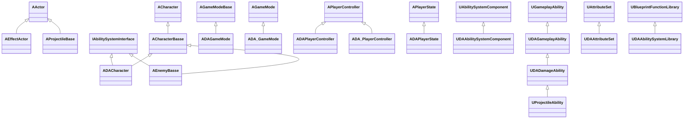
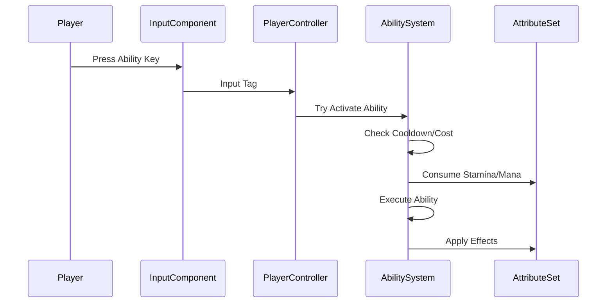

# 🎮 DA - Dark Age

> An Unreal Engine 5.7 Project | Version 0.4.0 alpha

*A Multiplayer Action RPG set in the Divided Realm*

<!-- BADGES_START -->
[](https://www.unrealengine.com/)
[]()
[]()
[]()
[](https://isocpp.org/)
[]()
<!-- BADGES_END -->

---

## ⚔️ Welcome to the Divided Realm

*In a world fractured by the Veil, where multiple realities coexist and a million players shape the story, your choices don't just matter—they define you. There are no chosen heroes here, only people who decide, moment by moment, who they will become.*

This is **Dark Age**, a multiplayer action RPG built on Unreal Engine 5.7 featuring a comprehensive Gameplay Ability System (GAS), dynamic character progression, and a deeply interconnected world where player choices have lasting consequences.

> *"The greatest power is not the ability to reshape reality. It is the ability to choose who you become while reality reshapes itself around you."*
> — **Vaelith the Confessor**

---

## 📚 Documentation Overview

This project includes comprehensive documentation covering all aspects of development and game design:

| Document | Description |
|----------|-------------|
| **[GDD/README.md](docs/GDD/README.md)** | Game Design Document - Core design philosophy and game overview |
| **[GDD/World.md](docs/GDD/World.md)** | The Divided Realm - Setting, factions, and the Veil |
| **[GDD/Story.md](docs/GDD/Story.md)** | Narrative design - Player journey and emergent storytelling |
| **[GDD/Characters.md](docs/GDD/Characters.md)** | Key figures - Companions, antagonists, and NPCs |
| **[GDD/Magic.md](docs/GDD/Magic.md)** | Magic systems - Soul Shards, Additive/Subtractive magic |
| **[GDD/Gameplay.md](docs/GDD/Gameplay.md)** | Core gameplay mechanics and progression |
| **[GDD/Locations.md](docs/GDD/Locations.md)** | World locations - Westbrook, Fractured Citadel, Bone Orchard |
| **[GDD/Multiplayer.md](docs/GDD/Multiplayer.md)** | Shared universe architecture |
| **[GDD/DeathAndResurrection.md](docs/GDD/DeathAndResurrection.md)** | Death mechanics and consequences |
| **[Architecture.md](docs/Architecture.md)** | Technical architecture and class diagrams |
| **[Systems/README.md](docs/Systems/README.md)** | Game systems documentation |
| **[CONTRIBUTING.md](docs/CONTRIBUTING.md)** | Development guidelines |
| **[API/README.md](docs/API/README.md)** | API reference documentation |

---

## 🎯 Core Pillars

These design pillars define the Dark Age experience, as detailed in the [GDD](docs/GDD/README.md):

### 1. Choice Defines Being
Unlike traditional RPGs, your character's appearance, powers, and standing emerge from your actions—not a character creation screen. Cruelty hardens you. Mercy softens you. The Void marks you.

### 2. Persistent Consequence
The world remembers. NPCs gossip about your deeds. Shops refuse service to villains. Kingdoms rise and fall based on collective player action.

### 3. Player Governance
Form guilds, build coalitions, rule kingdoms. Establish laws, levy taxes, command armies. The world is shaped by those powerful enough to shape it.

### 4. Multiplayer Reality
Millions of players coexist in a shared universe of Echoes (parallel realities). Travel between worlds. Build settlements in multiple realities. Project power across dimensional borders.

---

## 🏛️ Factions Overview

| Faction | Philosophy | Playstyle |
|---------|------------|-----------|
| **The Covenant** | Order through control | Structured, hierarchical, "safe" |
| **The Unbound** | Freedom above all | Chaotic, individualistic, dangerous |
| **The Unweaver's Cult** | Peace through surrender | Collective, harmonious, mindless |
| **Player Kingdoms** | Your rules, your way | Whatever you can enforce |

*Full faction details available in [GDD/World.md](docs/GDD/World.md)*

---

## ✨ Magic System

As documented in our [GDD/Magic.md](docs/GDD/Magic.md), magic in Dark Age is based on **Soul Shard Manipulation**:

### Two Forms of Magic

- **Additive Magic** - The art of creation, healing, and protection. Develops from helping behaviors and creates a gentle, soft appearance.
- **Subtractive Magic** - The art of destruction, unmaking, and Void powers. Develops from lethal violence and creates shadowed, corrupted features.

### The Confessor's Touch
Unique magic that bridges both forms - the ability to Add the caster's will while Subtracting the victim's identity, creating "Hollow" servants.

### The Wizard's Rules
Seven philosophical principles governing magic, taught by Soren the Wizard:

1. **People Are Stupid** - Given proper motivation, almost anyone will believe almost anything
2. **The Greatest Harm Can Result From the Best Intentions** - Every atrocity was committed by those who believed they were doing good
3. **Passion Rules Reason** - True passion breaks all chains, including logic
4. **There Is Magic in Sincere Forgiveness** - Even the Consumed can be redeemed
5. **Mind What People Do, Not What They Say** - Deeds betray a lie
6. **The Only Sovereign You Can Allow to Rule You Is Reason** - But reason without passion is empty
7. **Life Is the Future, Not the Past** - The past can teach us, but it can only be a guide

---

## 👥 Key Characters

### Player Character
You are not chosen. You are not destined. You are simply **you**—an individual who discovers the ability to perceive Soul Shards and must decide what to do with that power.

Your character evolves based entirely on your choices:
- **No pre-defined class**: Your abilities emerge from how you play
- **No fixed morality**: The game doesn't judge; the world reacts
- **No required path**: Help the Covenants, join the Unbound, or walk alone

### Major NPCs

| Character | Role | Description |
|-----------|------|-------------|
| **The Unweaver** | Primary Antagonist | Face of benevolent tyranny, believes freedom is cruelty |
| **Vaelith the Confessor** | Mentor/Moral Compass | Former Confessor who questions her orders |
| **Kael the Border Ranger** | Warrior Companion | Deserter from the Covenants, protects travelers |
| **Lyra the Bone Woman** | Mystic Guide | Healer who learned Subtractive Magic |
| **Soren the Wizard** | Teacher/Trickster | Former First Wizard, teaches the Wizard's Rules |
| **Seraphina the Echoed** | Information Broker | Exists in all Echoes simultaneously |

*Full character details available in [GDD/Characters.md](docs/GDD/Characters.md)*

---

## 🎮 Technical Overview

### Engine & Build

- **Engine**: Unreal Engine 5.7
- **Language**: C++ (C++17 standard)
- **Platform**: PC, Console
- **Network**: Client-Server with authoritative server

### Core Systems Implemented

The project implements a comprehensive game framework including:

#### Gameplay Ability System (GAS)
- Custom [`UDAAbilitySystemComponent`](Source/DA/Public/Systems/AbilitySystem/DAAbilitySystemComponent.h) for ability management
- [`UDAGameplayAbility`](Source/DA/Public/Systems/AbilitySystem/Abilities/DAGameplayAbility.h) base class for all abilities
- [`UDAAttributeSet`](Source/DA/Public/Systems/AbilitySystem/Attributes/DAAttributeSet.h) for replicated attributes
- Gameplay tags for ability identification and filtering

*See [Systems/README.md](docs/Systems/README.md) for detailed GAS documentation*

#### Attribute System
| Attribute | Description | Base Value |
|-----------|-------------|------------|
| Health | Hit points | 100 |
| MaxHealth | Health cap | 100 |
| Stamina | Action resource | 50 |
| MaxStamina | Stamina cap | 50 |
| Mana | Magic resource | 50 |
| MaxMana | Mana cap | 50 |

#### Inventory System
- Tag-based item identification using GameplayTags
- Network-replicated inventory with [`UInventoryComponent`](Source/DA/Public/Systems/Inventory/InventoryComponent.h)
- Widget controller pattern for UI integration

#### Input System
- Enhanced Input System integration
- Context-sensitive input mappings
- Gameplay tag-based ability activation

#### Character System
- [`ADACharacter`](Source/DA/Public/Character/DACharacter.h) - Player character with GAS integration
- [`AEnemyBasse`](Source/DA/Public/Character/EnemyBasse.h) - Base enemy class with AI
- [`ACharacterBasse`](Source/DA/Public/Character/CharacterBasse.h) - Base character class

#### Projectile System
- [`AProjectileBase`](Source/DA/Public/Projectiles/ProjectileBase.h) - Replicated projectiles
- [`UProjectileAbility`](Source/DA/Public/Systems/AbilitySystem/Abilities/ProjectileAbility.h) - Ability that spawns projectiles
- [`UProjectileInfo`](Source/DA/Public/Data/ProjectileInfo.h) - Data-driven projectile configuration

---

## 📂 Project Structure

```
Source/
    DA/
        Private/
            Actors/
                EffectActor.cpp
            Character/
                CharacterBasse.cpp
                DACharacter.cpp
                EnemyBasse.cpp
            Data/
                CharacterClassInfo.cpp
                ProjectileInfo.cpp
            Game/
                GameMode/
                    DAGameMode.cpp
                    DA_GameMode.cpp
                PlayerController/
                    DAPlayerController.cpp
                    DA_PlayerController.cpp
                PlayerState/
                    DAPlayerState.cpp
            Input/
                DAInputConfig.cpp
                DASystemsInputComponent.cpp
            Interfaces/
                DAAbilitySystemInterface.cpp
                InventoryInterface.cpp
            Projectiles/
                ProjectileBase.cpp
            Systems/
                AbilitySystem/
                    Abilities/
                        DADamageAbility.cpp
                        DAGameplayAbility.cpp
                        ProjectileAbility.cpp
                    Attributes/
                        DAAttributeSet.cpp
                    Libraries/
                        DAAbilitySystemLibrary.cpp
                    DAAbilitySystemComponent.cpp
                    DAGameplayTags.cpp
                Inventory/
                    InventoryComponent.cpp
                    ItemTypes.cpp
                    ItemTypesToTables.cpp
                DAAbilityTypes.cpp
            UI/
                WidgetControllers/
                    InventoryWidgetController.cpp
                    WidgetController.cpp
                DASystemsWidget.cpp
        Public/
            [Corresponding header files]
        DA.Build.cs
        DA.cpp
        DA.h
    DA.Target.cs
    DAEditor.Target.cs
```

---

## 🏗️ Architecture

### Class Hierarchy

See [Architecture.md](docs/Architecture.md) for detailed class diagrams and system architecture.



### Combat Flow



---

## 🎮 Controls

| Action | Keyboard | Gamepad |
|--------|----------|---------|
| Move | WASD | Left Stick |
| Camera | Mouse | Right Stick |
| Attack | Left Click | RT |
| Ability 1 | Q | LB |
| Ability 2 | E | RB |
| Inventory | I | Menu |
| Interact | F | X |
| Sprint | Shift | L3 |
| Dodge | Space | A |

---

## 🚀 Development Status

| Phase | Status | Completion |
|-------|--------|------------|
| Core Systems | In Progress | 40% |
| World Building | In Progress | 65% |
| Multiplayer Architecture | Planning | 20% |
| Visual Assets | Pre-production | 15% |
| Sound Design | Not Started | 0% |

### Version Information

| Property | Value |
|----------|-------|
| **Version** | `0.4.0` |
| **Stage** | `alpha` |
| **Build** | `71` |
| **Full Version** | `v0.4.0-alpha+build.71` |

---

## 📊 Project Statistics

| Metric | Count |
|--------|-------|
| Header Files | 31 |
| Source Files | 31 |
| Total C++ Files | 62 |
| Total Lines | 2,977 |
| Code Lines | 2,791 |
| Comment Lines | 186 |
| Total Commits | 58 |
| Contributors | 3 |

---

## 👥 Contributors

- **Raio-Core** (43 commits)
- **github-actions[bot]** (13 commits)
- **Raioix** (2 commits)

---

## 🛠️ Development Guidelines

### Prerequisites

- Unreal Engine 5.7
- Visual Studio 2022 (Windows) or Xcode (macOS)
- Git
- Python 3.11+ (for documentation generation)

### Coding Standards

This project follows strict coding standards as defined in [CONTRIBUTING.md](docs/CONTRIBUTING.md):

- **Naming**: PascalCase for classes/structs, camelCase for variables, m-Prefix for members
- **File Organization**: Engine includes → Project includes → Generated headers
- **Documentation**: XML-style comments for all public APIs
- **Unreal Specific**: Proper UPROPERTY/UFUNCTION specifiers

### Generating Documentation

Run the documentation generator to update README and API docs:

```bash
python scripts/generate_docs.py
```

*See [CONTRIBUTING.md](docs/CONTRIBUTING.md) for full development guidelines*

---

## 📄 License & Copyright

Copyright 2026 RaioCore and Raioix. All Rights Reserved.

| Holder | Role |
|--------|------|
| RaioCore | Project Owner |
| Raioix | Project Owner |

---

## 🔗 Links & Community

- **GitHub**: [RaioCore/DarkAge](https://github.com/Raio-Core/DarkAge)
- **Discord**: [discord.gg/darkage](https://discord.gg/darkage)
- **Twitter**: [@DarkAgeGame](https://twitter.com/DarkAgeGame)
- **Reddit**: [r/DarkAge](https://reddit.com/r/DarkAge)

---

<p align="center">
  <i>Copyright 2026 RaioCore and Raioix. All Rights Reserved.</i><br><br>
  <i>This README provides an overview of the DA project. For detailed game design, see the GDD in the docs folder.</i><br>
  <i>Version follows semantic versioning based on conventional commits.</i>
</p>
