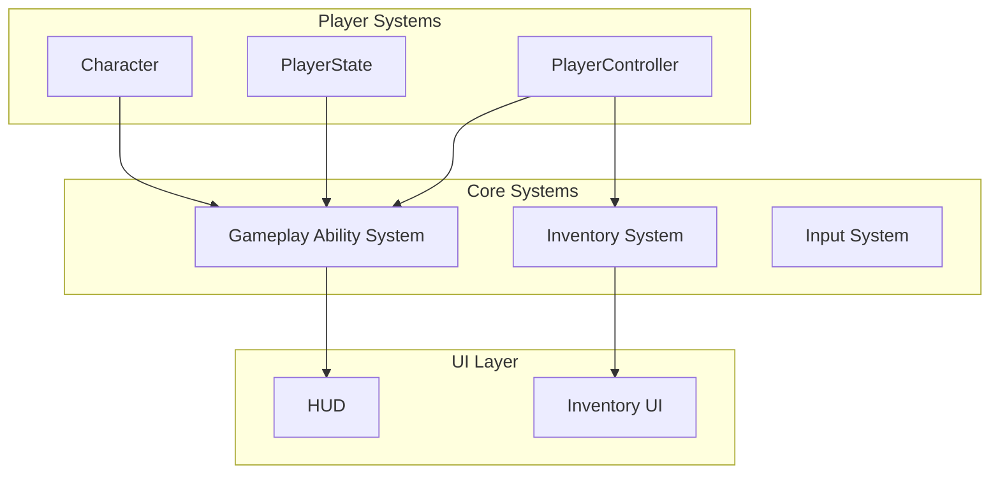

# DA

> An Unreal Engine 5.7 Project | Version 0.4.0 embryo

<!-- BADGES_START -->
[](https://www.unrealengine.com/)
[]()
[]()
[]()
[](https://isocpp.org/)
<!-- BADGES_END -->

<!-- VERSION_START -->
## Version Information

| Property | Value |
|----------|-------|
| **Version** | `0.4.0` |
| **Stage** | `pre-alpha` |
| **Build** | `33` |
| **Full Version** | `v0.4.0-pre-alpha+build.33` |

### Development Progress

Active development, features being implemented

| Metric | Count |
|--------|-------|
| Breaking Changes | 0 |
| New Features | 7 |
| Bug Fixes | 2 |
| Other Changes | 11 |

<!-- VERSION_END -->

## Overview

<!-- DESCRIPTION_START -->
DA is an Unreal Engine project featuring a comprehensive Gameplay Ability System (GAS) with 
custom attributes (Health, Stamina, Mana), character mechanics, and modular architecture designed for extensibility.

### Key Features

- Gameplay Ability System - Full GAS integration with custom ability system component
- Attribute System - Replicated attributes for Health, Stamina, and Mana
- Character Classes - Flexible character class system with data-driven configuration
- State Tree - AI and gameplay logic using Unreal's StateTree plugin
- Modular Architecture - Clean separation of systems for maintainability
<!-- DESCRIPTION_END -->

<!-- STATS_START -->
## Project Statistics

| Metric | Count |
|--------|-------|
| Header Files | 19 |
| Source Files | 19 |
| Total C++ Files | 38 |
| Total Lines | 107,966 |
| Code Lines | 107,837 |
| Comment Lines | 129 |
| Total Commits | 20 |
| Contributors | 3 |

<!-- STATS_END -->

<!-- COPYRIGHT_START -->
## Copyright

Copyright 2026 RaioCore and Raioix. All Rights Reserved.

### Copyright Holders

| Holder | Role |
|--------|------|
| RaioCore | Project Owner |
| Raioix | Project Owner |

### File Copyright Status

| Status | Count |
|--------|-------|
| Correct Copyright | 38 |
| Epic Games (Template) | 0 |
| Placeholder | 0 |
| Missing | 0 |

<!-- COPYRIGHT_END -->

<!-- DIRECTORY_START -->
## Project Structure

```
Source/
    DA/
        Private/
            Actors/
                EffectActor.cpp
            Data/
                CharacterClassInfo.cpp
            Game/
                GameMode/
                    DA_GameMode.cpp
                PlayerController/
                    DA_PlayerController.cpp
                PlayerState/
                    DAPlayerState.cpp
            Interfaces/
                InventoryInterface.cpp
            Systems/
                AbilitySystem/
                    Attributes/
                        DAAttributeSet.cpp
                    Libraries/
                        DAAbilitySystemLibrary.cpp
                    DAAbilitySystemComponent.cpp
                Inventory/
                    InventoryComponent.cpp
                    ItemTypes.cpp
                    ItemTypesToTables.cpp
            UI/
                WidgetControllers/
                    InventoryWidgetController.cpp
                    WidgetController.cpp
                DASystemsWidget.cpp
        Public/
            Actors/
                EffectActor.h
            Data/
                CharacterClassInfo.h
            Game/
                GameMode/
                    DA_GameMode.h
                PlayerController/
                    DA_PlayerController.h
                PlayerState/
                    DAPlayerState.h
            Interfaces/
                InventoryInterface.h
            Systems/
                AbilitySystem/
                    Attributes/
                        DAAttributeSet.h
                    Libraries/
                        DAAbilitySystemLibrary.h
                    DAAbilitySystemComponent.h
                Inventory/
                    InventoryComponent.h
                    ItemTypes.h
                    ItemTypesToTables.h
            UI/
                WidgetControllers/
                    InventoryWidgetController.h
                    WidgetController.h
                DASystemsWidget.h
        DA.Build.cs
        DA.cpp
        DA.h
        DACharacter.cpp
        DACharacter.h
        DAGameMode.cpp
        DAGameMode.h
        DAPlayerController.cpp
        DAPlayerController.h
    DA.Target.cs
    DAEditor.Target.cs
```

<!-- DIRECTORY_END -->

<!-- CLASSES_START -->
## C++ Classes

### DA

| Class | Type | Base | Description |
|-------|------|------|-------------|
| `ADACharacter` | Class | `ACharacter` |  |
| `ADAGameMode` | Class | `AGameModeBase` |  |
| `ADAPlayerController` | Class | `APlayerController` |  |
| `ADAPlayerState` | Class | `APlayerState` |  |
| `ADA_GameMode` | Class | `AGameMode` |  |
| `ADA_PlayerController` | Class | `APlayerController` |  |
| `AEffectActor` | Class | `AActor` |  |
| `FCharacterClassDefaultInfo` | Struct | `-` |  |
| `FConsumableProps` | Struct | `-` |  |
| `FMasterItemDefinition` | Struct | `-` |  |
| `FPackagedInventory` | Struct | `-` |  |
| `UCharacterClassInfo` | Class | `UDataAsset` |  |
| `UDAAbilitySystemComponent` | Class | `UAbilitySystemComponent` |  |
| `UDAAbilitySystemLibrary` | Class | `UBlueprintFunctionLibrary` |  |
| `UDAAttributeSet` | Class | `UAttributeSet` |  |
| `UDASystemsWidget` | Class | `UUserWidget` |  |
| `UInventoryWidgetController` | Class | `UWidgetController` |  |
| `UItemTypesToTables` | Class | `UDataAsset` |  |
| `UWidgetController` | Class | `UObject` |  |

<!-- CLASSES_END -->

<!-- TAGS_START -->
## Gameplay Tags

### Character
- `Character.Player.Default`

### Item
- `Item.Consumable.HealthPotion`
- `Item.Consumable.ManaPotion`

<!-- TAGS_END -->

<!-- COMMITS_START -->
## Recent Changes

- [`0f76ddd`](https://github.com/Raio-Core/DarkAge/commit/0f76ddd70a54c3df3f11f0c5542215a2a2f1c6f6) Merge remote-tracking branch 'origin/main' (2026-02-26)
- [`977339c`](https://github.com/Raio-Core/DarkAge/commit/977339ccc9af76474d370881eaf6e801898e8ebb) feat: implement inventory system with widget controller (2026-02-26)
- [`8235eb6`](https://github.com/Raio-Core/DarkAge/commit/8235eb6aca88308dca74ea8f3511e649cc152462) feat(inventory): add item usage with GAS integration (2026-02-25)
- [`f122cd9`](https://github.com/Raio-Core/DarkAge/commit/f122cd9a41f93b4ba5d42ab4ef56195abb867caf) refactor(inventory): rename parameter from InItemTag to Item... (2026-02-24)
- [`7ebbace`](https://github.com/Raio-Core/DarkAge/commit/7ebbace8febe50176954dcbc2c2ce3e3934850d7) docs: auto-update README [skip ci] (2026-02-24)
- [`19db8d8`](https://github.com/Raio-Core/DarkAge/commit/19db8d8976fe467a04fdea5cf6fcc118516d144a) Merge remote-tracking branch 'origin/main' (2026-02-24)
- [`b4d46d4`](https://github.com/Raio-Core/DarkAge/commit/b4d46d47b6a69ef00b08131e9113334962b11845) feat(game): add inventory system and mobile controls (2026-02-24)
- [`41366c3`](https://github.com/Raio-Core/DarkAge/commit/41366c3311b3bebc382b7c728d4e90f9b50888f5) docs: auto-update README [skip ci] (2026-02-22)
- [`411a70e`](https://github.com/Raio-Core/DarkAge/commit/411a70e34b2637512b01c63ac2fdf3e7bd86e75e) fix(readme): escape hyphen in stage badge for shields.io (2026-02-17)
- [`6c79532`](https://github.com/Raio-Core/DarkAge/commit/6c7953219238923735832c7b6ed85704bcf1885c) fix(readme): escape hyphens in stage badge for shields.io (2026-02-17)

<!-- COMMITS_END -->

<!-- AUTO-UPDATE-START: Documentation -->
## 📚 Documentation

Comprehensive documentation is available in the [docs/](docs/) folder:

| Document | Description |
|----------|-------------|
| [📖 Game Design Document](docs/GDD/README.md) | Game design, mechanics, and systems |
| [🏗️ Architecture](docs/Architecture.md) | Technical architecture and diagrams |
| [🔧 Systems](docs/Systems/README.md) | Detailed system documentation |
| [👥 Contributing](docs/CONTRIBUTING.md) | Contribution guidelines |
| [📋 API Reference](docs/API/README.md) | Auto-generated API documentation |

*Last updated: 2026-02-28*
<!-- AUTO-UPDATE-END: Documentation -->

<!-- AUTO-UPDATE-START: SystemOverview -->
## 🎮 System Overview



### Key Technologies

| System | Technology | Status |
|--------|------------|--------|
| **Gameplay Abilities** | Unreal GAS | ✅ Implemented |
| **Inventory** | Tag-Based System | ✅ Implemented |
| **Input** | Enhanced Input | ✅ Implemented |
| **UI** | Widget Controller Pattern | ✅ Implemented |
| **Multiplayer** | Network Replication | 🔄 In Progress |
<!-- AUTO-UPDATE-END: SystemOverview -->

<!-- CONTRIBUTORS_START -->
## Contributors

- **Raio-Core** (15 commits)
- **github-actions[bot]** (3 commits)
- **Raioix** (2 commits)

<!-- CONTRIBUTORS_END -->

---

<p align="center">
  <i>Copyright 2026 RaioCore and Raioix. All Rights Reserved.</i><br><br>
  <i>Last updated: 2026-02-27 00:09:45 UTC</i><br>
  <i>This README is automatically generated from project files and git history.</i><br>
  <i>Version follows semantic versioning based on conventional commits.</i>
</p>
