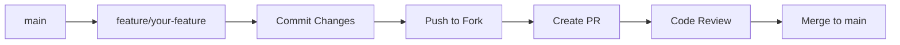

# Contributing to DA

Thank you for your interest in contributing to the DA project! This document provides guidelines and best practices for contributing.

---

## 📋 Table of Contents

- [Code of Conduct](#code-of-conduct)
- [Getting Started](#getting-started)
- [Development Workflow](#development-workflow)
- [Coding Standards](#coding-standards)
- [Documentation Standards](#documentation-standards)
- [Commit Message Guidelines](#commit-message-guidelines)
- [Pull Request Process](#pull-request-process)

---

## 📜 Code of Conduct

This project adheres to a code of conduct that all contributors are expected to follow:

- Be respectful and inclusive
- Provide constructive feedback
- Focus on what's best for the project
- Show empathy towards other contributors

---

## 🚀 Getting Started

### Prerequisites

- Unreal Engine 5.3 or later
- Visual Studio 2022 (Windows) or Xcode (macOS)
- Git
- Python 3.11+ (for documentation generation)

### Setup

1. Fork the repository
2. Clone your fork:
   ```bash
   git clone https://github.com/YOUR_USERNAME/DA.git
   cd DA
   ```
3. Generate project files:
   ```bash
   # Windows
   "C:\Program Files\Epic Games\UE_5.3\Engine\Binaries\DotNET\UnrealBuildTool\UnrealBuildTool.exe" -projectfiles -project="%CD%\DA.uproject" -game -engine -progress
   
   # Or use the .bat file
   GenerateProjectFiles.bat
   ```

---

## 🔄 Development Workflow

### Branch Naming

| Branch Type | Pattern | Example |
|-------------|---------|---------|
| Feature | `feature/description` | `feature/inventory-system` |
| Bug Fix | `fix/description` | `fix/ability-cooldown` |
| Documentation | `docs/description` | `docs/api-examples` |
| Hotfix | `hotfix/description` | `hotfix/crash-on-startup` |

### Workflow Steps



---

## 💻 Coding Standards

### C++ Style Guide

#### Naming Conventions

| Type | Convention | Example |
|------|------------|---------|
| Classes | PascalCase | `class UInventoryComponent` |
| Structs | PascalCase | `struct FPackagedInventory` |
| Enums | E-Prefix + PascalCase | `enum class EItemType` |
| Variables | camelCase | `int32 itemCount` |
| Member Variables | m-Prefix + PascalCase | `int32 m_ItemCount` |
| Functions | PascalCase | `void AddItem()` |
| Macros | UPPER_SNAKE_CASE | `#define ATTRIBUTE_ACCESSORS` |
| Template Prefixes | T- / U- / A- / I- | `TObjectPtr<>`, `UObject`, `AActor`, `IInterface` |

#### File Organization

```cpp
// Copyright Header
// Copyright 2026 RaioCore and Raioix. All Rights Reserved.

#pragma once

// Engine includes
#include "CoreMinimal.h"
#include "GameFramework/PlayerController.h"

// Project includes
#include "Interfaces/InventoryInterface.h"

// Generated header (always last)
#include "MyClass.generated.h"

// Forward declarations
class UAbilitySystemComponent;

/**
 * Brief description of the class.
 * 
 * Detailed description if needed.
 */
UCLASS()
class DA_API AMyClass : public APlayerController, public IInventoryInterface
{
    GENERATED_BODY()

public:
    // Constructors
    AMyClass();

    // APlayerController interface
    virtual void SetupInputComponent() override;
    
    // IInventoryInterface interface
    virtual UInventoryComponent* GetInventoryComponent_Implementation() const override;

protected:
    // Lifecycle
    virtual void BeginPlay() override;
    
    // Event handlers
    UFUNCTION()
    void OnHealthChanged(const FOnAttributeChangeData& Data);

private:
    // Properties
    UPROPERTY(EditDefaultsOnly, Category="MyCategory")
    TObjectPtr<UAbilitySystemComponent> m_AbilitySystemComponent;
    
    // Functions
    void InitializeAbilitySystem();
};
```

#### Code Formatting

- Use 4 spaces for indentation (no tabs)
- Maximum line length: 120 characters
- Place opening braces on a new line for functions/classes
- Place opening braces on the same line for control structures
- Always use braces for control structures, even single-line

```cpp
// Good
if (Condition)
{
    DoSomething();
}

// Good
for (int32 i = 0; i < Count; ++i)
{
    ProcessItem(i);
}

// Bad
if (Condition)
    DoSomething();
```

### Unreal Engine Specific

#### UPROPERTY Specifiers

Order of specifiers:
1. Edit/Visibility: `EditDefaultsOnly`, `VisibleAnywhere`, `BlueprintReadOnly`
2. Category: `Category="System|Subcategory"`
3. Replication: `Replicated`, `ReplicatedUsing=FunctionName`
4. Meta: `meta=(AllowPrivateAccess=true)`

```cpp
UPROPERTY(EditDefaultsOnly, Category="Combat|Abilities", ReplicatedUsing=OnRep_AbilitySet, meta=(AllowPrivateAccess=true))
TObjectPtr<UAbilitySet> m_DefaultAbilitySet;
```

#### UFUNCTION Specifiers

```cpp
// Blueprint callable function
UFUNCTION(BlueprintCallable, Category="Inventory")
void AddItem(const FGameplayTag& ItemTag, int32 Quantity = 1);

// Blueprint pure function (no side effects)
UFUNCTION(BlueprintPure, Category="Inventory")
int32 GetItemCount(const FGameplayTag& ItemTag) const;

// Server RPC
UFUNCTION(Server, Reliable, Category="Inventory")
void ServerAddItem(const FGameplayTag& ItemTag, int32 Quantity);

// Blueprint event
UFUNCTION(BlueprintImplementableEvent, Category="Events")
void OnInventoryChanged();

// Blueprint native event
UFUNCTION(BlueprintNativeEvent, Category="Events")
void OnItemAdded(const FGameplayTag& ItemTag);
virtual void OnItemAdded_Implementation(const FGameplayTag& ItemTag);
```

### Blueprint vs C++

| Use Case | Recommended |
|----------|-------------|
| Core gameplay systems | C++ |
| Data definitions | C++ |
| Performance-critical code | C++ |
| UI layout and styling | Blueprint |
| Visual effects (particles, materials) | Blueprint |
| Rapid prototyping | Blueprint |
| Scripting events | Blueprint |

---

## 📝 Documentation Standards

### Code Comments

```cpp
/**
 * Brief description of the function.
 * 
 * @param ParamName - Description of parameter
 * @return Description of return value
 * @note Any important notes
 * @see RelatedFunction
 */
UFUNCTION(BlueprintCallable)
int32 CalculateDamage(float BaseDamage, EDamageType DamageType);
```

### Class Documentation

```cpp
/**
 * Manages player inventory with tag-based item identification.
 * 
 * This component handles:
 * - Item storage and retrieval
 * - Network replication
 * - UI updates via delegates
 * 
 * @see UItemTypes for item definitions
 * @see IInventoryInterface for interface usage
 */
UCLASS(ClassGroup=(Custom), meta=(BlueprintSpawnableComponent))
class DA_API UInventoryComponent : public UActorComponent
```

---

## 💬 Commit Message Guidelines

### Format

```
<type>(<scope>): <subject>

<body>

<footer>
```

### Types

| Type | Description |
|------|-------------|
| `feat` | New feature |
| `fix` | Bug fix |
| `docs` | Documentation only |
| `style` | Code style (formatting) |
| `refactor` | Code refactoring |
| `perf` | Performance improvements |
| `test` | Adding tests |
| `chore` | Build/dependency changes |

### Examples

```
feat(inventory): add stackable items support

- Implement item quantity tracking
- Update UI to show quantities
- Add Server RPC for quantity changes

Fixes #123
```

```
fix(ability): correct cooldown calculation

Cooldown was using milliseconds instead of seconds,
causing abilities to appear ready immediately.

Closes #456
```

```
docs(api): add class hierarchy diagrams

- Add Mermaid diagrams to Architecture.md
- Document GAS class relationships
- Update README with new examples
```

---

## 🔀 Pull Request Process

### Before Creating a PR

1. **Update Documentation**
   - Run documentation generator: `python scripts/generate_docs.py`
   - Update relevant .md files
   - Add code comments for new classes/functions

2. **Test Your Changes**
   - Ensure code compiles
   - Test in-editor
   - Test packaged build (if applicable)

3. **Review Your Code**
   - Check for debug code or logs
   - Verify no hardcoded values
   - Ensure proper error handling

### PR Template

```markdown
## Description
Brief description of changes

## Type of Change
- [ ] Bug fix
- [ ] New feature
- [ ] Documentation update
- [ ] Refactoring

## Testing
- [ ] Tested in PIE
- [ ] Tested in Standalone
- [ ] Tested in Packaged Build

## Checklist
- [ ] Code follows style guidelines
- [ ] Self-review completed
- [ ] Documentation updated
- [ ] No new warnings generated
```

### Review Process

1. **Automated Checks**
   - Documentation generation
   - Link validation
   - Build verification

2. **Code Review**
   - At least one approval required
   - Address all comments
   - Resolve conversations

3. **Merge Requirements**
   - All checks passing
   - Approved by reviewer
   - Up to date with main

---

## 🧪 Testing Guidelines

### Unit Testing (Future)

```cpp
// Example structure for when tests are added
IMPLEMENT_SIMPLE_AUTOMATION_TEST(FInventoryAddItemTest, "DA.Inventory.AddItem",
    EAutomationTestFlags::EditorContext | EAutomationTestFlags::ProductFilter)

bool FInventoryAddItemTest::RunTest(const FString& Parameters)
{
    // Test implementation
    return true;
}
```

### Manual Testing Checklist

- [ ] Feature works in PIE (Play In Editor)
- [ ] Feature works in Standalone
- [ ] Feature works in Multiplayer (if applicable)
- [ ] Feature works in Packaged Build
- [ ] No new warnings or errors
- [ ] Performance is acceptable

---

## 📚 Additional Resources

- [Unreal Engine Coding Standard](https://docs.unrealengine.com/en-US/ProductionPipelines/DevelopmentSetup/CodingStandard/)
- [Gameplay Ability System Documentation](https://docs.unrealengine.com/en-US/InteractiveExperiences/GameplayAbilitySystem/)
- [Project Architecture](Architecture.md)
- [API Reference](API/README.md)

---

## ❓ Questions?

If you have questions:
1. Check existing documentation
2. Search closed issues
3. Create a new discussion

---

Thank you for contributing to DA! 🎮
