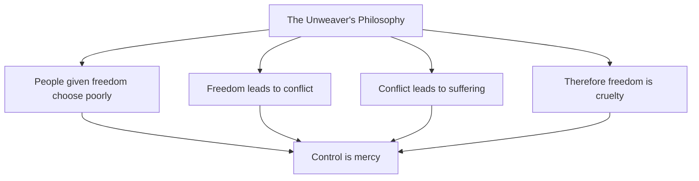
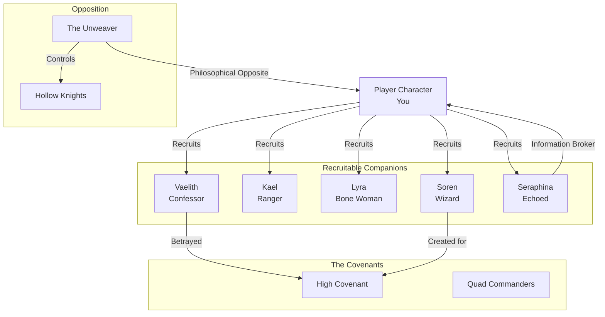

# 👥 Key Figures of the Divided Realm

> *"The greatest harm can result from the best intentions. Remember that when you judge those who oppose you. They may believe they save the world."*
> — **Soren the Wizard**

---

## The Player Character: You

### Core Identity

You are not chosen. You are not destined. You are simply **you**—an individual who discovers the ability to perceive Soul Shards and must decide what to do with that power.

Your character evolves based entirely on your choices:
- **No pre-defined class**: Your abilities emerge from how you play
- **No fixed morality**: The game doesn't judge; the world reacts
- **No required path**: Help the Covenants, join the Unbound, or walk alone

### Character Evolution

| Playstyle | Physical Changes | Social Standing | Available Powers |
|-----------|-----------------|-----------------|------------------|
| **Protector** | Softened features, gentle aura | Trusted by common folk | Healing, shields, buffs |
| **Destroyer** | Hardened angles, shadowed presence | Feared by many | Subtractive magic, fear effects |
| **Manipulator** | Shifting, unreadable features | Respected by criminals | Illusion, charm, deception |
| **Seeker** | Piercing gaze, alert posture | Sought for wisdom | Truth detection, knowledge |
| **Void-Touched** | Translucent skin, void-marks | Shunned by normals | Subtractive mastery, void travel |

> 🎭 **Key Moment**: After hours of play, you meet an NPC from your starting village. They comment on how much you've changed—not just your equipment, but your face, your bearing, your very presence. The mirror shows a stranger wearing your memories.

---

## Major Antagonist: The Unweaver

### Identity: The Face of Benevolent Tyranny

The Unweaver represents the ultimate expression of the "greater good" philosophy. They believe that individual freedom leads only to suffering, and that true compassion requires controlling people for their own benefit.

### Appearance

The Unweaver appears as a middle-aged scholar, kind-eyed, soft-spoken—a person you might trust with your children. They wear simple robes, not armor. They carry no visible weapons. They look like a teacher, a healer, a friend.

This is their greatest weapon. You cannot hate them easily. You cannot dismiss them as a monster. You must confront that their logic is coherent—and that makes them terrifying.

### Philosophy: The First Rule Applied

> *"I have studied the Wizard's Rules. I know the First Rule: people are stupid. They will believe a lie because they want it to be true. They want to believe they are free. They want to believe their choices matter. They want to believe they are good people.
>
> I offer them what they truly want: an end to the burden of choice. An end to the anxiety of freedom. An end to the guilt of failure. I offer them peace through surrender. And they love me for it.
>
> Your precious Covenants maintain control through fear. I maintain control through love. Which of us is the tyrant?"*

### Powers & Abilities

| Ability | Description | Story Impact |
|---------|-------------|--------------|
| **The Voice** | Can speak with absolute conviction; listeners want to believe | Converts enemies into followers without force |
| **The Unraveling Touch** | Can sever Soul Shards, creating willing servants | Victims believe they serve freely |
| **Echo Collapse** | Can merge Echoes, destroying those who resist unity | Demonstrates the cost of opposition |
| **Subtractive Magic Mastery** | Wields the Void's power without being consumed | Nearly unstoppable in direct combat |
| **The Logic That Cannot Be Denied** | Their arguments are always coherent, always reasonable | Defeating them requires rejecting reason itself |

### The Unweaver's Army

The Unweaver does not rule through force alone. They have **converts**:

#### The Hollow Knights
Once honorable warriors who surrendered their Soul Shards voluntarily. They believe they have been "freed" from the burden of choice.

> *"I was a murderer. I killed for gold, for pride, for sport. The Unweaver took that from me. Now I kill only to bring peace. Is that not better?"*
> — **Commander Alric**

#### The Resonant Preachers
Seven orators who travel between Echoes spreading the Unweaver's message through logic alone.

---

## Key Allies (Companion System)

### Vaelith the Confessor
**Role**: Mentor, Moral Compass, Potential Romance  
**Recruitment**: Rescue her from Covenant pursuit in Westbrook

#### Background
Vaelith was a Confessor who began to doubt. She saw that the "guilty" she touched were often simply inconvenient. She fled with forbidden knowledge—and a price on her head.

#### Personality
- **Duty-bound but questioning**—she wants to believe in authority but cannot ignore evidence
- **Compassionate beneath cold exterior**
- **Terrified of her own power**—each use brings her closer to becoming a monster
- **Desperate for connection**—her power makes intimacy impossible... until she meets someone pure of intent

#### Companion Benefits
- Reveals hidden truths about the Covenants
- Teaches the First Rule
- Opens unique dialogue options with authorities
- Romance option for players who prove their intentions are genuine

---

### Kael the Border Ranger
**Role**: Warrior Companion, Loyal Friend  
**Recruitment**: Help him defend a caravan crossing the Veil

#### Background
A deserter from the Covenants' forces who discovered his "enemies" were just people fleeing persecution. Now he protects travelers seeking freedom.

#### Companion Benefits
- Combat expertise
- Knowledge of hidden paths
- Honor-based moral guidance
- Teaches survival skills

---

### Lyra the Bone Woman
**Role**: Mystic Guide, Healer  
**Recruitment**: Find her in the Bone Orchard and earn her trust

#### Background
A healer who learned Subtractive Magic to cure the incurable. Declared a servant of evil by the Covenants, she hides in the deepest Echoes.

#### Companion Benefits
- Teaches Subtractive Magic safely
- Heals injuries no one else can
- Knows the paths between Echoes
- Warns of Void dangers

---

### Soren the Wizard
**Role**: Teacher, Trickster Mentor  
**Recruitment**: Solve his riddles at his sanctuary

#### Background
Former First Wizard of the Covenants who fled when he saw what they did with his creations. Now he teaches the Wizard's Rules to those who find him.

#### Companion Benefits
- Teaches all seven Wizard's Rules
- Explains magic theory
- Provides historical context
- Offers perspective on player choices

---

### Seraphina the Echoed
**Role**: Information Broker, Survivor  
**Recruitment**: Help her stabilize her existence

#### Background
Born in one Echo, raised in another, now existing in all simultaneously. She trades in secrets and has no patience for heroics.

#### Companion Benefits
- Access to black market
- Information on all factions
- Navigation between Echoes
- Cynical perspective that balances idealism

---

## Major NPCs by Faction

### The Covenants

| Name | Rank | Role | Player Interaction |
|------|------|------|-------------------|
| **High Covenant Thessa** | Council Leader | Antagonist | Sees the player as threat or tool |
| **Commander Kael** | Quad Commander | Honorable Enemy | Respects strength, offers redemption |
| **Master Oren** | Keeper of Records | Informant | Knows truths but serves power |
| **Novice Perrin** | Confessor-in-training | Potential Ally | Torn between duty and doubt |

### The Unweaver's Forces

| Name | Title | Role | Player Interaction |
|------|-------|------|-------------------|
| **The Unweaver** | Leader | Primary Antagonist | Offers "mercy" of control |
| **Commander Alric** | Hollow Knight | Field Commander | Genuinely believes he serves good |
| **Sister Mercy** | Resonant Preacher | Ideologue | Converts through logic |

### The Unbound

| Name | Role | Player Interaction |
|------|------|-------------------|
| **The Remnant** | Leader of Free Echoes | Tests player's worth |
| **Grimble the Smuggler** | Black Market Contact | Sells information |
| **Mother Ash** | Healer of the Hollow | Might restore Hollow servants |

---

## Character Relationships Web

---

## Companion Death & Consequences

Companions can die based on player choices:

| Character | Death Possible? | Impact |
|-----------|-----------------|--------|
| Vaelith | Yes | Lose truth-compelling ability |
| Kael | Yes | Lose combat support |
| Lyra | Yes | Lose Subtractive Magic training |
| Soren | Yes | Lose Wizard's Rules knowledge |
| Seraphina | Yes | Lose information network |

> ⚠️ **Permanent Consequences**: Death is final. No resurrection. Choices matter.

---

## Player Interaction with NPCs

### Dynamic Reputation

NPCs remember:
- **Personal interactions**: How you treated them specifically
- **Witnessed deeds**: What they saw you do
- **Reputation**: What they've heard about you
- **Appearance**: Your current physical manifestation

### Dialogue System

Not multiple-choice but **contextual**:
- NPCs react to your reputation before you speak
- Your appearance opens or closes dialogue options
- Previous interactions shape available topics
- Companions can interject with their perspectives

---

> *"We are not our titles. We are not our powers. We are the choices we make, moment by moment, when no one is watching. That is not destiny. That is character."*
> — **Vaelith's Lesson**
