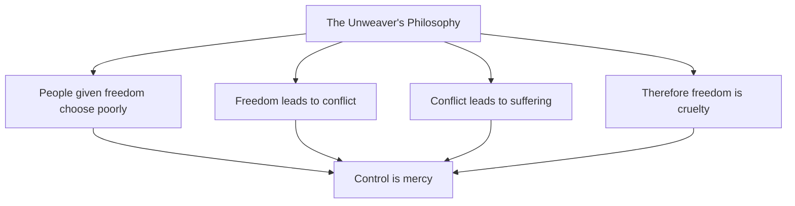
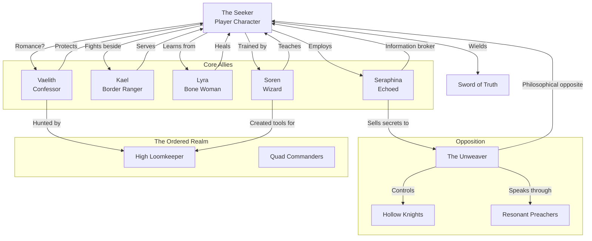

# 👥 Cast of Characters

> *"The greatest harm can result from the best intentions. Remember that when you judge those who oppose you. They may believe they save the world."*
> — **Soren the Wizard**

---

## The Protagonist: The Seeker

### Core Identity

The player character is the **Seeker**—wielder of the Sword of Truth, bound not by destiny but by choice to cut through the lies that bind the world. Unlike the Loomkeepers who maintain control or the Unweaver who seeks to end choice, the Seeker serves truth itself.

### Customizable Elements

| Aspect | Player Choice | Impact |
|--------|--------------|--------|
| **Origin** | Woods Guide / Truth-Teller / Outcast / Blank | Starting skills, initial relationships, unique dialogue |
| **Appearance** | Full customization | Recognized across the realms; reactions vary by region |
| **Moral Leanings** | Emergent through play | Determines Sword's behavior, companion loyalty, available endings |
| **Relationship with Vaelith** | Player-driven | Romance possible; shapes both characters' fates |

### The Seeker's Burden

Like Richard Cypher, the Seeker grapples with unique challenges:

- **The Sword's Judgment**: Cannot harm the innocent; amplifies anger
- **The Truth's Weight**: Once you see injustice, you cannot unsee it
- **The Isolation of Righteousness**: Doing what is right often means standing alone
- **The Temptation of Force**: The Sword could solve so many problems... if you stop caring about innocence

> 🎭 **Key Character Moment**: The Seeker faces an enemy soldier who is conscripted, terrified, and begging for mercy. The Sword refuses to cut—they are innocent of malice. But if spared, they return to the Unweaver's army. The choice is painful, and there is no "right" answer.

---

## Major Antagonist: The Unweaver

### Identity: The Face of Benevolent Tyranny

The Unweaver represents the ultimate expression of the "greater good" philosophy. Inspired by the Imperial Order from Sword of Truth, they believe that individual freedom leads only to suffering, and that true compassion requires controlling people for their own benefit.

### Appearance

The Unweaver appears as a middle-aged scholar, kind-eyed, soft-spoken—a person you might trust with your children. They wear simple robes, not armor. They carry no visible weapons. They look like a teacher, a healer, a friend.

This is their greatest weapon. You cannot hate them easily. You cannot dismiss them as a monster. You must confront that their logic is coherent—and that makes them terrifying.

### Philosophy: The First Rule Applied

> *"I have studied the Wizard's Rules, Seeker. I know the First Rule: people are stupid. They will believe a lie because they want it to be true. They want to believe they are free. They want to believe their choices matter. They want to believe they are good people.
>
> I offer them what they truly want: an end to the burden of choice. An end to the anxiety of freedom. An end to the guilt of failure. I offer them peace through surrender. And they love me for it.
>
> Your precious Loomkeepers maintain control through fear. I maintain control through love. Which of us is the tyrant?"*

### Powers & Abilities

| Ability | Description | Story Impact |
|---------|-------------|--------------|
| **The Voice** | Can speak with absolute conviction; listeners want to believe | Converts enemies into followers without force |
| **The Unraveling Touch** | Can sever Soul Threads, creating willing servants | Victims believe they serve freely |
| **Echo Collapse** | Can merge Echoes, destroying those who resist unity | Demonstrates the cost of opposition |
| **Subtractive Magic Mastery** | Wields the Void's power without being consumed | Nearly unstoppable in direct combat |
| **The Logic That Cannot Be Denied** | Their arguments are always coherent, always reasonable | Defeating them requires rejecting reason itself |

### The Unweaver's Lieutenants

The Unweaver does not rule through force alone. They have **converts**—people who have accepted their philosophy:

#### The Hollow Knights

Once honorable warriors, they have surrendered their Soul Threads voluntarily. They believe they have been "freed" from the burden of choice. They fight not from obedience but from genuine conviction that they serve the greater good.

> *"I was a murderer, Seeker. I killed for gold, for pride, for sport. The Unweaver took that from me. Now I kill only to bring peace. Is that not better? Am I not saved?"*
> — **Commander Alric**, before battle

#### The Resonant Preachers

Seven orators who travel between Echoes spreading the Unweaver's message. They do not threaten. They do not deceive. They simply explain—and those who understand cannot help but agree.

---

## Key Allies

### Vaelith the Confessor
**Origin**: The Ordered Realm  
**Role**: Deuteragonist, Moral Compass, Potential Romance  
**Archetype**: Kahlan Amnell—the powerful woman bound by duty who learns to choose for herself

#### Background
Vaelith was born to be a Confessor—taken as a child, trained to destroy wills, taught that she served justice. She has touched dozens of men, creating Hollow servants who now serve the Loomkeepers.

But she began to doubt. She saw that the "guilty" she touched were often simply inconvenient. She saw that the innocent suffered while the powerful remained untouched. And she saw that the Loomkeepers themselves were the greatest criminals of all.

She stole the Sword of Truth and fled beyond the Veil.

#### Personality
- **Duty-bound** but questioning—she wants to believe in authority but cannot ignore evidence
- **Compassionate** beneath her cold exterior—her power forces her to be distant
- **Terrified of herself**—each use of her touch brings her closer to becoming a monster
- **Desperate for connection**—the Confessor's power makes intimacy impossible... until the Seeker

#### The Confessor's Power

Vaelith can destroy a person's free will with a touch. The victim becomes a Hollow—alive, intelligent, utterly devoted to Vaelith. They live to please her. They die for her without hesitation.

She hates this power. She uses it only when absolutely necessary. And each use brings her closer to the **Confessor's Madness**—a state where she loses the ability to feel anything at all.

#### Character Arc
Vaelith must learn that she is more than her power, more than her duty, more than what the Loomkeepers made her. She must choose to be Vaelith—not the Confessor, not the fugitive, but herself.

If the player pursues romance with her, they discover that the Sword of Truth protects them from her touch—but only if they are truly innocent of intent to harm her.

> *"I have destroyed so many lives. I told myself it was justice. I told myself they deserved it. But I was lying. I was convenient. The Loomkeepers wanted them removed, and I was the tool. I will not be a tool anymore."*

---

### Kael the Border Ranger
**Origin**: The boundary lands between Ordered Realm and Wild Echoes  
**Role**: Warrior Companion, Loyal Friend  
**Archetype**: Chase Brandstone—the honorable warrior who serves because he chooses to

#### Background
Kael was a ranger who patrolled the Veil, keeping the Ordered Realm safe from Wild Echo threats—or so he believed. When he discovered that his "enemies" were often just people fleeing Loomkeeper persecution, he deserted.

Now he protects travelers crossing between realms, offering guidance to those seeking freedom.

#### Personality
- **Steadfast**—once he chooses a cause, he does not waver
- **Pragmatic**—he knows honor is a luxury of the secure
- **Haunted**—he has killed good people who were on the "wrong" side
- **Loyal**—he would die for the Seeker, not because of magic or prophecy, but because he chooses to

#### Character Arc
Kael must reconcile his honorable nature with the reality that honor is often used to justify atrocity. He learns that true honor means choosing your own code, not following someone else's.

> *"I was a soldier. I followed orders. I told myself that made me righteous. But righteousness is not obedience, is it? Righteousness is doing what is right—even when everyone tells you you're wrong."*

---

### Lyra the Bone Woman
**Origin**: The Wild Echoes, near the Void's edge  
**Role**: Mystic Guide, Healer  
**Archetype**: Adie—the outcast who knows too much and helps anyway

#### Background
Lyra was a healer who learned to work with Subtractive Magic—the power to unmake, to destroy, to return things to the Void. The Loomkeepers declared her a servant of evil and sent Confessors to capture her.

She escaped into the deepest Echoes, where the Void's influence is strongest. There, she learned to hear the Night Wisps without going mad. She learned to touch death and return.

Now she lives alone, helping those brave or desperate enough to seek her out.

#### Personality
- **Alien**—her time near the Void has changed her; she sees the world differently
- **Kind**—despite her terrifying power, she wants to help
- **Fearless**—she has looked into the Void and survived; little else frightens her
- **Warning**—she knows the cost of Subtractive Magic and tries to teach it to the Seeker

#### Character Arc
Lyra must decide whether to remain isolated or join the fight. She has avoided the war to protect herself, but her inaction allows suffering to continue.

> *"I can unmake flesh. I can return the living to the Void. The Loomkeepers call this evil. But I use it to heal—to remove tumors, to cleanse infections, to end pain. Is that evil? Or is evil in the intent, not the power?"*

---

### Soren the Wizard
**Origin**: Once First Wizard of the Loomkeepers; now exile  
**Role**: Mentor, Trickster Teacher  
**Archetype**: Zeddicus Zu'l Zorander—the mad, brilliant wizard who speaks in riddles

#### Background
Soren was the most powerful wizard in the Ordered Realm—master of both Additive and Subtractive Magic. He trained Confessors, crafted the Swords of Truth, served the Council for decades.

Then he discovered what the Council did with his creations. He fled beyond the Veil, taking the Wizard's Rules with him—knowledge too dangerous to leave in the hands of tyrants.

Now he lives in a hut that exists in multiple Echoes simultaneously, teaching those who find him the Rules that explain how power really works.

#### Personality
- **Eccentric**—he speaks in riddles, laughs at inappropriate times, seems mad
- **Wise**—beneath the madness is genuine understanding of human nature
- **Guilt-ridden**—he created the tools of oppression; he seeks redemption
- **Protective**—he will not let another of his students become a tyrant

#### The Wizard's Rules

Soren teaches the Seeker the Rules that govern power:
1. People are stupid
2. The greatest harm can result from the best intentions
3. Passion rules reason
4. There is magic in sincere forgiveness
5. Mind what people do, not what they say
6. The only sovereign is reason
7. Life is the future, not the past

Each Rule is demonstrated through experience, not lecture.

#### Character Arc
Soren must confront that his exile is cowardice. He ran rather than fight. He must choose whether to rejoin the world or hide in his Echo-hut forever.

> *"I made the Sword you carry. I made the Confessors who hunt you. I made the magic that maintains the Loomkeepers' power. And then I ran away because I couldn't bear what I had done. Some teacher I am, eh? Teaching you not to be like me."*

---

### Seraphina the Echoed
**Origin**: Caught between multiple Echoes  
**Role**: Information Broker, Survivor  
**Archetype**: The practical survivor who knows that idealism is a luxury

#### Background
Seraphina was born in one Echo, raised in another, and now exists in all of them simultaneously. She cannot control her shifting—she flickers between realities without warning. She has learned to use this curse as a gift, gathering information across the realms.

She trades in secrets, smuggles fugitives, and has no patience for heroics. She is alive because she puts survival first.

#### Personality
- **Cynical**—she has seen too much to believe in heroes
- **Resourceful**—she survives by being useful to everyone and loyal to no one
- **Hidden depth**—her cynicism protects a heart that has been broken too many times
- **Moral flexibility**—she will do business with anyone, including the enemy

#### Character Arc
Seraphina must learn that survival without principle is just slow death. She must choose to risk herself for something larger than her own continued existence.

> *"You want me to join your crusade? Risk my life for truth and justice? I don't believe in truth. I've seen too many versions of it. I don't believe in justice—I've seen the innocent punished and the guilty rewarded. I believe in staying alive. Make me believe in something else."*

---

## Major NPCs by Faction

### The Loomkeepers

| Name | Rank | Role | Relationship to Player |
|------|------|------|------------------------|
| **High Loomkeeper Thessa** | Council Leader | Primary antagonist | Sees Seeker as threat to order |
| **Commander Kael** (different Kael) | Quad Commander | Military pursuer | Honorable enemy who respects the Seeker |
| **Master Oren** | Keeper of Records | Historian | Knows the truth but serves power anyway |
| **Novice Perrin** | Confessor-in-training | Eyewitness to Seeker's naming | Torn between duty and doubt |

### The Unweaver's Forces

| Name | Title | Role | Relationship to Player |
|------|-------|------|------------------------|
| **The Unweaver** | Leader | Primary antagonist | Believes they save the Seeker from themselves |
| **Commander Alric** | Hollow Knight | Field commander | Genuinely believes he serves good |
| **Sister Mercy** | Resonant Preacher | Ideologue | Converts through logic, not force |

### The Unbound

| Name | Role | Relationship to Player |
|------|------|------------------------|
| **The Remnant** | Leader of free Echoes | Potential ally, demands proof of Seeker's worth |
| **Grimble the Smuggler** | Black market contact | Sells information, trusts no one |
| **Mother Ash** | Healer of the Hollow | Might restore Hollow servants—if they want to be restored |

---

## Character Relationships Web

---

## Romance Options

### Vaelith: The Confessor's Heart
- **Archetype**: Powerful woman learning to be vulnerable
- **Challenge**: Her touch destroys free will; she cannot be intimate without risk
- **Resolution**: The Sword protects the truly innocent; the Seeker must prove they have no hidden malice
- **Unique Scene**: Vaelith tests the Seeker by touching them deliberately; the Sword's protection proves their purity of intent

> *"I have destroyed everyone I ever loved. Not because I wanted to—because I couldn't help myself. The Confessor's power... it activates when I feel too much. Love, anger, fear. If I let myself feel, I destroy. If I feel nothing, I become hollow myself. I don't know how to be human anymore."*

### Kael: The Warrior's Devotion
- **Archetype**: Honorable man who chooses his master
- **Challenge**: His honor code conflicts with the Seeker's needs
- **Resolution**: He must learn that honor without truth is empty
- **Unique Scene**: Kael teaches the Seeker to fight; the lesson becomes about when *not* to fight

> *"I would follow you into the Void itself. But I need to know: are you fighting for truth? Or just fighting? Because I've followed men who just wanted to fight, and they left nothing but ashes."*

### Lyra: The Void's Touch
- **Archetype**: Alien beauty who sees too clearly
- **Challenge**: Her exposure to the Void has changed her; she is not quite human anymore
- **Resolution**: The Seeker must accept her as she is, not as she was
- **Unique Scene**: Lyra shows the Seeker what the Void really is—not evil, but hungry

> *"I have looked into nothingness. I have seen what waits when everything ends. And I came back... changed. Can you love something that has touched the Void? Can you trust it?"*

---

## Character Death & Consequences

Major characters can die based on player choices:

| Character | Death Possible? | Impact of Death |
|-----------|-----------------|-----------------|
| Vaelith | Yes | Lose Confessor powers; cannot compel truth from enemies |
| Kael | Yes | Lose strongest warrior; some battles become unwinnable |
| Lyra | Yes | Cannot heal injuries; Subtractive Magic lost |
| Soren | Yes | Cannot learn remaining Wizard's Rules |
| Seraphina | Yes | Lose information network; cannot navigate Echoes easily |

> ⚠️ **Permanent Consequences**: Death in this world is often final. The Sword of Truth cannot restore the dead, and Lyra's healing has limits.

---

> *"We are not our titles. We are not our powers. We are the choices we make, moment by moment, when no one is watching. That is what the Sword judges. Not your intentions. Not your regrets. Your choices."*
> — **Soren's final lesson**
