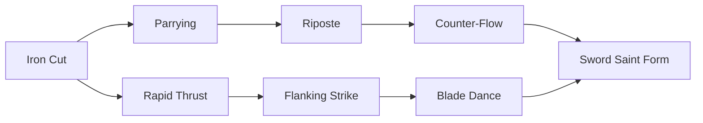
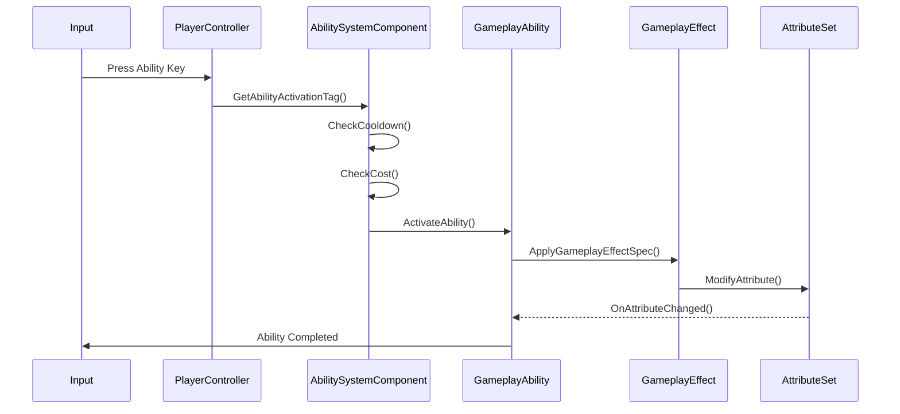
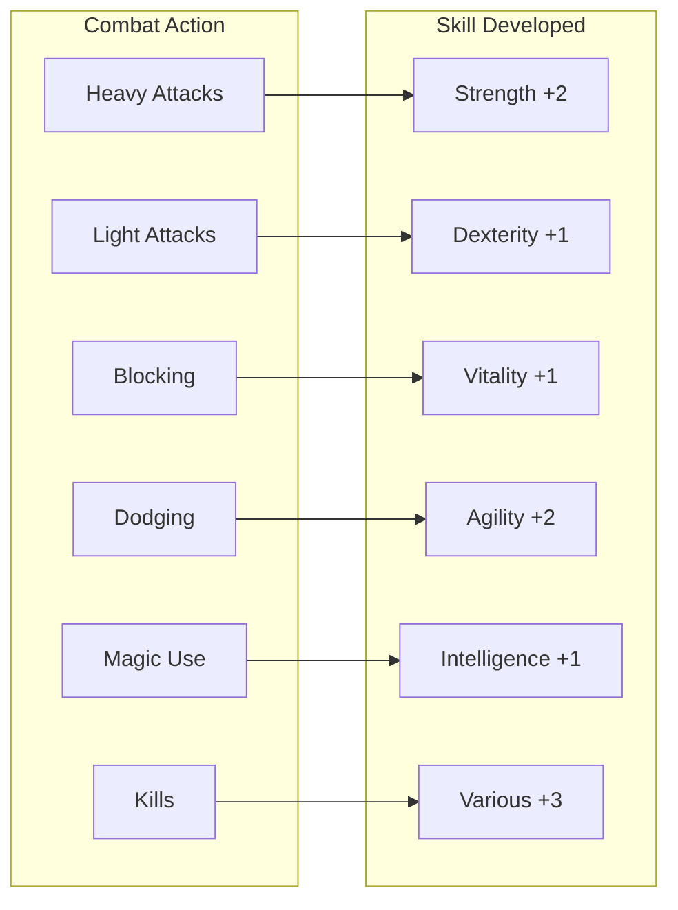

# ⚔️ Combat System: The Art of War in the Divided Realm

> *"In the Divided Realm, combat is not just about killing your enemy—it's about choosing who you become. Every blow struck, every wound inflicted, every life taken shapes your very soul. The way you fight defines what you are."*
> — **Kael the Border Ranger**

---

## Overview

Combat in Dark Age is designed around **meaningful choice and consequence**. Unlike traditional action RPGs where combat is purely mechanical, here every engagement carries weight. Your combat style shapes your character's development, affects how NPCs perceive you, and determines which abilities become available to you.

The combat system operates on three interconnected layers:

1. **Physical Combat Layer** - Mundane fighting techniques available to all
2. **Ability Combat Layer** - Gameplay Ability System (GAS) powered skills
3. **Soul Combat Layer** - Magic-based attacks that affect the opponent's Soul Shard

---

## Physical Combat System

### Combat Stances

Every warrior begins with access to three fundamental stances. Your proficiency in each stance develops through use, unlocking advanced techniques.

#### The Defender's Stance

**Philosophy**: *"The best battle is the one that never happens. When it does happen, the best victory is survival."*

| Technique | Description | Stamina Cost | Skill Required |
|-----------|-------------|--------------|----------------|
| **Guard** | Raise weapon to block incoming attacks | 5/sec | Beginner |
| **Counter** | Parry and immediately counterattack | 15 | Intermediate |
| **Shield Bash** |bash with shield to stun | 20 | Intermediate |
| **Fortress** | Become immovable, reflect projectiles | 40 | Master |
| **Last Stand** | Double defenses when below 25% HP | 0 (cooldown) | Expert |

#### The Aggressor's Stance

**Philosophy**: *"Strike first. Strike hard. There is no mercy in combat, only victory."*

| Technique | Description | Stamina Cost | Skill Required |
|-----------|-------------|--------------|----------------|
| **Slash** | Quick diagonal cut | 8 | Beginner |
| **Thrust** | Powerful forward stab | 12 | Beginner |
| **Flurry** | Rapid chain of attacks | 25 | Intermediate |
| **Cleave** | Wide arc attack hitting multiple targets | 30 | Intermediate |
| **Execute** | Deadly blow against weakened enemies | 50 | Master |
| **Bloodrage** | Sacrifice health for overwhelming offense | 0 (HP cost) | Expert |

#### The Evader's Stance

**Philosophy**: *"Hit without being hit. A warrior who cannot be touched is already victorious."*

| Technique | Description | Stamina Cost | Skill Required |
|-----------|-------------|--------------|----------------|
| **Dodge** | Quick roll to avoid attack | 15 | Beginner |
| **Sidestep** | Lateral movement to avoid | 10 | Beginner |
| **Dash Strike** | Charge through enemy | 20 | Intermediate |
| **Shadow Step** | Teleport short distance | 35 | Advanced |
| **Blur** | Move so fast attacks miss | 50 | Master |
| **Phasing** | Briefly become intangible | 60 | Expert |

### Weapon Mastery

Weapons in Dark Age are categorized by their mastery trees. Training in a weapon unlocks techniques specific to that weapon type.

#### Sword Mastery

The sword represents balance—offense and defense in equal measure.



| Technique | Type | Effect | Unlocks At |
|-----------|------|--------|-------------|
| **Iron Cut** | Basic | Standard slash attack | Level 1 |
| **Parrying** | Defensive | Block and prepare counter | Level 5 |
| **Rapid Thrust** | Offensive | Quick succession of stabs | Level 10 |
| **Riposte** | Counter | Counterattack after successful block | Level 15 |
| **Flanking Strike** | Tactical | Attack from behind | Level 20 |
| **Counter-Flow** | Advanced | Redirect enemy force | Level 30 |
| **Blade Dance** | Expert | Whirlwind of steel | Level 40 |
| **Sword Saint Form** | Master | Ultimate sword technique | Level 50 |

#### Axe Mastery

Axes prioritize power over precision—devastating but slower.

| Technique | Type | Effect | Unlocks At |
|-----------|------|--------|-------------|
| **Cleave** | Basic | Wide chopping attack | Level 1 |
| **Maul** | Basic | Heavy overhead strike | Level 1 |
| **Sunder** | Offensive | Reduce enemy armor | Level 10 |
| **Decapitate** | Lethal | Execute weakened enemies | Level 20 |
| **Berserker Rage** | Buff | Attack speed boost | Level 25 |
| **Executioner's Chord** | Ultimate | Devastating spinning attack | Level 50 |

#### Bow Mastery

Ranged combat with emphasis on precision and positioning.

| Technique | Type | Effect | Unlocks At |
|-----------|------|--------|-------------|
| **Aim Shot** | Basic | Standard ranged attack | Level 1 |
| **Quick Shot** | Basic | Rapid fire while moving | Level 5 |
| **Piercing Arrow** | Advanced | Arrow penetrates multiple targets | Level 15 |
| **Snipe** | Advanced | Long-range critical hit | Level 25 |
| **Rain of Arrows** | Area | Volley over wide area | Level 40 |
| **Arrow Storm** | Ultimate | Continuous rain of arrows | Level 50 |

---

## Gameplay Ability System Integration

All combat capabilities flow through Unreal Engine's Gameplay Ability System (GAS), providing a unified framework for both mundane and magical combat.

### Ability Activation Flow



### Ability Categories

#### Offensive Abilities

| Ability Name | Type | Damage | Cost | Cooldown | Description |
|--------------|------|--------|------|----------|-------------|
| **Slash** | Physical | 100% Weapon | 10 Stamina | 1.0s | Basic melee attack |
| **Power Strike** | Physical | 200% Weapon | 25 Stamina | 3.0s | Heavy melee attack |
| **Magic Missile** | Magical | 120% Spell | 15 Mana | 2.0s | Projectile attack |
| **Fireball** | Area | 150% Spell | 40 Mana | 8.0s | Explosive area damage |
| **Soul Rend** | Soul | 180% Spell | 50 Mana | 10.0s | Damages enemy Soul Shard |

#### Defensive Abilities

| Ability Name | Type | Effect | Cost | Cooldown | Description |
|--------------|------|--------|------|----------|-------------|
| **Block** | Physical | 50% damage reduction | 5/sec | 0s | Active block |
| **Dodge Roll** | Physical | Evade attack | 15 Stamina | 1.5s | Quick evasion |
| **Stone Skin** | Buff | +50% armor | 30 Mana | 20s | Temporary defense |
| **Healing Light** | Restoration | Restore 30% HP | 40 Mana | 15s | Heal self or ally |
| **Phase Shift** | Buff | Invulnerable 2s | 50 Mana | 30s | Brief invulnerability |

#### Crowd Control Abilities

| Ability Name | Type | Duration | Cost | Cooldown | Description |
|--------------|------|----------|------|----------|-------------|
| **Stun** | Physical | 2s | 20 Stamina | 8s | Render enemy immobile |
| **Fear** | Soul | 5s | 30 Mana | 15s | Enemy flees in terror |
| **Root** | Magic | 3s | 25 Mana | 12s | Immobilize target |
| **Silence** | Magic | 4s | 20 Mana | 10s | Prevent ability use |
| **Sleep** | Magic | 10s | 45 Mana | 30s | Put target to sleep |

### Combat Effects System

#### Damage Types

Dark Age uses a granular damage type system for tactical combat:

| Damage Type | Physical? | Affected By | Notes |
|-------------|-----------|-------------|-------|
| **Slashing** | Yes | Armor | Standard melee |
| **Piercing** | Yes | Armor, Dodge | Good vs armored |
| **Blunt** | Yes | Armor, Vitality | Good vs shields |
| **Fire** | No | Fire Resistance | Over time |
| **Ice** | No | Cold Resistance | Slows target |
| **Lightning** | No | Lightning Resistance | Chain damage |
| **Void** | No | None | Ignores resistances |
| **Soul** | No | Soul Defense | Damages will |

#### Resistance and Mitigation

```mermaid
flowchart TB
    subgraph Damage["Incoming Damage"]
        Raw[Raw Damage Value]
    end
    
    subgraph Mitigation["Damage Mitigation"]
        DR[Damage Reduction]
        Resist[Resistance %]
        Armor[Armor Formula]
    end
    
    subgraph Calculation["Final Calculation"]
        Formula[(Raw - DR) * (1 - Resist) / ArmorMult]
    end
    
    Raw --> DR
    DR --> Formula
    Resist --> Formula
    Armor --> Formula
```

---

## Soul Combat: The Deepest Layer

When combatants possess Shard Sight, they can engage in Soul Combat—direct attacks on the opponent's essence.

### Soul Shard Attacks

#### For Additive Mages

| Technique | Effect | Cost | Risk |
|-----------|--------|------|------|
| **Mending Touch** | Heal target's Soul Shard | 30 Mana | None |
| **Binding Threads** | Restrain enemy's movements | 40 Mana | Can be countered |
| **Shield of Light** | Protective aura | 50 Mana | None |
| **Brand of Truth** | Reveal hidden enemies | 25 Mana | None |
| **Purifying Flame** | Burn away corruption | 60 Mana | High |

#### For Subtractive Mages

| Technique | Effect | Cost | Risk |
|-----------|--------|------|------|
| **Soul Tear** | Damage enemy essence | 35 Mana | Corruption build-up |
| **Hunger Void** | Drain life force | 45 Mana | Addiction risk |
| **Silencing Touch** | Nullify abilities | 40 Mana | None |
| **Void Step** | Walk through reality | 50 Mana | Getting lost |
| **Unmaking** | Destroy utterly | 100 Mana | Consumption risk |

### The Confessor's Art

The most terrifying combat technique—combining Additive and Subtractive magic:

> ⚠️ **Warning**: The Confessor's Touch is the only technique that can permanently destroy a player's identity. Its use is tracked globally and carries severe reputation consequences.

| Technique | Effect | Cost | Consequence |
|-----------|--------|------|-------------|
| **The Touch** | Take control of enemy | 100 Mana | Permanent will damage |
| **Hollow Creation** | Create obedient servant | 200 Mana | Lose emotion permanently |
| **Soul Brand** | Mark target for hunting | 50 Mana | Target gains resistance |
| **Mass Confession** | Affect multiple targets | 300 Mana | Massive corruption |

---

## Enemy AI Combat Behavior

### AI Behavior Trees

Enemies in Dark Age use sophisticated behavior trees that adapt to player tactics.

```mermaid
graph TD
    Start[Combat Start] --> Assess{Assess Threat}
    Assess -->|Stronger| Flee[Attempt Escape]
    Assess -->|Weaker| Attack[Engage Attack]
    Assess -->|Equal| Maneuver[Tactical Maneuver]
    
    Attack --> CombatStyle{Style}
    CombatStyle -->|Aggressive| Aggressive[Maximum Offense]
    CombatStyle -->|Defensive[Defensive]
    CombatStyle -->|Cautious[Hit and Run]
    
    Maneuver --> Flank[Flank Attack]
    Maneuver --> Range[Maintain Distance]
    Maneuver --> Call[Call for Help]
    
    Aggressive --> Overextend{Overextended?}
    Overextend -->|Yes| Retreat[Strategic Retreat]
    Overextend -->|No| Continue[Continue Attack]
```

### Enemy Types and Tactics

#### Basic Enemies

| Enemy | Tactics | Weakness | Drops |
|-------|---------|----------|-------|
| **Bandit** | Group ambush, melee | Fire | Gold, common gear |
| **Soldier** | Formation combat, shield wall | Lightning | Armor pieces |
| **Mage** | Ranged spells, barriers | Physical | Spell components |
| **Assassin** | Stealth, critical hits | Area denial | Poison, daggers |

#### Elite Enemies

| Enemy | Tactics | Strategy | Drops |
|-------|---------|----------|-------|
| **Void Knight** | Heavy armor, void magic | Kite and range | Legendary gear |
| **Confessor** | Mind control, healing | Burst damage | Unique abilities |
| **Wraith** | Ethereal, phasing | Soul magic | Ethereal materials |
| **Dragon** | Fire breath, flight | Patience, ranged | Dragon scales |

#### Boss Enemies

| Boss | Phase 1 | Phase 2 | Phase 3 | Strategy |
|------|---------|---------|---------|----------|
| **The Unweaver** | Minion summoning | Reality manipulation | Void transformation | Save abilities for final phase |
| **Covenant Commander** | Tactical positioning | Army support | Enraged attack | Interrupt healing |
| **Void Titan** | Physical attacks | Area effects | berserker mode | Dodge everything |

---

## Combat Progression System

### Skill Development Through Combat

Your combat abilities grow based on how you fight:



### Advanced Combat Metrics

| Metric | Description | Affects |
|--------|-------------|---------|
| **Combat Rating** | Overall combat effectiveness | Matchmaking, damage dealt |
| **Survival Rating** | Defensive capabilities | Mitigation, healing received |
| **Threat Level** | Aggro generation | Party role, enemy focus |
| **Kill Count** | Enemies defeated | Unlocks techniques, titles |
| **Death Count** | Times defeated | Reputation, unlock restrictions |

---

## Player vs Player Combat

### PvP Modes

#### Dueling

Structured 1v1 combat with rules:
- No outside interference
- Equalized equipment (optional)
- Honor system enforced
- Ranked and unranked options

#### Battlegrounds

Objective-based team combat:
- **Capture the Flag**: Secure enemy artifact
- **Domination**: Control capture points
- **Assassination**: Eliminate VIP target
- **Siege**: Destroy enemy fortifications

#### Open World PvP

Free-form combat in designated zones:
- Territory control conflicts
- Random encounters
- Bounty system
- Guard NPC interactions

### PvP Mechanics

#### Honor System

| Honor Level | Title | Benefits |
|-------------|-------|----------|
| **Dishonored** | Deserter | -50% rewards, NPCs attack on sight |
| **Neutral** | Adventurer | Normal gameplay |
| **Honorable** | Knight | +10% rewards, NPC discounts |
| **Exalted** | Champion | +25% rewards, unique vendors |

#### Combat Logging Prevention

- Death triggers brief invulnerability for resurrection
- Leaving combat zone teleports to nearest jail
- AFK detection prevents farming

---

## Accessibility and Balance

### Assist Options

| Option | Function | Default |
|--------|----------|---------|
| **Auto-attack** | Automatic basic attacks | Off |
| **Aim assist** | Magnetic targeting | Off |
| **Reduced motion** | Slower animations | Off |
| **One-hand mode** | Simplified controls | Off |
| **Audio cues** | Sound-based enemy alerts | On |

### Balance Philosophy

> *"Every build must be viable. Every playstyle must have counterplay. Every advantage must have a cost."*

| Principle | Implementation |
|-----------|----------------|
| **No dominant strategies** | Rock-paper-scissors balance |
| **Skill expression** | High skill ceiling, accessible floor |
| **Pacing variety** | Build diversity encouraged |
| **Counterplay** | Every advantage has weakness |

---

## Future Combat Expansions

### Planned Features

- **Combo System**: String attacks into custom combos
- **Weapon Crafting**: Create unique weapons with special properties
- **Counter System**: Timing-based defensive reactions
- **Mounted Combat**: Fight from horseback, creature-back
- **Siege Warfare**: Massive battles with weaponized structures
- **Underwater Combat**: Complete water-based mechanics

---

> *"The blade does not choose who it cuts. The hand that wields it must choose. That is the only difference between warrior and murderer—choice. Choose wisely."*
> — **Kael the Border Ranger**
