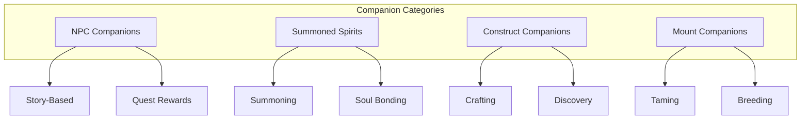
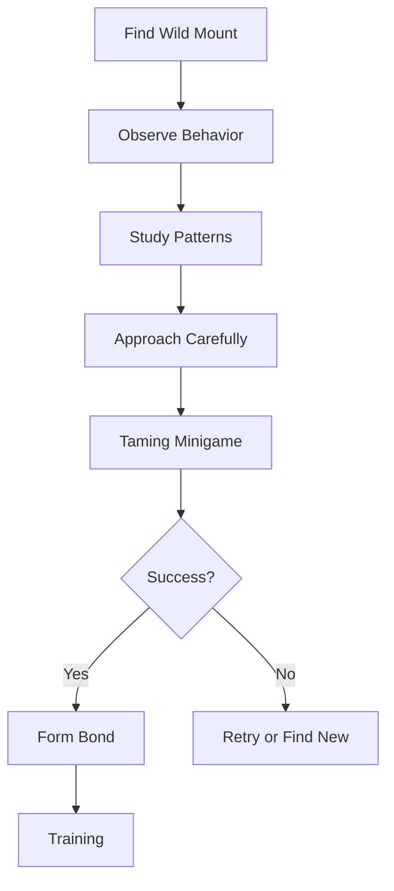

e# 🤝 Companions & Mounts: Bonds Beyond the Veil

> *"In a world fractured by the Veil, friendship is the one bond that transcends reality itself. A faithful companion is worth more than a legion of Hollow soldiers."*
> — **Lyra the Bone Woman**

---

## Overview

The Divided Realm is dangerous, but no one has to face it alone. Dark Age features deep systems for companions and mounts that go beyond simple mechanical benefits—these relationships are narrative pillars that shape your journey.

### Core Philosophy

> *"A mount is not just transportation. A companion is not just a helper. They are souls who chose to walk beside you. Treat them accordingly."*

The companion and mount systems are designed around:
- **Narrative Depth** - Each companion has their own story and arc
- **Mechanical Synergy** - Build-defining abilities and bonuses
- **Emotional Investment** - Relationships that evolve over time
- **Practical Utility** - Real gameplay advantages

---

## Companions System

### Companion Types

There are four categories of companions, each with unique roles and acquisition methods:

### NPC Companions

#### Acquisition Methods

| Method | Description | Requirements |
|--------|-------------|--------------|
| **Story Progression** | Companions join through main story | Complete specific quests |
| **Side Quests** | Earn loyalty through side content | Complete companion's personal quest |
| **Reputation** | High faction reputation unlocks | Reach specific reputation level |
| **Rescue** | Save trapped or injured NPCs | Complete rescue missions |
| **Recruitment** | Convince join through dialogue | Meet specific conditions |

#### Companion Roster

##### Kael the Border Ranger (Warrior)

> *"I've watched good men die for causes they didn't understand. I won't let that happen to you. Not if I have anything to say about it."*

| Attribute | Value |
|-----------|-------|
| **Class** | Warrior/Tank |
| **Origin** | Former Covenant soldier |
| **Personality** | Loyal, protective, haunted |
| **Specialty** | Defensive combat, tactics |

**Abilities**:
| Ability | Effect | Unlocked |
|---------|--------|----------|
| **Shield Wall** | 50% damage reduction for ally | Level 10 |
| **Rallying Cry** | +20% damage for allies | Level 20 |
| **Last Stand** | Immortal for 5s at low HP | Level 30 |
| **Commander's Voice** | Taunt all nearby enemies | Level 40 |

**Personal Quest**: *"The Deserters"*
- Help Kael confront his former unit
- Consequences affect Covenant reputation
- Unlocks unique defensive abilities

##### Vaelith the Confessor (Healer/Mage)

> *"I was trained to destroy people's souls. Now I use what I learned to protect them. The Covenants call this betrayal. I call it redemption."*

| Attribute | Value |
|-----------|-------|
| **Class** | Healer/Support |
| **Origin** | Former Covenant Confessor |
| **Personality** | Kind, conflicted, wise |
| **Specialty** | Healing, protection, revelation |

**Abilities**:
| Ability | Effect | Unlocked |
|---------|--------|----------|
| **Mending Light** | Heal ally for 200% Magic | Level 10 |
| **Protective Aura** | 30% damage reduction | Level 20 |
| **Truth Reveal** | Show hidden enemies | Level 30 |
| **Purify** | Remove all debuffs | Level 40 |

**Personal Quest**: *"The Confessor's Burden"*
- Help Vaelith come to terms with her past
- Choose between redemption or revenge
- Determines her final ability tree

##### Soren the Wizard (Mage)

> *"Magic is not power. Magic is understanding. And understanding is the one thing the Covenants fear more than anything."*

| Attribute | Value |
|-----------|-------|
| **Class** | Arcane Mage |
| **Origin** | Former First Wizard |
| **Personality** | Eccentric, wise, trickster |
| **Specialty** | Elemental magic, knowledge |

**Abilities**:
| Ability | Effect | Unlocked |
|---------|--------|----------|
| **Fireball** | 150% Magic damage | Level 10 |
| **Frost Nova** | AoE freeze | Level 20 |
| **Arcane Intellect** | +30% Mana regen | Level 30 |
| **Time Warp** | Double attack speed | Level 40 |

**Personal Quest**: *"The Seven Rules"*
- Learn Soren's philosophical teachings
- Choices shape your character's magic
- Final lesson determines ultimate ability

##### Lyra the Bone Woman (Mystic)

> *"Death is not the enemy. Death is just a door. Some doors lead to better places. Some lead to the Void. I help people choose the right door."*

| Attribute | Value |
|-----------|-------|
| **Class** | Necromancer/Healer |
| **Origin** | Void-touched healer |
| **Personality** | Eerie, compassionate, death-wisdom |
| **Specialty** | Both healing and dark magic |

**Abilities**:
| Ability | Effect | Unlocked |
|---------|--------|----------|
| **Bone Shield** | Temporary hitpoints | Level 10 |
| **Soul Drain** | Drain HP from enemies | Level 20 |
| **Death's Door** | Revive at 1 HP | Level 30 |
| **Hollow Army** | Summon skeleton allies | Level 40 |

**Personal Quest**: *"The Edge of the Void"*
- Journey to the Void's edge with Lyra
- Discover her true origins
- Choose her fate—and yours

##### Seraphina the Echoed (Scout)

> *"I exist in a thousand worlds simultaneously. I remember every version of myself. And I remember every version of you. Fascinating, isn't it?"*

| Attribute | Value |
|-----------|-------|
| **Class** | Scout/Rogue |
| **Origin** | The Echoed |
| **Personality** | Playful, mysterious, ancient |
| **Specialty** | Stealth, information, cross-Echo |

**Abilities**:
| Ability | Effect | Unlocked |
|---------|--------|----------|
| **Shadow Step** | Teleport behind target | Level 10 |
| **Echo Sight** | See all Echoes simultaneously | Level 20 |
| **Memory Walk** | Recall any location visited | Level 30 |
| **Paradox Strike** | Attack from multiple Echoes | Level 40 |

**Personal Quest**: *"The Many Selves"*
- Help Seraphina find unity
- Interact with her Echo copies
- Unlocks cross-Echo abilities

### Companion Loyalty System

| Loyalty Level | Bonus Effects | Ability Access |
|--------------|---------------|----------------|
| Hostile | -20% effectiveness | None |
| Unfriendly | -10% effectiveness | Basic only |
| Neutral | Normal | Standard |
| Friendly | +10% effectiveness | Standard |
| Honored | +20% effectiveness + unique | Advanced |
| Revered | +30% effectiveness + gear | Advanced |
| Legendary | Full potential + ultimate | All abilities |

### Companion Equipment

Companions can be equipped with gear:

| Slot | Equipment Type | Effect |
|------|---------------|--------|
| **Weapon** | Companion-specific | Damage/stats |
| **Armor** | Companion-specific | Defense/stats |
| **Accessory 1** | Ring/Amulet | Special bonus |
| **Accessory 2** | Ring/Amulet | Special bonus |
| **Soul Gem** | Embedded gem | Special ability |

---

## Mounts and Riding System

### Mount Types

#### Land Mounts

| Mount | Speed | Capacity | Terrain | Rarity |
|-------|-------|----------|---------|--------|
| **War Horse** | 100% | 1 rider | Plains, roads | Common |
| **Armored Destrier** | 90% | 1 rider + gear | All land | Uncommon |
| **Void Wolf** | 110% | 1 rider | All terrain | Rare |
| **Corrupted Bear** | 80% | 2 riders | Forests, mountains | Rare |
| **Bone Griffin** | 130% | 2 riders | All land | Epic |
| **Void Drake** | 150% | 2 riders | All terrain | Legendary |

#### Aquatic Mounts

| Mount | Speed | Capacity | Abilities |
|-------|-------|----------|----------|
| **Giant Turtle** | 60% | 4 riders | Underwater breathing |
| **Drowned Serpent** | 100% | 2 riders | Deep diving |
| **Abyssal Leviathan** | 120% | 6 riders | Summon whirlpools |

#### Flying Mounts

| Mount | Speed | Capacity | Abilities |
|-------|-------|----------|-----------|
| **Peregrine Falcon** | 150% | 1 rider | Fastest in air |
| **Giant Bat** | 130% | 1 rider | Night vision |
| **Griffin** | 140% | 2 riders | Land/air transition |
| **Wyvern** | 160% | 2 riders | Fire breath |
| **Void Phoenix** | 180% | 2 riders | Resurrection on death |

### Mount Acquisition

#### Taming

**Taming Requirements**:
- Taming skill (increases with practice)
- Specific food/preferences
- Time investment
- Failure possible (mount attacks)

#### Breeding

| Parent 1 | Parent 2 | Offspring | Chance |
|----------|----------|-----------|--------|
| War Horse | War Horse | War Horse (100%) | Guaranteed |
| War Horse | Void Wolf | Void Hound (50%) | 50% failure |
| Griffin | Wyvern | Gryphon (25%) | Rare |
| Any Legendary | Any Legendary | Hybrid (10%) | Very rare |

#### Quest Rewards

| Quest | Mount Reward | Requirements |
|-------|--------------|---------------|
| "The Lost Cavalry" | War Horse | Complete quest chain |
| "Master of the Hunt" | Void Wolf | Defeat alpha wolf |
| "The King's Steed" | Armored Destrier | Help king retake throne |
| "Breeders' Road" | Griffin | Complete breeding quest line |

### Mount Training

| Skill | Description | Levels |
|-------|-------------|--------|
| **Riding** | Basic mount control | 1-100 |
| **Advanced Riding** | Combat while mounted | 1-50 |
| **Mount Armor** | Equip armor on mount | 1-25 |
| **Breeding** | Create new mount variants | 1-100 |
| **Taming** | Tame wild mounts | 1-100 |

### Mount Abilities

Mounts gain abilities as they level:

| Level | Ability | Effect |
|-------|---------|--------|
| 10 | **Sprint** | Temporary speed boost |
| 20 | **Charge** | Damage on impact |
| 30 | **Dismount** | Quick dismount |
| 40 | **Mounted Combat** | Fight while mounted |
| 50 | **Ultimate** | Unique mount-specific |
| 60 | **Bond** | Special companion link |
| 70 | **Mastery** | Full potential unlocked |
| 80 | **Legendary Form** | Visual transformation |
| 90 | **Ethereal** | Can phase through obstacles |
| 100 | **Mythic** | Ultimate mount ability |

---

## Companion/Mount Synergy

### Combined Abilities

When certain companions and mounts are used together:

| Companion | Mount | Synergy Ability |
|-----------|-------|----------------|
| Kael | Armored Destrier | **Shield Charge** - Kael creates barrier while you charge |
| Vaelith | Griffin | **Healing Winds** - Vaelith heals while you fly |
| Soren | Void Phoenix | **Arcane Flight** - Fire spells while flying |
| Lyra | Void Wolf | **Death March** - Lyra raises fallen enemies as you ride |
| Seraphina | Any | **Echo Jump** - Teleport to any visited location |

### Bonding System

Deepen your relationship with companions and mounts:

**Bonding Activities**:
- Complete quests together
- Spend time in world (idle proximity)
- Give gifts
- Equip matching gear
- Share victories

---

## Housing and Stable Systems

### Personal Stables

| Stable Level | Mount Capacity | Features |
|--------------|----------------|----------|
| Basic | 2 mounts | Basic care |
| Enhanced | 4 mounts | Training area |
| Luxury | 6 mounts | Breeding pen |
| Royal | 10 mounts | Magical enhancements |
| Legendary | 20 mounts | Mythic stable |

### Companion Housing

| Housing Type | Companion Slots | Benefits |
|--------------|-----------------|----------|
| Camp | 1 companion | Mobile base |
| Cottage | 2 companions | Personal space |
| Manor | 4 companions | Guest rooms |
| Castle | 8 companions | Throne room |

---

## Future Features

### Planned Expansions

- **More Companion Quests**: Deep story arcs for each companion
- **Mount Customization**: Visual modifications, armor
- **Breeding System Expansion**: More hybrid possibilities
- **Companion Storage**: Store companions when not in use
- **Cross-Echo Travel**: Companions travel between realities with you

---

> *"The bond between rider and mount is the oldest magic. Older than the Veil, older than the Covenants, older than the Void itself. Honor that bond, and it will honor you."*
> — **Soren the Wizard**
