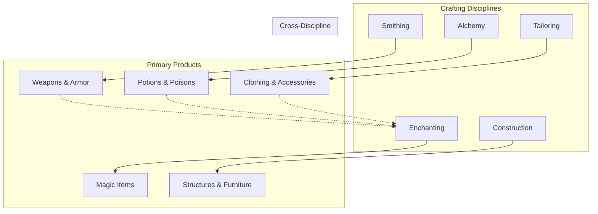
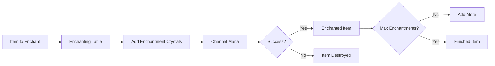
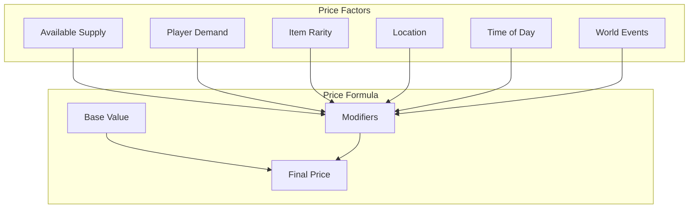

# 🔨 Crafting & Economy: The Blood and Soul of Trade

> *"Gold is just shiny metal until someone decides what it's worth. In the Divided Realm, worth is measured in blood, sweat, and the souls of those who dare to create."*
> — **Martha Goldfinger, Merchant Prince of the Borderlands**

---

## Overview

The economy of Dark Age is a living, breathing system driven by player actions. Unlike traditional MMOs where NPCs dominate crafting, Dark Age places the means of production directly into players' hands. The things that power the world—its weapons, its medicines, its magical artifacts—are all created by players.

This creates a unique economic landscape where:
- **Crafters are essential** - Without player crafters, the world lacks vital goods
- **Specialization matters** - No one can master everything
- **Economy is player-driven** - Prices fluctuate based on supply and demand
- **Risk creates value** - The rarest materials require dangerous expeditions

---

## Crafting System

### Core Philosophy

> *"A sword is not just steel shaped by fire. It is the will of the maker given form. Every craft carries a piece of the crafter's soul."*

Crafting in Dark Age is more than a gameplay mechanic—it's a narrative element. Items crafted by skilled artisans carry bonuses that reflect the crafter's expertise and reputation.

### Crafting Disciplines

There are five primary crafting disciplines, each with unique recipes, materials, and playstyles:



#### 1. Smithing (Weapons & Armor)

**Philosophy**: *"Fire purifies. Hammer shapes. The metal remembers what the maker intends."*

| Skill Level | Title | Ability |
|-------------|-------|---------|
| 1-20 | Apprentice | Basic weapons, simple armor |
| 21-40 | Journeyman | Quality gear, weapon modifications |
| 41-60 | Expert | Masterwork items, rare schematics |
| 61-80 | Master | Legendary crafting, unique designs |
| 81-100 | Grandmaster | Soul-forged items, player-named techniques |

**Materials Required**:

| Material Type | Source | Common Uses |
|---------------|--------|-------------|
| **Iron Ore** | Mining nodes | Basic weapons |
| **Coal** | Mining nodes | Fuel for forge |
| **Steel Ingot** | Processed | Quality weapons |
| **Mithril** | Rare nodes | Light armor |
| **Adamantite** | Boss drops | Heavy armor |
| **Dragon Scale** | Dragons | Legendary items |
| **Void Iron** | Void zones | Corrupted gear |

**Specialization Trees**:

```
                    [WEAPON SMITHING]
                           │
        ┌──────────────────┼──────────────────┐
        │                  │                  │
   Sword Mastery      Axe Mastery       Polearm Mastery
        │                  │                  │
   ┌────┴────┐        ┌───┴───┐         ┌───┴───┐
   │         │        │       │         │       │
Rapiers  Greatswords  Battleaxes  Warhammers  Halberds  Spears

                    [ARMOR SMITHING]
                           │
        ┌──────────────────┼──────────────────┐
        │                  │                  │
   Light Armor         Medium Armor      Heavy Armor
        │                  │                  │
   Leather  Chain    Composite  Scale   Plate  Shield
```

#### 2. Alchemy (Potions & Poisons)

**Philosophy**: *"In the smallest drop lies the power to heal or kill. The difference is knowledge."*

| Potion Type | Effect | Ingredients | Difficulty |
|-------------|--------|-------------|------------|
| **Health Potion** | Restore HP | Bloodleaf, Spring Water | Beginner |
| **Stamina Draught** | Restore Stamina | Mountain Root, Ginseng | Beginner |
| **Mana Elixir** | Restore Mana | Moonpetal, Crystal Dew | Intermediate |
| **Antidote** | Cure poison | Sage, Garlic | Intermediate |
| **Strength Brew** | Temporary +STR | Bear's Heart, Ironbeard | Advanced |
| **Invisibility Potion** | Vanish 30s | Shadow Essence, Ghostleaf | Expert |
| **Essence of Life** | Resurrect if within 5s | Shard of True Life component | Master |

**Gathering Professions**:

| Gathering | Materials Collected | Tool Required |
|-----------|-------------------|--------------|
| **Herbology** | Plants, flowers | Sickle |
| **Mining** | Ores, gems | Pickaxe |
| **Skinning** | Hides, bones | Skinning Knife |
| **Butchering** | Meat, organs | Cleaver |
| **Void Extraction** | Essence, corruption | Void Crystal |

#### 3. Enchanting (Magic Item Creation)

**Philosophy**: *"To enchant is to trap a piece of infinity in finite matter. The magic remembers. The item becomes."*

**Enchantment Categories**:

| Category | Effect Types | Required Skill |
|----------|--------------|----------------|
| **Weapon Enchantments** | Fire, Ice, Lightning, Soul | 30+ |
| **Armor Enchantments** | Resistance, Protection | 25+ |
| **Utility Enchantments** | Speed, Stealth, Detection | 20+ |
| **Soul Enchantments** | Life steal, Mana drain | 50+ |
| **Void Enchantments** | Corruption, Fear | 70+ |

**Enchantment Process**:



#### 4. Construction (Structures & Furniture)

**Philosophy**: *"Four walls and a roof are not a home. A home is where the heart settles. Build with purpose, build with meaning."*

| Structure Type | Materials Required | Time | Use |
|----------------|-------------------|------|-----|
| **Basic Shelter** | 50 Wood, 20 Stone | 30 min | Personal housing |
| **Guild Hall** | 500 Wood, 200 Stone, 50 Iron | 4 hours | Guild base |
| **Trading Post** | 200 Wood, 100 Stone, 50 Gold | 2 hours | Player shop |
| **Windmill** | 300 Wood, 100 Stone | 3 hours | Resource generation |
| **Fortification** | 1000 Stone, 200 Iron | 8 hours | Territory defense |

#### 5. Tailoring (Clothing & Accessories)

**Philosophy**: *"Clothes tell stories. The fabric remembers the hands that sewed it, the body that wore it, the battles it survived."*

| Item Type | Materials | Stats Provided |
|-----------|-----------|----------------|
| **Leather Armor** | Treated hides | Agility, Defense |
| **Cloth Robes** | Enchanted fabrics | Mana, Comfort |
| **Chainmail** | Metal rings | Defense, Flexibility |
| **Traveler's Boots** | Various | Speed, Stamina |
| **Noble's Finery** | Rare fabrics | Charisma, Style |

---

## Economy System

### Currency Types

Dark Age uses a multi-currency system reflecting the complexity of its world:

| Currency | Source | Uses | Exchangeable |
|----------|--------|------|--------------|
| **Gold** | Drops, quests, trade | General purchases | Yes |
| **Faction Tokens** | Faction activities | Faction vendors | No |
| **Soul Essence** | Void creatures, crafting | High-tier crafting | Yes (limited) |
| **Echo Crystals** | Each Echo | Cross-Echo travel | Yes |
| **Reputation Marks** | Reputation gains | Rank-up items | No |
| **Arena Points** | PvP matches | PvP gear | No |
| **Crafting Tokens** | Crafting achievements | Recipe unlocks | No |

### Market System

#### Player Markets

Players can establish shops in designated areas:

| Market Type | Requirements | Benefits | Costs |
|-------------|--------------|----------|-------|
| **Basic Stall** | 10,000 Gold | 5 item slots | 500 Gold/day |
| **Player Shop** | Guild or 50,000 Gold | 20 item slots | 2,000 Gold/day |
| **Trading House** | Guild + Territory | 100 item slots | 10,000 Gold/day |
| **Auction House** | Territory Control | Global listing | 5% commission |

#### Dynamic Pricing

Prices fluctuate based on:



### Trade Systems

#### Direct Trading
- Player-to-player barter
- Gold for items
- Item for item (evaluated by system)

#### Auction House
- List items for bidding
- Buy-now pricing option
- Global accessibility

#### Guild Trading
- Internal guild exchange
- Shared resource pools
- Taxable transfers

#### Cross-Echo Trade
- Trade between realities
- Arbitrage opportunities
- Unique Echo goods

---

## Resource Generation

### Player-Driven Production

#### Gathering Nodes

| Resource Type | Respawn Time | Locations | Skill Gained |
|---------------|--------------|-----------|--------------|
| **Iron Vein** | 15 min | Mountains, caves | Mining +1 |
| **Herb Patch** | 10 min | Forests, meadows | Herbalism +1 |
| **Animal Herd** | 30 min | Plains, forests | Skinning +1 |
| **Fishing Spot** | 5 min | Rivers, lakes, ocean | Fishing +1 |
| **Void Deposit** | 60 min | Corrupted zones | Void Extraction +1 |

#### Production Buildings

| Building | Output | Requirements | Maintenance |
|----------|--------|--------------|-------------|
| **Farm** | Food, herbs | Territory | Gold/day |
| **Mine** | Ores | Territory, miners | Gold/day |
| **Workshop** | Crafted items | Building, crafter | Materials |
| **Trading Post** | Income | Building, stock | Gold, stock |

### Economic Sinks

To prevent inflation, the economy includes built-in sinks:

| Sink Type | Frequency | Impact |
|-----------|-----------|--------|
| **Repair Costs** | Every death | Removes gold |
| **Taxation** | Daily | Territory upkeep |
| **Crafting Failures** | Random | Material destruction |
| **Travel Costs** | Every trip | Cross-Echo fees |
| **Soul Anchor Repair** | After death | Massive gold removal |
| **Housing Maintenance** | Weekly | Building upkeep |

---

## Rare and Legendary Crafting

### Soul Anchor Crafting

> ⚠️ **Exclusive to Permadeath Mode**

Soul Anchors are the most critical crafted item in the game, required for the Standard Mode resurrection system.

**Required Components**:
- 500 Void Essence
- 50 Soul Shards (from enemies)
- 5 Echo Crystals (one from each Echo)
- 1 Essence of Binding (rare drop)
- 100 Masterwork Iron

**Crafter Requirements**:
- Permadeath character
- Master-level Additive Magic
- Master-level Subtractive Magic
- 200+ crafting skill

**Time Investment**:
- Casual: 6-8 months
- Dedicated: 2-3 months
- Guild-assisted: 1 month

### Shard of True Life Crafting

> ⚠️ **Exclusive to Permadeath Mode**

The most valuable item in the game—can restore a character from True Death.

**Required Components**:
- 1,000 Void Essence
- 100 Soul Shards
- 10 Echo Crystals
- 1 Pure Heart (from ultimate good deed)
- 1 Dark Pact (from ultimate sacrifice)
- 500 Masterwork materials

**Crafter Requirements**:
- Permadeath character
- Grandmaster Additive + Subtractive Magic
- 300+ crafting skill
- Legendary crafting station access

**Time Investment**:
- Casual: 12-18 months
- Dedicated: 6-8 months
- Guild effort: 3-4 months

> *"A Shard of True Life is not merely an item—it is a second chance at existence. The power to create one comes only from those who understand the true cost of death."*

---

## Economic Impact of Game Modes

### Single Mode Economy

- NPC vendors with fixed prices
- No player trading
- Reduced loot quality
- Limited crafting recipes
- Gold has limited utility

### Multi Mode Economy

- Full player-driven market
- Dynamic pricing
- Player-crafted everything
- Territory control affects production
- Guild economies

### Cross-Mode Considerations

| Aspect | Single Mode | Multi Mode | Transfers? |
|--------|-------------|------------|------------|
| Gold | Capped, NPC only | Unlimited, player | ❌ No |
| Recipes | Basic only | Everything | 50% XP |
| Materials | Common/Uncommon | All rarities | ❌ No |
| Crafted Items | Basic | Legendary | ❌ No |

---

## Market Manipulation and Rules

### Prohibited Activities

- **Real Money Trading**: Against Terms of Service
- **Price Fixing**: Automated monitoring detects collusion
- **Hoarding**: Server-wide alerts for rare material囤积
- **Exploit Trading**: Bug exploitation results in bans

### Protected Systems

- **Minimum Prices**: Items cannot be listed below 10% of value
- **Transaction Limits**: Maximum gold per transaction
- **Market Cooldowns**: New listings require wait time

---

## Future Economic Features

### Planned Expansions

- **Player-Owned Banks**: Secure storage with interest
- **Guild Stock Markets**: Invest in guilds
- **Land Development**: Build cities, not just buildings
- **Shipping Lanes**: Trade route ownership
- **Manufacturing Chains**: Resource processing pipelines
- **Contract System**: Player-written quests

---

> *"The economy of the Divided Realm is simple: you get what you work for, you keep what you can defend, and you lose what you cannot protect. Welcome to the market."*
> — **Martha Goldfinger**
