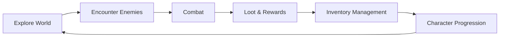
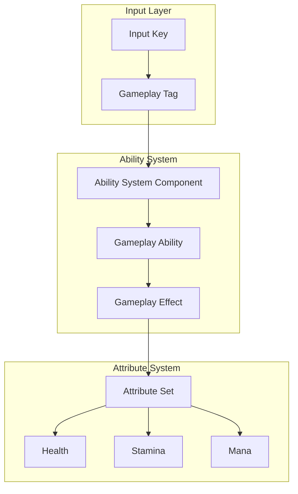
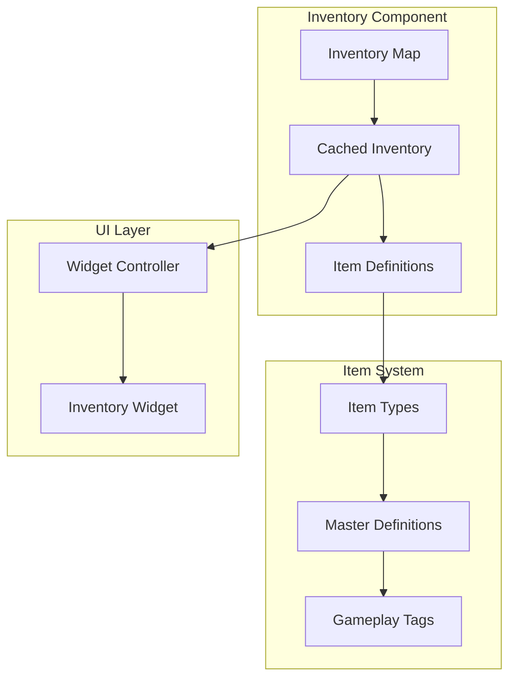
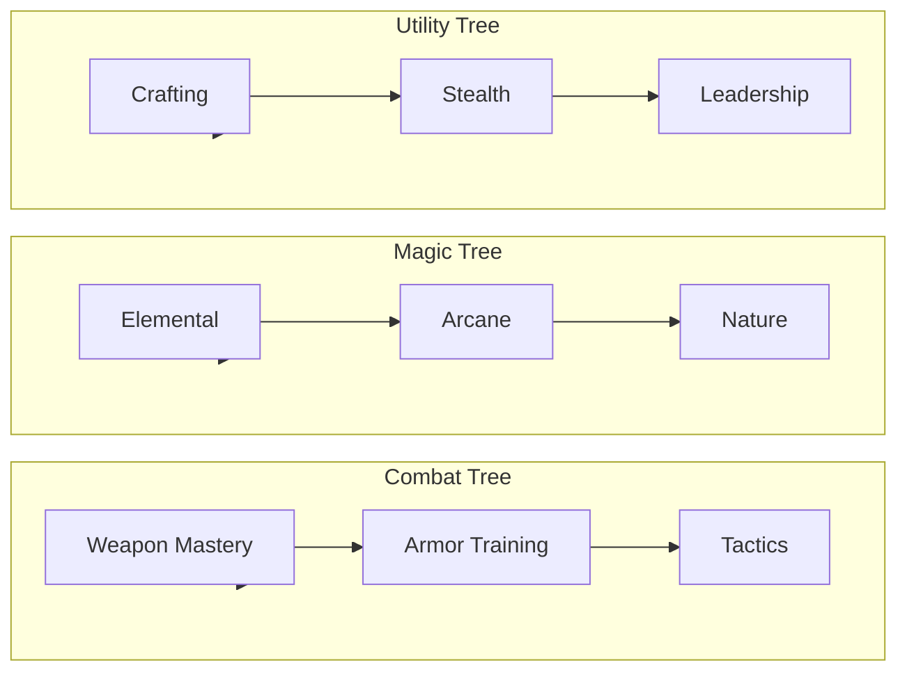

# Gameplay Overview

## 🎮 Core Gameplay Loop

### Primary Activities

1. **Exploration** - Navigate diverse environments, discover secrets
2. **Combat** - Engage enemies using abilities and tactics
3. **Looting** - Collect items, gear, and resources
4. **Progression** - Level up, unlock abilities, improve attributes

---

## ⚔️ Combat System

### Gameplay Ability System (GAS) Architecture

### Combat Mechanics

| Mechanic | Description | Status |
|----------|-------------|--------|
| **Basic Attacks** | Light and heavy attack combos | ✅ Implemented |
| **Abilities** | Special skills using GameplayAbility | ✅ Implemented |
| **Dodging** | Stamina-based evasion | 📋 Planned |
| **Blocking** | Damage mitigation | 📋 Planned |
| **Status Effects** | Buffs, debuffs, DoTs | 🔄 In Progress |

### Ability Types

1. **Offensive** - Damage dealing abilities
2. **Defensive** - Shields, healing, buffs
3. **Utility** - Movement, crowd control
4. **Ultimate** - High cooldown, powerful effects

---

## 📦 Inventory System

### Architecture

### Features

| Feature | Description | Status |
|---------|-------------|--------|
| **Tag-Based Items** | Items identified by GameplayTags | ✅ Implemented |
| **Stacking** | Multiple quantities of same item | ✅ Implemented |
| **Categories** | Weapons, Consumables, Materials | ✅ Implemented |
| **Tooltips** | Detailed item information | 🔄 In Progress |
| **Drag & Drop** | Intuitive item management | 📋 Planned |
| **Crafting** | Item combination system | 💡 Concept |

---

## 🎭 Character Progression

### Attributes

| Attribute | Description | Base Value | Max Value |
|-----------|-------------|------------|-----------|
| **Health** | Hit points | 100 | Variable |
| **Max Health** | Health cap | 100 | Variable |
| **Stamina** | Action resource | 50 | Variable |
| **Max Stamina** | Stamina cap | 50 | Variable |
| **Mana** | Magic resource | 50 | Variable |
| **Max Mana** | Mana cap | 50 | Variable |

### Progression Paths

---

## 🌐 Multiplayer

### Network Architecture

- **Client-Server Model** - Authoritative server
- **Replication** - Actor and variable replication
- **Prediction** - Client-side prediction for responsive gameplay

### Supported Modes

| Mode | Players | Description | Status |
|------|---------|-------------|--------|
| **Single Player** | 1 | Solo adventure | ✅ Implemented |
| **Co-op** | 2-4 | Cooperative campaign | 📋 Planned |
| **PvP** | 2-8 | Player vs Player | 💡 Concept |

---

## 🎮 Controls

### Default Bindings

| Action | Keyboard | Gamepad |
|--------|----------|---------|
| Move | WASD | Left Stick |
| Camera | Mouse | Right Stick |
| Attack | Left Click | RT |
| Ability 1 | Q | LB |
| Ability 2 | E | RB |
| Inventory | I | Menu |
| Interact | F | X |
| Sprint | Shift | L3 |
| Dodge | Space | A |

### Input System

The game uses Unreal Engine 5's Enhanced Input system with:
- Context-sensitive mappings
- Separate mobile controls
- Rebindable keys (planned)

---

## 📋 Feature Roadmap

### Phase 1 - Core (Current)
- ✅ Basic character controller
- ✅ Gameplay Ability System integration
- ✅ Inventory system
- ✅ Basic UI

### Phase 2 - Combat
- 🔄 Combat abilities
- 📋 Enemy AI
- 📋 Damage system
- 📋 Loot tables

### Phase 3 - Progression
- 📋 Experience system
- 📋 Skill trees
- 📋 Equipment system
- 📋 Crafting

### Phase 4 - Content
- 📋 Level design
- 📋 Quest system
- 📋 NPCs and dialogue
- 📋 World events

---

*Last updated: 2026-02-28*
