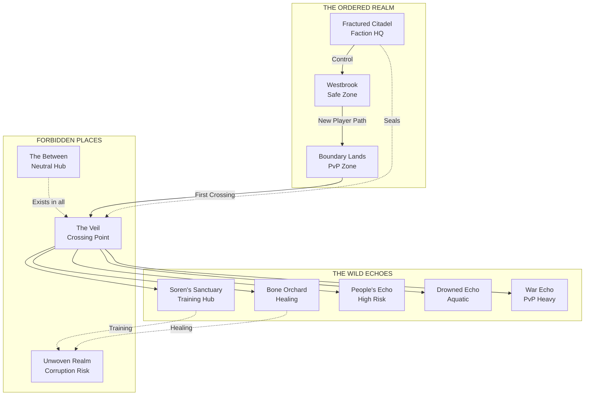

i# 🗺️ The Lands of the Divided Realm

> *"A place is not just geography. A place is the agreements people have made about what is real. Cross into another Echo, and you don't just change location—you change the rules of reality itself."*
> — **Lyra the Bone Woman**

---

## The Ordered Realm

### Westbrook: Where Journeys Begin

A frontier town at the edge of the Covenants' control, Westbrook represents the last outpost of something like freedom. Here, millions of players take their first steps into the world.

**Key Features**:
- **The Green Way**: A woods-guide's path that leads beyond the Veil
- **The Council House**: Where the town's diminished elders meet
- **The Awakening Grounds**: Where players first manifest Shard Sight
- **The Refugee Camp**: Where those fleeing the Covenants gather

**Atmosphere**: A place of quiet desperation mixed with stubborn hope. Players begin here as ordinary people in extraordinary circumstances.

**Multiplayer Elements**:
- New player tutorials happen here
- Safe zone—PvP disabled
- Player housing available after completing starter quests
- Marketplace for low-level trading

---

### The Fractured Citadel: Heart of Control

The seat of Covenant power, a fortress-city of white stone and crystal spires. Here, magic is controlled, catalogued, and weaponized.

**Key Features**:
- **The Sharding Spire**: Where initiates learn to See Soul Shards
- **The Confessors' Cloister**: Where the feared mind-breakers are trained
- **The High Council Chamber**: Where twelve people decide the fate of millions
- **The Archives**: Forbidden knowledge under heavy guard

**Atmosphere**: Sterile, controlled, beautiful in a cold way. Everything is monitored.

**Multiplayer Elements**:
- Covenant faction headquarters
- High-tier crafting stations
- PvP-enabled areas for faction conflicts
- Guild registration for Covenant-aligned groups

---

### The Boundary Lands

The contested zone between the Ordered Realm and the Wild Echoes. Here, Covenant control weakens and reality becomes flexible.

**Key Features**:
- **The Shifting Wastes**: Desert that changes layout when unobserved
- **The Watchtowers**: Abandoned outposts from failed expansion attempts
- **Smuggler's Run**: Hidden paths used by those fleeing to freedom
- **The First Veil Crossing**: Where players first enter the Wild Echoes

**Atmosphere**: Dangerous, unpredictable, alive with possibility.

**Multiplayer Elements**:
- Open PvP zone
- Resource-rich but dangerous
- Faction skirmishes common
- Hideouts for criminal player organizations

---

## The Wild Echoes

### Soren's Sanctuary: The Wizard's Hut

A structure that exists in multiple Echoes simultaneously, accessible only to those who can See. Here, the mad wizard teaches those brave enough to seek him.

**Key Features**:
- **The Library of Rules**: Forbidden knowledge
- **The Practice Grounds**: Learn Shard manipulation safely
- **The Void Pool**: A window into the nothingness between realities
- **The Riddle Door**: Only opens for those who think differently

**Atmosphere**: Cozy chaos. Books everywhere, experiments gone wrong, laughter from empty corners.

**Multiplayer Elements**:
- Group training sessions
- Puzzle challenges requiring cooperation
- Safe haven for pursued players
- Portal hub to other Echoes

---

### The Bone Orchard: Lyra's Domain

A grove of white trees near the Void's edge, where Lyra practices her forbidden healing.

**Key Features**:
- **The Healing Circle**: Where damaged Soul Shards are mended
- **The Whispering Path**: Learn to hear the Night Wisps
- **The Edge Marker**: Furthest point anyone has traveled and returned
- **The Bone-Trees**: Living Shard-stuff that sings

**Atmosphere**: Eerie but peaceful. Death and life are neighbors here.

**Multiplayer Elements**:
- Healing services for injured players
- Training in Subtractive Magic
- Dangerous area—PvP enabled
- Rare crafting materials

---

### The People's Echo: The Unweaver's Paradise

An Echo where the Unweaver's philosophy has been fully implemented—a warning of control disguised as kindness.

**Key Features**:
- **The Harmonious City**: Beautiful, clean, orderly—everyone smiles
- **The Choice Centers**: Where citizens surrender their wills voluntarily
- **The Peace Garden**: Where conflicts are "resolved" through compliance
- **The Compliance Spires**: Broadcasting control to all residents

**Atmosphere**: Surface-level utopia, underlying horror. Everyone is happy because unhappiness is impossible.

**Multiplayer Elements**:
- High-risk, high-reward area
- Unweaver cultist player hub
- Special resources for control-based crafting
- Converting this area is a server-wide goal

---

### The Drowned Echo: The Sunken World

An Echo where the world is mostly ocean, where survivors live on floating cities.

**Key Features**:
- **The Floating City of Abyssal**: Built on tamed sea-beasts
- **The Drowned Cathedral**: Sunken temple to the Deep Current
- **The Breathing Gardens**: Where air is cultivated from Shard-stuff
- **The Abyssal Trenches**: Deepest points, home to Void creatures

**Atmosphere**: Beautiful, alien, claustrophobic. Light filters from above in gold shafts.

**Multiplayer Elements**:
- Underwater combat mechanics
- Unique aquatic mounts
- Trade hub for ocean resources
- Guild territories on floating platforms

---

### The War Echo: The Eternal Battlefield

An Echo locked in perpetual conflict—a warning of what happens when freedom becomes chaos.

**Key Features**:
- **The No-Man's Land**: Trenches filled with the Hollow
- **The Command Tents**: Warlords plan endless campaigns
- **The Peace Market**: Neutral ground for trading weapons
- **The Shattered Fortress**: Changes hands daily

**Atmosphere**: Exhausted desperation. Everyone wants to stop but no one trusts anyone enough.

**Multiplayer Elements**:
- Constant PvP zone
- Territory control mechanics
- Resource extraction under fire
- Mercenary player opportunities

---

## The Forbidden Places

### The Unwoven Realm

The space between Echoes, where the Void holds sway. Not a place but an **un-place**.

**Key Features**:
- **No consistent geography**: Landscape shifts by observer expectation
- **The Void Pools**: Areas of absolute nothingness
- **The Echo Fragments**: Memories of destroyed realities
- **The Hunger**: The Void itself, patient and eternal

**Atmosphere**: Wrong. Everything feels off. Time does not flow consistently.

**Multiplayer Elements**:
- Highest risk area
- Best rewards for survival
- Corruption mechanic—extended exposure changes players
- Group exploration recommended

---

### The Between: Sanctuary of the Echoed

A settlement built by and for the Echoed—those trapped between realities.

**Key Features**:
- **The Flickering Market**: Goods from all Echoes traded
- **The Anchor Stones**: Objects that help maintain identity
- **The Integration Chambers**: Where Echoed try to become whole
- **The Council of Fragments**: Leadership of the lost

**Atmosphere**: Hopeful desperation. Everyone is lost in some way.

**Multiplayer Elements**:
- Neutral ground—PvP disabled
- Cross-Echo trading hub
- Information market
- Refuge for players with corrupted Shards

---

## Reactive World Elements

### Dynamic Territories

| Territory | Controlled By | Benefits | Risks |
|-----------|--------------|----------|-------|
| **Westbrook** | Player majority faction | Safe trade, tutorials | Limited high-tier resources |
| **Fractured Citadel** | Covenants | Best crafting, information | Heavy surveillance |
| **Shifting Wastes** | Contested | Rare resources | Constant PvP |
| **Abyssal** | Player guilds | Unique aquatic resources | Environmental dangers |
| **War Echo** | Shifting | Combat experience | Permanent death possible |

### World Events

The world changes based on collective player actions:

- **The Unweaver's Advance**: If enough players embrace control, the Unweaver gains territory
- **The Veil Weakens**: If enough players use Void magic, Echoes merge temporarily
- **The Covenants' Purge**: If chaos grows too great, NPC crackdowns occur
- **The Festival of Shards**: Periodic celebration with unique quests

### Player-Constructed Locations

Players can shape the world:

- **Guild Halls**: Permanent structures in controlled territory
- **Trade Posts**: Player-established markets
- **Waypoints**: Fast-travel points unlocked by exploration
- **Monuments**: Memorials to legendary player deeds

---

## Traveling Between Echoes

### Methods of Crossing

| Method | Requirements | Risk | Multiplayer Note |
|--------|--------------|------|------------------|
| **Covenant Seal** | Official permission | None | Bound to character, not account |
| **Shardwalking** | Shard Sight ability | Getting lost | Can bring party members |
| **Void-Walking** | Subtractive Magic mastery | Consumption | Creates corruption stacks |
| **Echo-Sickness** | Being Echoed | Uncontrolled | Random destinations |
| **Portal Networks** | Player construction | Maintenance costs | Guild-controlled |

### The Experience of Crossing

Crossing between Echoes:
- Moment of absolute silence
- Sensation of being pulled in multiple directions
- Brief glimpse of alternate versions of oneself
- Smell of ozone and forgotten memories

---

## Mapping the Echoes

---

> *"I have walked in a hundred worlds. I have learned that there is no perfect place. Only places where different people suffer. The question is not 'which world is best?' The question is 'which suffering can we change?'"*
> — **Seraphina the Many**
