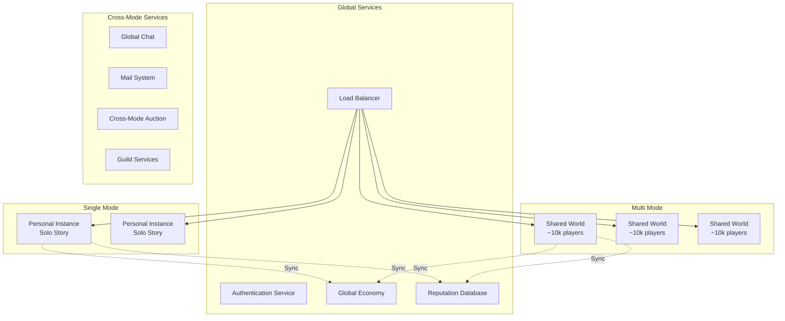
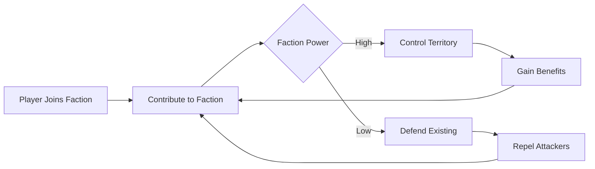
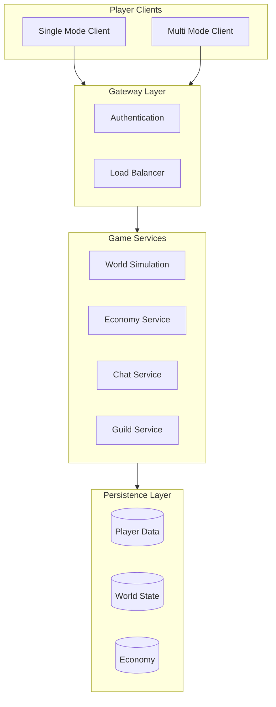

# 🌐 Multiplayer Design & Architecture

> *"A world with millions of heroes is a world with no heroes at all. But a world with millions of people making choices? That is a world worth living in."*
> — **Design Philosophy**

---

## Overview

Dark Age is designed as a **massively multiplayer online RPG** supporting millions of concurrent players. The world is persistent, reactive, and shaped by collective player behavior.

### Core Principles

1. **Player Agency**: Every player matters; no one is just a number
2. **Emergent Narrative**: Stories arise from player interaction, not scripted quests
3. **Meaningful Consequence**: Choices persist and affect the shared world
4. **Scalable Architecture**: Systems designed to handle millions without degradation
5. **Social Primacy**: Multiplayer interaction is the core experience

---

## Game Modes

### Single Mode vs. Multi Mode Architecture

Instead of traditional server sharding, Dark Age uses a **mode-based** system:

### Single Mode (Personal Instance)

**For players who prefer:**
- Solo story experience
- No PvP pressure
- Relaxed exploration
- Learning the game mechanics
- Playing without internet

**Features:**
- Personal instance of a **limited world** (not the full world)
- **Story-focused quests only** (no dynamic world events)
- AI-controlled companions (not other players)
- **Reduced loot quality** (greens and blues only, no epics/legendaries)
- **No permadeath option** (must play Multi Mode for permadeath)
- **No territory control** or player governance
- **No player economy** (NPC vendors only, fixed prices)
- **Level cap**: Maximum level 30 (Multi Mode goes to 100)
- **Echo travel restricted**: Only 2 Echoes available (Multi Mode has 10+)
- **Crafting limitations**: Cannot craft Soul Anchors, Shards of True Life, or legendary items
- **No guilds** or social structures

**What Transfers to Multi Mode:**
- Character appearance and name
- **50% of earned XP** (to prevent grinding exploits)
- Basic equipment (common and uncommon only)
- Learned recipes (common and uncommon only)
- Story progress (unlocks starting areas)

**What Does NOT Transfer:**
- Rare, Epic, or Legendary items (must be earned in Multi Mode)
- Gold (Multi Mode has its own economy)
- Territory control or reputation
- Permadeath unlocks or achievements
- Guild memberships

### Multi Mode (Shared World) - The True Dark Age Experience

**For players who want:**
- The complete Dark Age experience
- Full character progression (levels 1-100)
- Rare, Epic, and Legendary loot
- PvP, territory control, and player governance
- Permadeath mode (exclusive to Multi Mode)
- Player-driven economy and trading
- Guilds, kingdoms, and social structures
- All 10+ Echoes and world events

**Exclusive Multi Mode Features:**
- **Full loot tables**: Access to all item rarities
- **Permadeath Mode**: Ultimate risk/reward gameplay
- **Territory Control**: Claim and rule land
- **Player Governance**: Become King/Queen (permadeath only)
- **Player Economy**: Trade, auction house, dynamic pricing
- **Guilds & Kingdoms**: Social structures and warfare
- **World Events**: Dynamic, server-wide happenings
- **All Echoes**: Full access to the multiverse
- **Legendary Crafting**: Create Soul Anchors and Shards of True Life
- **Level 100 Cap**: Full character progression
- **Seasonal Content**: Time-limited events and rewards
- **Leaderboards**: PvP rankings, wealth, achievements

### Mode Transition Rules (Anti-Exploit)

**Single → Multi:**
- Character transfers with restrictions
- XP gains in Single Mode are **50% effective** in Multi Mode
- Equipment above uncommon quality **does not transfer**
- Gold **does not transfer** (Multi Mode economy is separate)
- Recipes for rare+ items **must be relearned** in Multi Mode
- **Cannot bypass level requirements** (level 30 cap in Single)
- **Cannot gain permadeath achievements** in Single Mode

**Multi → Single:**
- Can visit Single Mode anytime for story or practice
- Full character and gear transfers (for practice/testing)
- **No rewards earned in Single Mode** transfer back to Multi
- **Cannot farm Single Mode** for Multi Mode benefits
- Useful for:
  - Practicing boss fights
  - Testing new builds
  - Playing offline during travel
  - Experiencing story without competition

### Why Multi Mode is Superior

| Feature | Single Mode | Multi Mode |
|---------|------------|------------|
| **Max Level** | 30 | 100 |
| **Loot Quality** | Common/Uncommon only | All rarities including Legendary |
| **Permadeath** | ❌ Not available | ✅ Available with exclusive benefits |
| **Territory Control** | ❌ None | ✅ Full player governance |
| **Player Economy** | ❌ NPC vendors only | ✅ Dynamic player-driven market |
| **Crafting** | Basic only | Legendary recipes (Soul Anchors, etc.) |
| **Echo Access** | 2 Echoes | 10+ Echoes |
| **World Events** | ❌ Static only | ✅ Dynamic server events |
| **Guilds** | ❌ None | ✅ Full guild system |
| **PvP** | ❌ None | ✅ Full PvP and warfare |
| **Leaderboards** | ❌ None | ✅ Global rankings |
| **Seasonal Content** | ❌ None | ✅ Time-limited events |

> 💡 **Design Philosophy**: Single Mode is a "demo/tutorial" experience. Multi Mode is the **real game** where legends are made. Single Mode lets you learn and enjoy the story, but Multi Mode is where you achieve greatness.

---

## Player Interaction Systems

### Faction Warfare

Players align with factions that control territory:

- **Territory Control**: Factions claim regions through PvP and influence
- **Benefits**: Controlled territories provide resources, crafting bonuses, and safe zones
- **Defense**: Territories must be defended from rival factions
- **Conquest**: Players can siege and capture enemy territories

### Player Governance & Kingdom Building

Dark Age takes inspiration from Starfield's persistent universe—but instead of exploring different planets, players navigate between **different realities (Echoes)**. Each Echo is a fully realized world with unique:
- Physics and magic rules
- NPC populations and cultures
- Resources and challenges
- Player-built settlements

#### The Permadeath Sovereignty Rule

**Only permadeath mode characters can rule as Kings, Queens, or High Rulers.**

This creates a unique dynamic:
- Standard mode players can achieve high ranks (lords, governors, generals)
- But the ultimate power is reserved for those who risk everything
- This makes permadeath players incredibly valuable and influential
- Kingdoms compete to recruit and protect permadeath players

**Why This Matters:**
- Creates natural hierarchy based on risk/reward
- Standard players serve under permadeath rulers
- Permadeath rulers depend on standard players for protection
- Symbiotic relationship between game modes

#### Guilds, Coalitions & Kingdoms

Players don't just join factions—they **create and rule them**:

**Guilds** (10+ players):
- Claim territory within an Echo
- Establish internal hierarchies and ranks
- Create custom laws within their domain
- War with other guilds for control
- Standard mode: Can be guild leaders
- Permadeath mode: Can establish legendary guilds with special bonuses

**Coalitions** (Alliance of Guilds):
- Multiple guilds unite under shared governance
- Elect council representatives
- Control larger regions spanning multiple settlements
- Shape Echo-wide policies
- Standard mode: Can serve as council members
- Permadeath mode: Can be High Councilors with veto power

**Kingdoms** (Massive Coalitions):
- Rule entire regions with player kings/queens
- **ONLY permadeath characters can be crowned**
- Establish taxation and trade laws across multiple Echoes
- Command armies of allied players
- NPCs within the kingdom adapt to player rule
- Standard players serve as nobles, knights, and advisors

#### Territory Control System

| Control Level | Requirements | Benefits | Ruler Requirement |
|--------------|--------------|----------|-------------------|
| **Settlement** | 1 Guild, 10+ players | Guild housing, local market, crafting stations | Any player |
| **Town** | 1 Coalition, 50+ players | NPC population, quest generation, tax income | Standard or Permadeath |
| **Region** | 1 Kingdom, 200+ players | Multiple towns, military command, Echo influence | Permadeath only |
| **Echo** | Alliance of Kingdoms, 1000+ players | Control Echo rules, access to unique resources | Permadeath only |

#### The Permadeath Protection Economy

Because permadeath rulers are irreplaceable:

- **Elite Guard**: Standard players can become Royal Guard (highly paid)
- **Bounty System**: Rewards for protecting permadeath rulers
- **Assassination Contracts**: High-risk, high-reward PvP missions
- **Royal Insurance**: Guilds pool resources to fund permadeath ruler recovery
- **Succession Planning**: Permadeath rulers appoint heirs (standard mode players)

#### Cross-Echo Governance

Like Starfield's ship allowing travel between planets, **Shardwalking** allows players to:
- Establish settlements in multiple Echoes
- Create trade routes between realities
- Project power across dimensional borders
- Escape persecution by fleeing to other Echoes

#### Player-Led World Events

Player rulers can trigger world-wide events:

- **War Declarations**: Formal warfare between kingdoms across Echoes
- **Trade Embargoes**: Economic warfare affecting multiversal commerce
- **Echo Merges**: Temporary alignment of Echoes for massive events
- **Crusades**: United campaigns against the Unweaver spanning all realities
- **Royal Tournaments**: Permadeath-only competitions with legendary rewards

#### Governance Mechanics

Player rulers must manage:

- **Economy**: Set taxes, manage trade routes between Echoes, fund infrastructure
- **Justice**: Establish laws that persist across player territories
- **Defense**: Maintain armies, build fortifications, patrol borders
- **Diplomacy**: Negotiate with other player kingdoms across realities
- **NPC Relations**: Keep NPC populations content or face uprisings
- **Succession**: Train and appoint standard-mode heirs

#### NPC Integration

Player kingdoms include NPC populations that:
- **Work** player-owned farms, mines, and workshops
- **Pay taxes** to fund kingdom operations
- **Join armies** as militia during wars
- **Rebel** if mistreated (affecting productivity)
- **Tell stories** about player rulers that become legends
- **Admire permadeath rulers** more (unique interactions)

---

## Instance Types

| Type | Description | Capacity | Mode |
|------|-------------|----------|------|
| **Persistent World** | Main game world | 10,000 per instance | Multi Mode |
| **Personal Instance** | Single-player story areas | 1 player | Single Mode |
| **Dungeon Instances** | PvE content | 5-25 players | Both Modes |
| **PvP Battlegrounds** | Structured PvP | 50-100 players | Multi Mode |
| **Personal Housing** | Player homes | 1 player + guests | Both Modes |
| **Guild Strongholds** | Guild territories | 100+ guild members | Multi Mode |

---

## Economy

**Player-Driven Market**:
- All items crafted by players
- Supply and demand determines prices
- Regional markets with trade routes
- Black markets in lawless areas
- Permadeath crafters control essential markets (Soul Anchors, Shards)

**Currency Systems**:
- **Gold**: Standard currency for most transactions
- **Faction Tokens**: Faction-specific rewards
- **Shard Essence**: Rare crafting material used as high-value currency
- **Barter**: Direct item trading

---

## Social Structures

### Guilds
- **Formation**: 10+ players required
- **Ranks**: Customizable hierarchy
- **Benefits**: Shared storage, group content, territorial claims
- **Warfare**: Can declare war on other guilds
- **Permadeath Bonus**: Guilds led by permadeath players gain special abilities

### Friend System
- **Cross-Mode**: Friends list works in Single and Multi modes
- **Benefits**: XP bonuses when playing together
- **Shardwalking**: Can travel to friend's Echo instantly
- **Legacy**: Inherit from deceased friends

### Reputation
- **Player Reputation**: Track record with other players
- **Faction Reputation**: Standing with NPC factions
- **World Reputation**: Global fame/infamy
- **Permadeath Bonus**: Permadeath players gain reputation faster

---

## PvP Systems

### Consensual PvP
- **Dueling**: 1v1 structured combat
- **Battlegrounds**: Team-based objective modes
- **Tournaments**: Scheduled competitive events
- **Permadeath Arenas**: High-stakes combat (optional permadeath risk for rewards)

### Territory PvP
- **Open World**: Contested zones allow unrestricted PvP
- **Sieges**: Large-scale castle/fortress battles
- **Raids**: Guerrilla attacks on enemy settlements
- **Assassination**: High-value target elimination (often permadeath rulers)

### PvP Rewards
- **Honor Points**: Currency for PvP gear
- **Territory**: Control of resource-rich areas
- **Prestige**: Cosmetic rewards and titles
- **Legendary Gear**: Unique items from PvP achievements

---

## Communication

### Channels
- **Global**: Cross-mode chat
- **Echo**: Current reality only
- **Guild**: Guild members only
- **Party**: Current group
- **Whisper**: Direct message
- **RP**: Roleplay channel

### Features
- **Voice Chat**: Built-in proximity and group voice
- **Mail**: Cross-mode messaging and item transfer
- **Bulletin Boards**: Player-posted quests and advertisements
- **Herald System**: Town criers broadcast important news

---

## Technical Implementation

### Network Architecture

### Persistence
- **Player Data**: Saved continuously
- **World State**: Persistent across sessions
- **Territory Control**: Saved in real-time
- **Economy**: Global and persistent
- **Cross-Mode**: Seamless data transfer

### Scalability
- **Horizontal Scaling**: Add instances as player count grows
- **Database Sharding**: Split data across multiple databases
- **Caching**: Frequently accessed data cached in memory
- **CDN**: Static assets delivered via CDN

---

## Anti-Cheat & Security

### Measures
- **Client Validation**: Server authoritative for all critical calculations
- **Behavioral Analysis**: ML-based detection of suspicious patterns
- **Report System**: Player-driven reporting with investigation
- **Permadeath Protection**: Special monitoring for high-value permadeath characters

### Penalties
- **Temporary Ban**: 1-30 days
- **Permanent Ban**: Account termination
- **Character Deletion**: For severe exploits (even permadeath characters)
- **Economy Rollback**: Reverse ill-gotten gains

---

## Future Expansions

### Planned Features
- **Guild Wars 2.0**: Large-scale alliance warfare
- **Player Cities**: Build and manage entire cities
- **Sea Travel**: Naval combat and exploration
- **Airships**: Travel between Echoes in style
- **Permadeath Tournaments**: Esports-style competitions
- **Legacy System**: Descendants inherit traits from permadeath heroes

### Community Tools
- **Modding Support**: Custom content creation
- **API Access**: Third-party tools and websites
- **Streaming Integration**: Built-in OBS support
- **Tournament Tools**: Organized competitive play

---

> *"In Dark Age, you're not just playing a game—you're living in a world that remembers. Every choice echoes across realities."*
