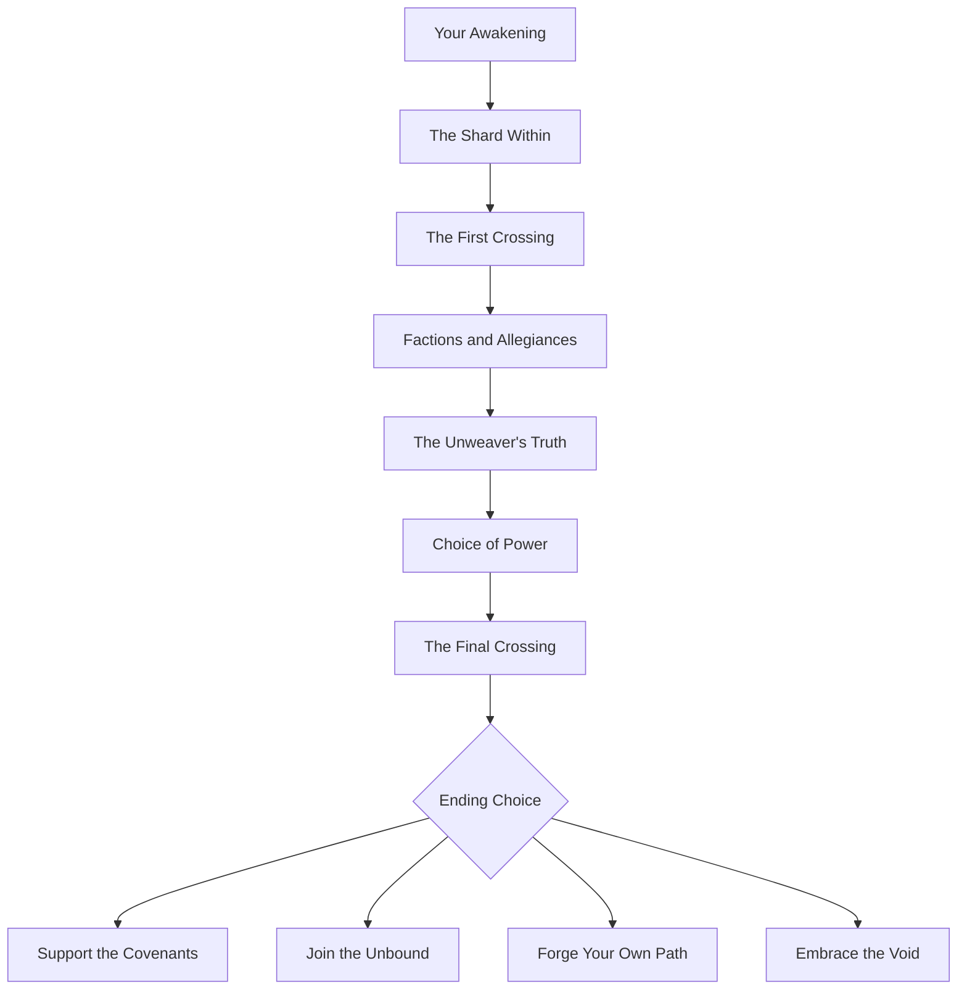
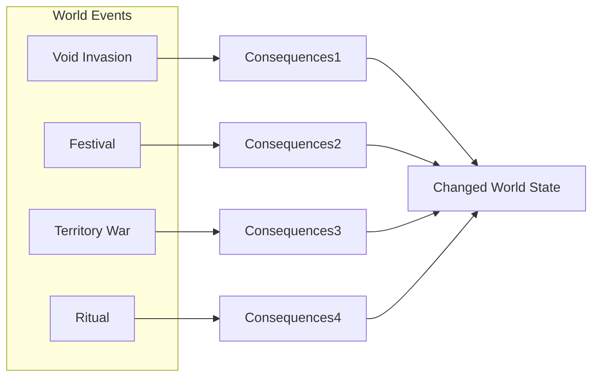
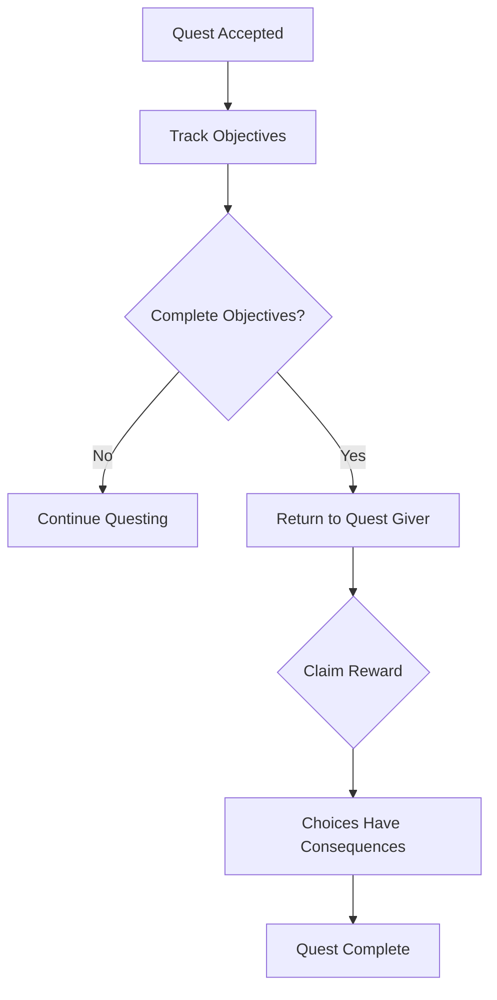
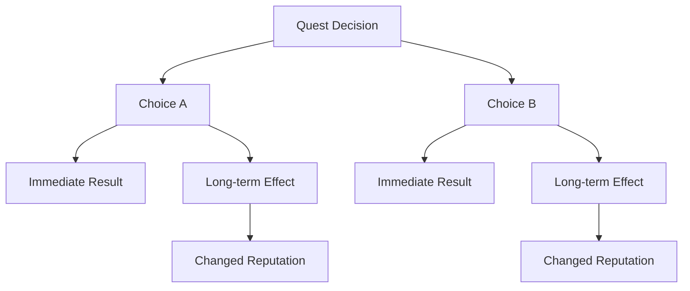
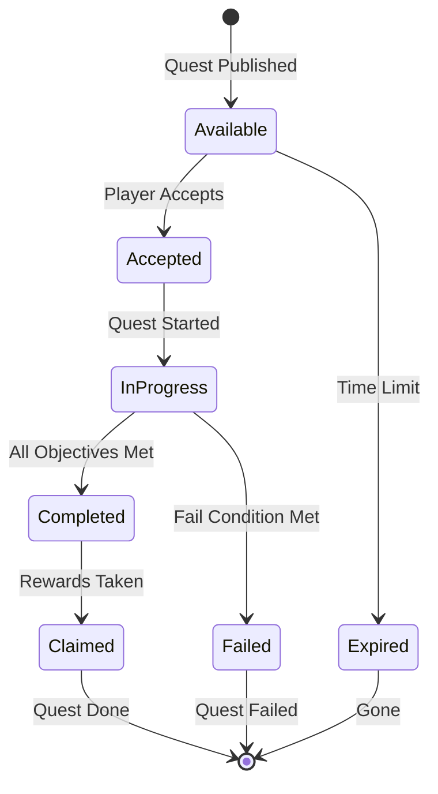

# 📜 Quests & Missions: Your Path Through the Divided Realm

> *"Every quest is a choice. Every choice has consequences. The question is not 'what will you do?' The question is 'who will you become?'"*
> — **Soren the Wizard**

---

## Overview

Quests in Dark Age are designed around player agency and meaningful consequence. Unlike traditional MMOs where quests are fetch-deliver loops, every quest in the Divided Realm shapes your character's identity, reputation, and abilities.

### Core Philosophy

> *"There are no 'right' quests, only right intentions and right outcomes. Or wrong intentions and wrong outcomes. Choose carefully."*

The quest system emphasizes:
- **Player Choice** - Every quest has multiple solutions
- **Consequence** - Your decisions matter and persist
- **Emergence** - Quests react to player behavior
- **Narrative Depth** - Stories that respect your time and intelligence

---

## Quest Categories

### Main Story Quests

The main narrative arc of Dark Age focuses on the conflict between the Covenants, the Unbound, and the growing threat of the Unweaver.



#### Chapter Overview

| Chapter | Title | Core Theme | Key Decisions |
|---------|-------|------------|---------------|
| 1 | The Shard Within | Discovery | Trust Vaelith or investigate alone? |
| 2 | The First Crossing | Freedom | Help refugees or report them? |
| 3 | Factions and Allegiances | Loyalty | Join Covenant, Unbound, or remain neutral? |
| 4 | The Unweaver's Truth | Truth | Expose Covenants or hide truth? |
| 5 | Choice of Power | Sacrifice | Use forbidden magic to win? |
| 6 | The Final Crossing | Destiny | Save one reality or all of them? |

### Side Quests

Side quests in Dark Age are character-driven stories that explore the world's depth:

| Quest Type | Description | Examples |
|------------|------------|----------|
| **Character Quests** | Deep dive into companion/NPC stories | Kael's past, Lyra's origins |
| **Location Quests** | Discover secrets of places | Explore ruins, find hidden areas |
| **Faction Quests** | Specific to faction progression | Covenant duties, Unbound raids |
| **World Quests** | Emergent events and discoveries | Random encounters, world mysteries |

### Daily and Weekly Quests

Recurring quests that provide steady progression:

| Quest Type | Frequency | Purpose |
|-----------|-----------|---------|
| **Bounties** | Daily | Hunt specific enemies |
| **Gathering** | Daily | Collect resources |
| **Dungeon Runs** | Weekly | Complete challenging content |
| **PvP Objectives** | Weekly | Territory and honor |
| **World Events** | Random | Server-wide participation |

### World Events

Dynamic, server-wide events that shape the world:



#### Event Types

| Event | Description | Player Impact |
|-------|-------------|---------------|
| **The Unweaver's Advance** | Void army attacks | Territory changes, NPC reactions |
| **Festival of Shards** | Celebration in safe zones | Bonus rewards, special vendors |
| **Covenant Purge** | Increased patrols | Caution required, avoided areas |
| **The Veil Weakens** | Echoes merge temporarily | Cross-realm access, chaos |
| **Harvest Moon** | Enhanced gathering | Double resources |
| **Blood Moon** | Increased danger | Rare spawns, elite enemies |

---

## Quest Mechanics

### Quest Acceptance

| Method | Description | Availability |
|--------|-------------|--------------|
| **NPC Greeting** | Talk to quest-giver | Always |
| **Quest Board** | Centralized quest listing | Major locations |
| **Discovery** | Find quest markers in world | Exploration |
| **Companion Suggestion** | Companion recommends | Companion level |
| **Faction Offer** | Automatic at rank-up | Faction reputation |
| **Player Quest** | Created by players | Player economy |

### Quest Progression Tracking



### Quest Objectives

| Objective Type | Description | Tracking |
|----------------|-------------|----------|
| **Kill** | Defeat specific enemies | Kill counter |
| **Collect** | Gather items | Inventory check |
| **Interact** | Use/activate objects | Proximity trigger |
| **Deliver** | Take items to locations | Location trigger |
| **Escort** | Protect NPC | Survival check |
| **Discover** | Find locations | Exploration flag |
| **Craft** | Create items | Crafting log |
| **Social** | Talk to NPCs | Dialogue completion |

---

## Branching Narratives

### Choice Consequence System

Every significant choice in Dark Age creates branching paths:



### Reputation Impact

| Action | Faction Impact | World Impact |
|--------|----------------|---------------|
| Save Covenant soldier | +Covenant rep | None |
| Kill Unbound member | -Unbound rep | Unbound hostile |
| Expose Covenant corruption | +Unbound, -Covenant | NPCs discuss |
| Help refugees cross | +Unbound, +Covenant (sneak) | Faction tension |
| Use Void magic publicly | +Void-touched, -Covenant | Fear reactions |

### Quest Examples

#### "The Prisoner's Dilemma"

**Giver**: A captured Covenant soldier
**Situation**: The soldier has information about an upcoming raid, but will die without help

**Options**:
| Choice | Action | Consequence |
|--------|--------|-------------|
| **Save Him** | Heal and release | +Covenant rep, soldier lives |
| **Interrogate** | Question for info then release | Both faction reps, info gained |
| **Turn Him In** | Return to Covenant | +Covenant rep, soldier imprisoned |
| **Execute Him** | Kill immediately | +Unbound rep, -Covenant rep |
| **Use Him as Bait** | Trap his rescuers | -Reputation all, tactical advantage |

---

## Quest Rewards

### Reward Types

| Reward Type | Description | Tradeable? |
|-------------|-------------|-------------|
| **Experience** | Direct XP gain | No |
| **Gold** | Currency | Yes |
| **Items** | Equipment, materials | Usually |
| **Reputation** | Faction standing | No |
| **Ability** | New skill/unlock | No |
| **Title** | Display honorific | No |
| **Housing** | Property unlock | No |
| **Story** | Narrative content | No |

### Reward Scaling

| Quest Difficulty | XP Multiplier | Gold Multiplier | Item Rarity |
|-----------------|---------------|-----------------|--------------|
| Trivial | 0.5x | 0.5x | Common |
| Easy | 1.0x | 1.0x | Common/Uncommon |
| Medium | 1.5x | 1.5x | Uncommon |
| Hard | 2.0x | 2.0x | Rare |
| Elite | 3.0x | 3.0x | Epic |
| Legendary | 5.0x | 5.0x | Legendary |

---

## Player-Created Quests

### Quest Writing System

In Multi Mode, players can create their own quests:

| Feature | Description | Limitations |
|---------|-------------|-------------|
| **Objectives** | Custom kill/collect/interact | Must be achievable |
| **Requirements** | Level/class restrictions | Minimum level 1 |
| **Rewards** | Set gold and items | Must provide own rewards |
| **Story** | Custom narrative | Length limit |
| **Repeatable** | Can be done multiple times | Cooldown required |

### Player Quest Economy

- **Quest Givers**: Players post quests on bulletin boards
- **Bounty System**: Player-set bounties on specific players
- **Contract Jobs**: Escort, protection, crafting services
- **Guild Quests**: Group objectives with shared rewards

---

## Technical Implementation

### Quest State Machine



### Quest Data Structure

```
Quest Definition:
├── QuestID (unique identifier)
├── Title
├── Description
├── Type (Main/Side/Daily/Event)
├── Prerequisites
│   ├── Level requirement
│   ├── Quest chain completion
│   └── Faction requirements
├── Objectives[]
│   ├── Type
│   ├── Target
│   ├── Count
│   └── Optional/Required
├── Rewards[]
│   ├── Experience
│   ├── Gold
│   ├── Items
│   └── Reputation
├── Choices[]
│   ├── ChoiceID
│   ├── Description
│   └── Consequences
└── Metadata
    ├── Location
    ├── NPC Giver
    └── Repeatable
```

---

## Quest Quality Assurance

### Design Principles

1. **Meaningful Choices** - No obviously "correct" answers
2. **Respected Time** - No meaningless backtracking
3. **Clear Stakes** - Players know what's at risk
4. **Logical Flow** - Story makes sense
5. **Replayability** - Different choices = different experiences
6. **Moral Complexity** - No pure good/evil options

### Testing Checklist

- [ ] All quest paths completable
- [ ] No soft-locks or bugs
- [ ] Rewards match difficulty
- [ ] Consequences properly tracked
- [ ] Text proofread and consistent
- [ ] Voice acting (if applicable) matches
- [ ] No exploits possible

---

## Future Quest Features

### Planned Expansions

- **Procedural Quests**: AI-generated quests based on world state
- **Guild Story Arcs**: Long-form guild narratives
- **Seasonal Questlines**: Time-limited story content
- **Echo-Specific Quests**: Unique to specific realities
- **Cross-Faction Quests**: Complex multi-faction storylines

---

> *"A quest is not a list of tasks. A quest is a story you are living. Make it worth telling."*
> — **Soren the Wizard**
