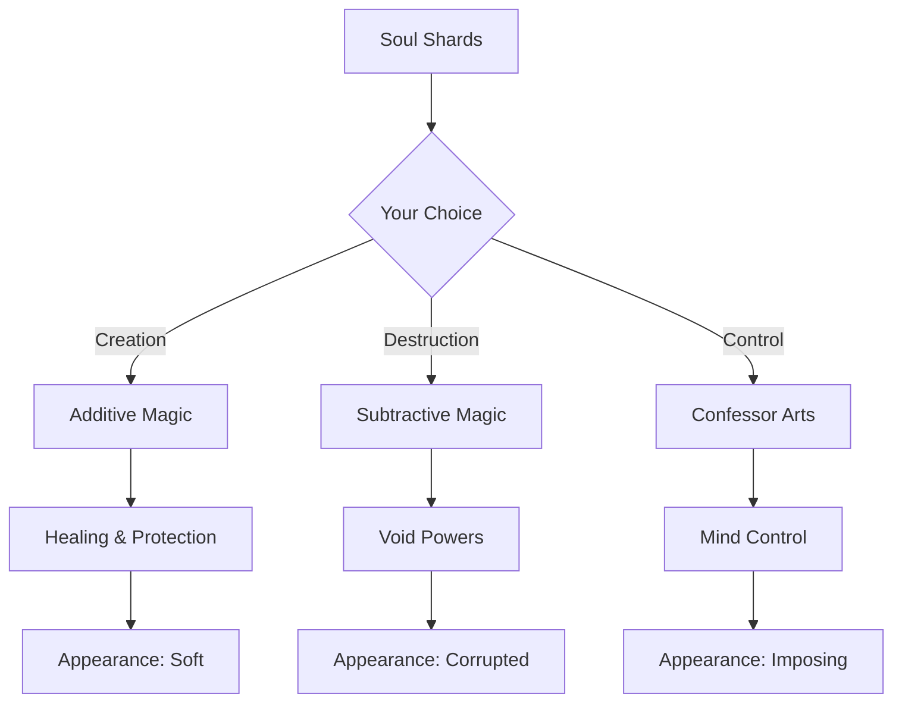

# 🎮 Game Design Document (GDD)

> **Project:** Dark Age  
> **Engine:** Unreal Engine 5  
> **Genre:** Multiplayer Action RPG  
> **Platform:** PC, Console  
> **Target Audience:** Ages 16+, RPG & Strategy Enthusiasts

---

## ⚔️ Welcome to the Divided Realm

*In a world fractured by the Veil, where multiple realities coexist and a million players shape the story, your choices don't just matter—they define you. There are no chosen heroes here, only people who decide, moment by moment, who they will become.*

---

## 📚 Table of Contents

### 🌍 [World.md](World.md)
**The Setting**

Explore the Divided Realm:
- The Ordered Realm under the Covenant's control
- The chaotic freedom of the Wild Echoes
- The Soul Shard magic system
- The eternal struggle between order and freedom

### 📖 [Story.md](Story.md)
**Player Journey**

Your path through the world:
- No chosen one—your choices define you
- Appearance evolves with your actions
- Reputation systems that remember
- Emergent narrative in a living world

### 👥 [Characters.md](Characters.md)
**Key Figures**

Meet the inhabitants:
- The player—you are the protagonist
- The Unweaver, face of benevolent tyranny
- Vaelith, the doubting Confessor
- Companions who react to your choices

### ✨ [Magic.md](Magic.md)
**Powers & Abilities**

Master the mystical:
- Additive Magic of creation
- Subtractive Magic of destruction
- The Confessor's terrifying touch
- The Seven Rules of Power

### 🗺️ [Locations.md](Locations.md)
**The World**

Journey through:
- Westbrook, where freedom lingers
- The Fractured Citadel of control
- The Bone Orchard's healing
- The Unwoven Realm between realities

### 🌐 [Multiplayer.md](Multiplayer.md)
**Shared Universe**

Play with millions:
- Guilds, coalitions, and kingdoms
- Player governance and rule
- Territory control and wars
- Starfield-inspired persistent universe

---

## 🎯 Core Pillars

### 1. Choice Defines Being
Unlike traditional RPGs, your character's appearance, powers, and standing emerge from your actions—not a character creation screen. Cruelty hardens you. Mercy softens you. The Void marks you.

### 2. Persistent Consequence
The world remembers. NPCs gossip about your deeds. Shops refuse service to villains. Kingdoms rise and fall based on collective player action.

### 3. Player Governance
Form guilds, build coalitions, rule kingdoms. Establish laws, levy taxes, command armies. The world is shaped by those powerful enough to shape it.

### 4. Multiplayer Reality
Millions of players coexist in a shared universe of Echoes (parallel realities). Travel between worlds. Build settlements in multiple realities. Project power across dimensional borders.

---

## 🏛️ Factions Overview

| Faction | Philosophy | Playstyle |
|---------|------------|-----------|
| **The Covenant** | Order through control | Structured, hierarchical, "safe" |
| **The Unbound** | Freedom above all | Chaotic, individualistic, dangerous |
| **The Unweaver's Cult** | Peace through surrender | Collective, harmonious, mindless |
| **Player Kingdoms** | Your rules, your way | Whatever you can enforce |

---

## ⚡ Magic at a Glance

---

## 🎨 Visual Identity

Dark Age features a **dark fantasy aesthetic**:
- Deep blacks and blood reds
- Gold accents for nobility and magic
- Crystalline Soul Shard motifs
- Gothic architecture meets cosmic horror

See our [custom styling](../assets/css/style.css) for the full visual treatment.

---

## 🚀 Development Status

| Phase | Status | Completion |
|-------|--------|------------|
| Core Systems | In Progress | 40% |
| World Building | In Progress | 65% |
| Multiplayer Architecture | Planning | 20% |
| Visual Assets | Pre-production | 15% |
| Sound Design | Not Started | 0% |

---

## 📖 Additional Documentation

- [Systems Documentation](../Systems/) - Technical system designs
- [API Documentation](../API/) - Code reference
- [Contributing Guidelines](../CONTRIBUTING.md) - How to help
- [Architecture Overview](../Architecture.md) - Technical architecture

---

## 🌟 Key Features

### For Players
- ✅ **No Classes**: Your playstyle defines your abilities
- ✅ **Reactive World**: NPCs remember and react
- ✅ **Player Kingdoms**: Rule territories, make laws
- ✅ **Cross-Echo Travel**: Explore parallel realities
- ✅ **Emergent Story**: Your legend written by your actions

### For Developers
- ✅ **Modular Design**: Extensible systems architecture
- ✅ **GAS Integration**: Unreal's Gameplay Ability System
- ✅ **Scalable Backend**: Support for millions of players
- ✅ **Data-Driven**: Easy content iteration

---

## 📞 Contact & Community

- **GitHub**: [RaioCore/DarkAge](https://github.com/RaioCore/DarkAge)
- **Discord**: [discord.gg/darkage](https://discord.gg/darkage)
- **Twitter**: [@DarkAgeGame](https://twitter.com/DarkAgeGame)
- **Reddit**: [r/DarkAge](https://reddit.com/r/DarkAge)

---

> *"The greatest power is not the ability to reshape reality. It is the ability to choose who you become while reality reshapes itself around you."*
> — **Vaelith the Confessor**

---

**© 2024 RaioCore Studios. All rights reserved.**

*Dark Age, the Dark Age logo, and all related content are trademarks of RaioCore Studios.*
