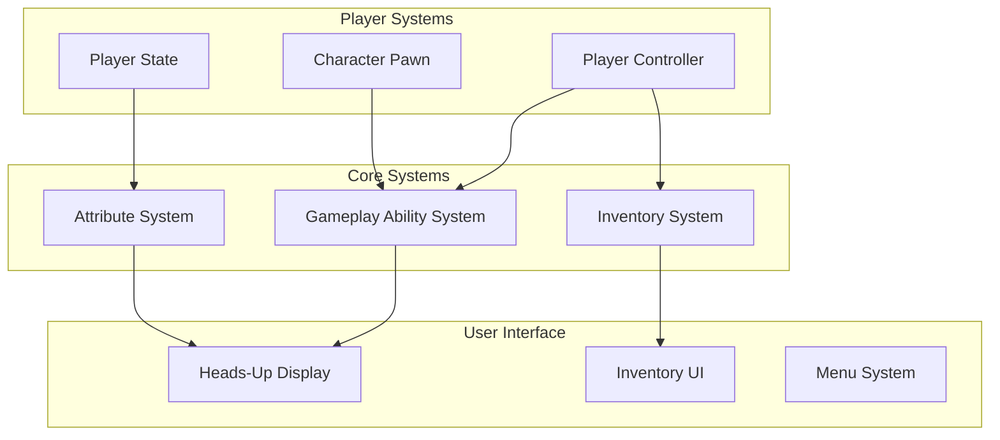

# Game Design Document (GDD)

> **Project:** DA (Dungeon Adventure)  
> **Engine:** Unreal Engine 5  
> **Genre:** Action RPG  
> **Platform:** PC, Console  
> **Target Audience:** Ages 13+, RPG Enthusiasts

---

## 📋 Table of Contents

1. [Executive Summary](Executive-Summary.md)
2. [Gameplay Overview](Gameplay.md)
3. [Narrative & World](Narrative.md)
4. [Characters](Characters.md)
5. [Progression Systems](Progression.md)
6. [Economy & Items](Economy.md)
7. [User Interface](UI-Design.md)
8. [Technical Requirements](Technical-Requirements.md)

---

## 🎮 Game Summary

DA is an action role-playing game built on Unreal Engine 5 featuring:

- **Gameplay Ability System (GAS)** - Robust ability framework for spells, skills, and combat
- **Dynamic Inventory System** - Flexible item management with tag-based categorization
- **Multiplayer Support** - Networked gameplay with dedicated server architecture
- **Modular Architecture** - Extensible systems for easy content creation

---

## 🎯 Core Pillars

### 1. Engaging Combat
- Real-time action combat using Gameplay Ability System
- Skill-based gameplay with combo systems
- Dynamic enemy AI with emergent behaviors

### 2. Meaningful Progression
- Character attributes (Health, Stamina, Mana)
- Skill trees and ability unlocks
- Equipment and gear upgrades

### 3. Deep Systems
- Complex inventory management
- Crafting and item enhancement
- World exploration and discovery

### 4. Social Experience
- Co-operative multiplayer
- Trading and economy
- Guild/clan systems

---

## 📊 Game Systems Overview

---

## 🏗️ Technical Architecture

See [Architecture.md](../Architecture.md) for detailed technical documentation.

### Key Technologies

| Technology | Purpose |
|------------|---------|
| **Unreal Engine 5** | Core game engine |
| **Gameplay Ability System** | Combat and ability framework |
| **Enhanced Input** | Modern input handling |
| **Network Replication** | Multiplayer synchronization |

---

## 📝 Document Conventions

### Status Indicators

- ✅ **Implemented** - Feature is complete and functional
- 🔄 **In Progress** - Currently being developed
- 📋 **Planned** - Scheduled for future development
- 💡 **Concept** - Under design consideration

### Priority Levels

- **P0 (Critical)** - Must have for release
- **P1 (High)** - Important, should have
- **P2 (Medium)** - Nice to have
- **P3 (Low)** - Future consideration

---

## 🔄 Version History

| Version | Date | Author | Changes |
|---------|------|--------|---------|
| 0.1.0 | 2026-02-28 | RaioCore | Initial GDD structure |

---

*This document is a living document and will be updated as the game evolves.*
