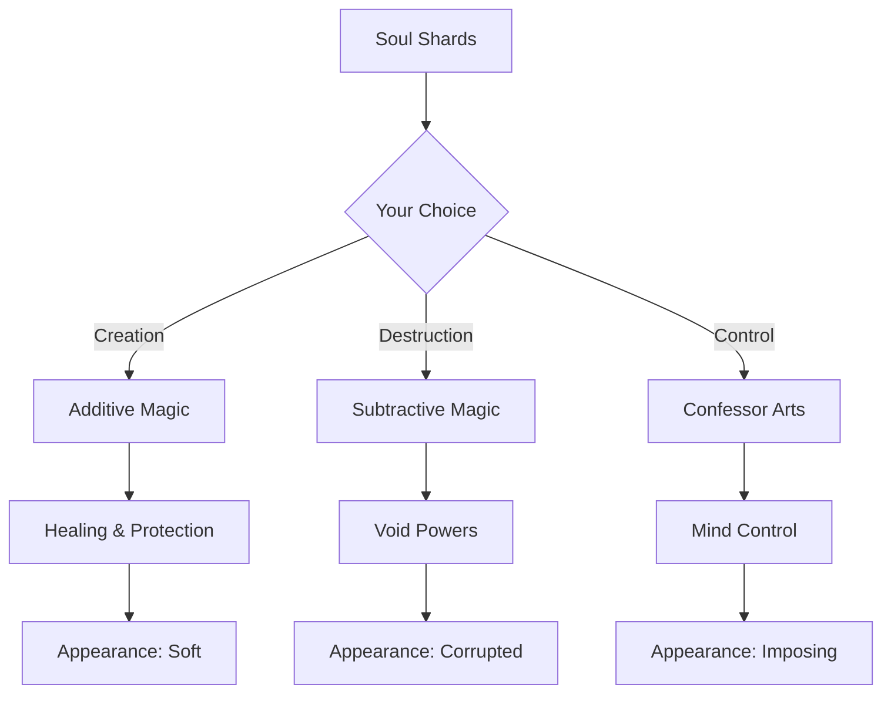

# 🎮 Game Design Document (GDD)

> **Project:** Dark Age  
> **Engine:** Unreal Engine 5  
> **Genre:** Multiplayer Action RPG  
> **Platform:** PC, Console  
> **Target Audience:** Ages 16+, RPG & Strategy Enthusiasts

---

## ⚔️ Welcome to the Divided Realm

*In a world fractured by the Veil, where multiple realities coexist and a million players shape the story, your choices don't just matter—they define you. There are no chosen heroes here, only people who decide, moment by moment, who they will become.*

---

## 📚 Table of Contents

### 🌍 [World.md](World.md)
**The Setting**

Explore the Divided Realm:
- The Ordered Realm under the Covenant's control
- The chaotic freedom of the Wild Echoes
- The Soul Shard magic system
- The eternal struggle between order and freedom

### 📖 [Story.md](Story.md)
**Player Journey**

Your path through the world:
- No chosen one—your choices define you
- Appearance evolves with your actions
- Reputation systems that remember
- Emergent narrative in a living world

### 👥 [Characters.md](Characters.md)
**Key Figures**

Meet the inhabitants:
- The player—you are the protagonist
- The Unweaver, face of benevolent tyranny
- Vaelith, the doubting Confessor
- Companions who react to your choices

### ✨ [Magic.md](Magic.md)
**Powers & Abilities**

Master the mystical:
- Additive Magic of creation
- Subtractive Magic of destruction
- The Confessor's terrifying touch
- The Seven Rules of Power

### 🗺️ [Locations.md](Locations.md)
**The World**

Journey through:
- Westbrook, where freedom lingers
- The Fractured Citadel of control
- The Bone Orchard's healing
- The Unwoven Realm between realities

### 🌐 [Multiplayer.md](Multiplayer.md)
**Shared Universe**

Play with millions:
- Guilds, coalitions, and kingdoms
- Player governance and rule
- Territory control and wars
- Starfield-inspired persistent universe

### ⚔️ [Combat.md](Combat.md)
**Combat System**

Master the art of war:
- Physical combat stances and techniques
- Weapon mastery trees
- Gameplay Ability System integration
- Soul combat mechanics
- Enemy AI behaviors
- PvP combat and honor system

### 🔨 [CraftingAndEconomy.md](CraftingAndEconomy.md)
**Crafting & Economy**

Build your legacy:
- Five crafting disciplines
- Player-driven economy
- Resource generation
- Soul Anchor crafting
- Dynamic market system

### 🤝 [CompanionsAndMounts.md](CompanionsAndMounts.md)
**Companions & Mounts**

Build bonds:
- NPC companion roster
- Companion loyalty system
- Mount types and acquisition
- Bonding and synergies
- Personal stables and housing

### 📜 [QuestsAndMissions.md](QuestsAndMissions.md)
**Quests & Missions**

Your path forward:
- Main story questline
- Branching narratives
- Quest rewards and scaling
- World events
- Player-created quests

### 📖 [HistoryAndLore.md](HistoryAndLore.md)
**History & Lore**

Discover the world:
- Age before the Veil
- Covenant's rise
- Faction histories
- Important locations
- Prophecies and legends

### 📖 [Bestiary.md](Bestiary.md)
**Bestiary**

Know thy enemies:
- Humanoid enemies
- Void creatures
- Wildlife
- Boss enemies
- Combat tips

### 💀 [DeathAndResurrection.md](DeathAndResurrection.md)
**Death & Resurrection**

Face mortality:
- Soul Anchor system
- Permadeath mode
- Life-preserving shards
- True Death mechanics

---

## 🚀 REVOLUTIONARY SYSTEMS - What Makes Dark Age Unique

Dark Age is built on 8 groundbreaking game systems that work together to create an unprecedented gaming experience. These systems are 100% original and differentiate Dark Age from any other game in the market.

### ⚡ [MomentumSystem.md](MomentumSystem.md)
**Momentum System - Flow-Based Combat**

Master the art of combat flow:
- Build Momentum with every action (attack, dodge, parry)
- Enter FLOW STATE at 80%+ for devastating 2-3x power
- Combo chains requiring skill to execute
- Visual spectacle when at peak power
- Soul Shard resonance at high Momentum

*No other game has this exact system.*

### 🌍 [LivingWorldSystem.md](LivingWorldSystem.md)
**Living World System - A World That Breathes**

Your actions change everything:
- Faction influence shifts territories in real-time
- The World Tide cycles weekly
- Player-driven economy responds to scarcity
- Your actions become history in the Chronicle
- Echo Events create parallel reality conflicts

*Dynamic world evolution like no other.*

### 💀 [LegacySystem.md](LegacySystem.md)
**Legacy System - Death Is Not The End**

Permadeath with profound meaning:
- Soul Fragments pass power to future characters
- The Ancestral Library tracks your history
- Echo Resurrection offers second chances
- Death Craters mark your final moments
- "The Covenant's Challenge" hardcore mode

*Death has never been this meaningful.*

### 🔗 [SoulChainSystem.md](SoulChainSystem.md)
**Soul Chain System - Bonds Beyond Death**

Deep party connections unlike any other game:
- Soul Chains create permanent player bonds
- Shared abilities requiring coordination
- Chain persists through character death
- Unique combo attacks with your partner
- Soul Chain guilds and ceremonies

*Real connections that transcend individual characters.*

### 🧠 [MemorySystem.md](MemorySystem.md)
**Memory System - Your Past Shapes Your Present**

Every choice creates lasting memories:
- Memory unlocks unique abilities
- Karma axes (Compassion, Honor, Order, Sacrifice)
- Cross-character memory inheritance
- Echo encounters with alternate selves
- Memory Corruption for going against your nature

*Your story truly matters.*

### 🌀 [RiftWalkerSystem.md](RiftWalkerSystem.md)
**Rift Walker System - Master of Realities**

Walk between parallel worlds:
- Visit Echoes—parallel versions of reality
- Unique materials per Echo (Void Crystal, Chronos Ore, etc.)
- Fight your Shadow self
- Rift Master class specialization
- Echo stabilization and collapsing

*True multiverse exploration.*

### 🌊 [WorldShiftSystem.md](WorldShiftSystem.md)
**World Shift System - Reality Evolves**

Server-wide dynamic events:
- Weekly Turning events
- Cataclysmic world changes (The Breaking)
- Seasonal content cycles
- Server identity and Chronicle history
- World Boss dynamic spawning

*Your server has a living history.*

### 🎯 [AddictiveGameLoops.md](AddictiveGameLoops.md)
**Addictive Game Loops - Psychology of Engagement**

Built for lasting addiction through satisfaction:
- 7 scientifically-designed engagement loops
- Mastery, Collection, Social, Narrative
- Variable rewards, Loss aversion, Competition
- Ethical, player-first design principles

*Engagement through genuine satisfaction, not manipulation.*

---

## 🎯 Core Pillars

### 1. Choice Defines Being
Unlike traditional RPGs, your character's appearance, powers, and standing emerge from your actions—not a character creation screen. Cruelty hardens you. Mercy softens you. The Void marks you.

### 2. Persistent Consequence
The world remembers. NPCs gossip about your deeds. Shops refuse service to villains. Kingdoms rise and fall based on collective player action.

### 3. Player Governance
Form guilds, build coalitions, rule kingdoms. Establish laws, levy taxes, command armies. The world is shaped by those powerful enough to shape it.

### 4. Multiplayer Reality
Millions of players coexist in a shared universe of Echoes (parallel realities). Travel between worlds. Build settlements in multiple realities. Project power across dimensional borders.

---

## 🏛️ Factions Overview

| Faction | Philosophy | Playstyle |
|---------|------------|-----------|
| **The Covenant** | Order through control | Structured, hierarchical, "safe" |
| **The Unbound** | Freedom above all | Chaotic, individualistic, dangerous |
| **The Unweaver's Cult** | Peace through surrender | Collective, harmonious, mindless |
| **Player Kingdoms** | Your rules, your way | Whatever you can enforce |

---

## ⚡ Magic at a Glance

---

## 🎨 Visual Identity

Dark Age features a **dark fantasy aesthetic**:
- Deep blacks and blood reds
- Gold accents for nobility and magic
- Crystalline Soul Shard motifs
- Gothic architecture meets cosmic horror

See our [custom styling](../assets/css/style.css) for the full visual treatment.

---

## 🚀 Development Status

| Phase | Status | Completion |
|-------|--------|------------|
| Core Systems | In Progress | 40% |
| World Building | In Progress | 65% |
| Multiplayer Architecture | Planning | 20% |
| Visual Assets | Pre-production | 15% |
| Sound Design | Not Started | 0% |

---

## 📖 Additional Documentation

- [Systems Documentation](../Systems/) - Technical system designs
- [API Documentation](../API/) - Code reference
- [Contributing Guidelines](../CONTRIBUTING.md) - How to help
- [Architecture Overview](../Architecture.md) - Technical architecture

---

## 🌟 Key Features

### For Players
- ✅ **No Classes**: Your playstyle defines your abilities
- ✅ **Reactive World**: NPCs remember and react
- ✅ **Player Kingdoms**: Rule territories, make laws
- ✅ **Cross-Echo Travel**: Explore parallel realities
- ✅ **Emergent Story**: Your legend written by your actions

### For Developers
- ✅ **Modular Design**: Extensible systems architecture
- ✅ **GAS Integration**: Unreal's Gameplay Ability System
- ✅ **Scalable Backend**: Support for millions of players
- ✅ **Data-Driven**: Easy content iteration

---

## 📞 Contact & Community

- **GitHub**: [RaioCore/DarkAge](https://github.com/RaioCore/DarkAge)
- **Discord**: [discord.gg/darkage](https://discord.gg/darkage)
- **Twitter**: [@DarkAgeGame](https://twitter.com/DarkAgeGame)
- **Reddit**: [r/DarkAge](https://reddit.com/r/DarkAge)

---

> *"The greatest power is not the ability to reshape reality. It is the ability to choose who you become while reality reshapes itself around you."*
> — **Vaelith the Confessor**

---

**© 2024 RaioCore Studios. All rights reserved.**

*Dark Age, the Dark Age logo, and all related content are trademarks of RaioCore Studios.*
