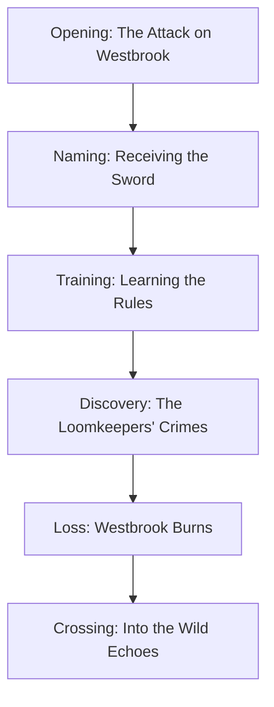
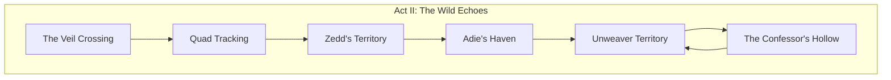
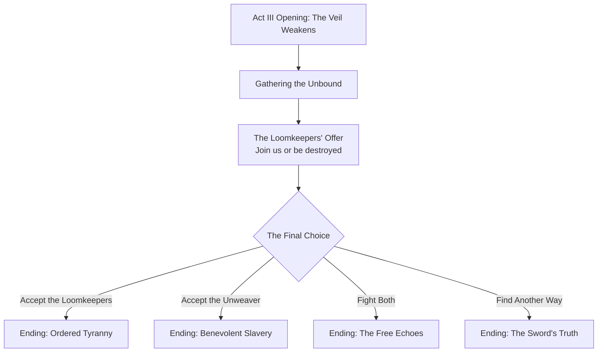

# 📖 The Seeker's Journey

> *"You are not who you were born to be. You are who you choose to be. And today, you must choose whether to be a victim or a warrior, a liar or a truth-teller, a slave or a free man."*
> — **Vaelith the Confessor, naming the Seeker**

---

## Narrative Overview

### The Core Premise

**DA** tells the story of a **Seeker**—an ordinary person chosen by the Sword of Truth to wield its power and cut through the lies that bind the world. Unlike the Threadwalkers who navigate between Echoes for their own purposes, the Seeker is bound by the Sword itself to seek truth and oppose tyranny—whether that tyranny wears the mask of the Loomkeepers' control or the Unweaver's "mercy."

This mirrors Richard Cypher's journey in the Sword of Truth series—from a simple woods guide to the wielder of ultimate truth, forced to confront that the greatest evils come not from monsters but from those who believe they act for the "greater good."

### Genre & Tone

| Element | Description |
|---------|-------------|
| **Primary Genre** | Epic Fantasy of Ideas |
| **Secondary Genre** | Adventure, Philosophical Thriller |
| **Tone** | Serious, morally uncompromising, passionate |
| **Themes** | Truth vs. comfortable lies, individualism vs. collectivism, the morality of force |
| **Primary Influence** | Sword of Truth (Wizard's First Rule, Seeker's burden, Imperial Order philosophy) |
| **Secondary Influences** | Wheel of Time (magic system complexity), Game of Thrones (political intrigue), Lord of the Rings (epic scope) |

---

## The Three-Act Structure

### Act I: The Naming (Chapters 1-8)

#### The Ordinary World

The story begins in **Westbrook**, a frontier town in the Ordered Realm—far enough from the Loomkeepers' central authority that people still value self-reliance, close enough that their children are taken for "training" and never seen again.

The player character is a **woods guide**—someone who knows the hidden paths, the safe ways through dangerous territory, the difference between real threats and imagined ones. Like Richard Cypher before his naming, they are competent, honest, and utterly unprepared for destiny.

> 🎭 **Character Origins** (Player Choice):
> - **The Woods Guide**: Knows the land, skilled at survival, values freedom
> - **The Truth-Teller**: A teacher or healer who refuses to parrot Loomkeeper doctrine
> - **The Outcast**: Someone whose family was taken by the Confessors, living on the edge of society
> - **The Blank**: An amnesiac with instinctive knowledge of the Wild Echoes

#### The Inciting Incident

A woman stumbles into Westbrook, bleeding, pursued by **Quad soldiers**—the Loomkeepers' elite enforcers. She is **Vaelith**, a Confessor who has committed the unforgivable sin: she has begun to doubt.

Vaelith carries the **Sword of Truth**, stolen from the Loomkeepers' vault. She was sent to hide it beyond the Veil, but she has seen what the Loomkeepers do with their power. She cannot simply obey.

The Quad attack. Vaelith is cornered. And in desperation, she does what no Confessor has ever done: she names a Seeker without the Loomkeepers' permission.

> *"I name you Seeker. Not because the Council wills it. Not because prophecy demands it. Because the Sword has chosen you. Because you are a person who would rather die than accept a lie. Because we need you."*

The Sword comes alive in the player's hands. The Quad are repelled. And everything changes.

#### Key Events - Act I

#### Major Revelations

1. **The Loomkeepers are tyrants**: They maintain power through the Confessors, through controlled information, through the threat of the Void
2. **Vaelith is dying**: Confessors who use their power too much lose their humanity; she has used hers to save the Sword
3. **The Unweaver is coming**: Not a monster, but an army with a philosophy—"the greater good justifies any means"
4. **The player is truly chosen**: The Sword will not leave them, will not serve another, will turn against them if they lie

#### Act I Climax: The Burning of Westbrook

The Quad return—not to capture, but to punish. Westbrook burns. Friends die. And the player, still learning to wield the Sword, must choose:

- **Save the villagers**: Risk the Sword, risk capture, but save innocent lives
- **Pursue the Quad commander**: Cut off the snake's head, but let the villagers suffer
- **Flee with Vaelith**: Protect the only one who knows the full truth, but abandon everyone else

There is no "right" choice. Only consequences. This is the Seeker's burden.

---

### Act II: The Journey Through the Wild Echoes (Chapters 9-18)

#### Into the Unknown

Fleeing the Ordered Realm, the Seeker and Vaelith cross the Veil into the **Wild Echoes**—a land of magic, danger, and freedom. Here, they must:

- Navigate between different Echoes, each with its own culture and dangers
- Gather allies who can teach them to use the Sword and their growing magic
- Learn the truth about the Unweaver's army
- Decide what kind of Seeker they will be

#### The Echo Map

#### Key Story Beats - Act II

| Chapter | Title | Key Event |
|---------|-------|-----------|
| 9 | *The Wizard's First Rule* | Meet **Soren**, the mad wizard in exile who teaches the First Rule |
| 10 | *The Bone Woman* | Find **Lyra**, a healer who knows the paths between Echoes |
| 11 | *The People's Peace* | Enter an Echo controlled by the Unweaver's ideology; see "benevolent" tyranny |
| 12 | *The Confessor's Kiss* | Vaelith must use her power; the cost is visible |
| 13 | *The Night Wisps* | Encounter creatures of the Void; learn the danger of Subtractive Magic |
| 14 | *The Sword's Truth* | The Sword refuses to kill an enemy; learn that it judges innocence |
| 15 | *The Army of the Greater Good* | See the Unweaver's forces firsthand—ordinary people who believe they're saving the world |
| 16 | *The Choice of Sacrifice* | A companion must die so others can live; the Seeker decides who |
| 17 | *The Unweaver's Face* | First direct confrontation; the enemy is not a monster but a believer |
| 18 | *The Naming of Names* | The Seeker learns their true parentage and why they were chosen |

#### The Companion Web

Throughout Act II, the Seeker gathers allies—each representing different approaches to truth and freedom:

- **Kael** (warrior from the borderlands): Honor without lies
- **Lyra** (the bone woman): Healing that requires touching death
- **Seraphina** (Echoed merchant): Survival through adaptation
- **Soren** (the wizard): Power without control

> 💡 **Narrative Choice Impact**: The Seeker's Sword reacts to their moral choices. Use it to kill someone who could have been captured, and the Sword grows heavier. Use it to protect the innocent, and it becomes an extension of your will. But the Sword also amplifies anger—let rage rule you, and you may find the Sword wielding you.

#### Act II Climax: The Unweaver's Philosophy

Captured by the Unweaver's forces, the Seeker faces their enemy not in battle but in debate:

> *"I know the Wizard's Rules, Seeker. I know them better than you. The First Rule: people are stupid. They will choose comfort over freedom every time. They will follow anyone who promises to take care of them.
>
> Look at your precious Loomkeepers. They control through fear. I control through love. I tell people: 'You don't have to choose. You don't have to struggle. Surrender your will to me, and I will ensure the greater good.' And they line up to be saved.
>
> I am not a tyrant. I am a doctor, curing humanity of the disease of freedom. Freedom leads to conflict. Conflict leads to suffering. I will end suffering by ending choice. This is not evil. This is the ultimate compassion."*

The Unweaver is not lying. They truly believe this. And that makes them more dangerous than any monster.

---

### Act III: The War for Truth (Chapters 19-24)

#### The Convergence

The Unweaver's army prepares to cross the Veil. The Loomkeepers, threatened for the first time in centuries, respond with desperate cruelty. Caught between two tyrannies—one that controls through lies, one that controls through "kindness"—the Seeker must find a third way.

#### The Four Endings

##### Ending 1: Ordered Tyranny (Side with the Loomkeepers)

The Seeker accepts that the Loomkeepers, for all their flaws, maintain order. They turn the Sword against the Unweaver, then surrender it back to the Council.

> *"You were right. People cannot handle freedom. They need guidance, protection, control. I will be your sword, your shield, your enforcer. And I will bear the guilt of your lies, so the people don't have to."*

**Consequences**:
- The Unweaver is defeated
- The Ordered Realm is preserved
- The Seeker becomes the Loomkeepers' weapon
- Secret epilogue: A new Confessor questions her orders...

---

##### Ending 2: Benevolent Slavery (Side with the Unweaver)

The Seeker accepts the Unweaver's logic. They help breach the Veil, not to destroy the Ordered Realm, but to "save" it from itself.

> *"You offer peace through freedom. I offer peace through unity. No more choices. No more mistakes. No more suffering. I will be the hand that guides, the will that decides, the truth that cannot be questioned."*

**Consequences**:
- The Unweaver's army conquers the Ordered Realm
- Suffering is reduced through total control
- The Seeker becomes the Unweaver's champion
- Secret epilogue: A child in the new order begins to ask questions...

---

##### Ending 3: The Free Echoes (Fight Both)

The Seeker rejects both tyrannies. They unite the Unbound, the outcasts, the free people of the Wild Echoes, and fight a war on two fronts.

> *"You both offer chains. One gilded, one iron. I offer something more terrifying: choice. The freedom to be wrong. The freedom to suffer. The freedom to live. If that means war eternal, so be it. Better a free war than a peaceful slavery."*

**Consequences**:
- Both the Loomkeepers and Unweaver are weakened
- The Wild Echoes remain free but dangerous
- The Seeker becomes a perpetual warrior
- Secret epilogue: A new generation learns what freedom costs...

---

##### Ending 4: The Sword's Truth (The Synthesis)

The Seeker discovers that the Sword of Truth has a final power, one unknown even to the Loomkeepers: it can ** sever not just flesh, but the lies that bind souls**. The Seeker uses it to free the Hollow, to break the Confessors' touch, to give people back their stolen will.

> *"You both seek to control. I seek to liberate. The Sword does not just cut—it unbinds. I will cut the threads of your control. I will free your slaves, your servants, your believers. And then, finally free, they will choose for themselves. Some will choose wrong. That is the price of truth."*

**Consequences**:
- The Hollow are restored
- The Confessors' power is broken
- Both the Loomkeepers and Unweaver lose their grip
- Secret epilogue: The world is chaotic, dangerous, and free...

---

## Key Narrative Themes

### The Nature of Evil

Evil in this story is not monstrous—it is reasonable, compassionate, and utterly convinced of its own righteousness:
- The Loomkeepers believe they protect the innocent from themselves
- The Unweaver believes they save humanity from the burden of freedom
- Both destroy what they claim to preserve

### The Cost of Truth

Truth is not comfortable. Truth does not care about your feelings. Truth demands action:
- Once you see the Loomkeepers' crimes, you cannot unsee them
- Once you understand the Unweaver's logic, you cannot dismiss it
- The Seeker must choose what to do with truth—and live with the consequences

### Passion and Reason

The Sword of Truth amplifies anger, but anger alone is not enough:
- The Loomkeepers have reason without passion—cold, efficient, dead
- The Unweaver has passion without reason—fervent, certain, destructive
- The Seeker must balance both

### Individual vs. Collective

The central philosophical conflict:
- The Loomkeepers sacrifice individuals for the "order" of the collective
- The Unweaver sacrifices individual will for the "good" of the collective
- The Seeker believes individuals are ends in themselves, not means to an end

---

## Narrative Mechanics

### The Sword's Judgment

The Sword of Truth has three properties that shape gameplay:

1. **It cannot harm the innocent**: Against those who have done no wrong, the blade will not cut. This forces the player to find creative solutions rather than simply killing.

2. **It cuts through lies**: Illusions, disguises, and deceptions fail against the Sword. This reveals hidden truths but also creates complications.

3. **It amplifies anger**: The more angry the player is, the more powerful the Sword becomes—but rage can blind you to truth.

### The Confessor's Touch

Vaelith can use her power to force truth from enemies, but each use:
- Brings her closer to losing her own humanity
- Creates a Hollow servant who will obey her absolutely
- Cannot be undone

The player must decide when the truth is worth the cost.

### The Rules in Action

Key story moments illustrate the Wizard's Rules:
- **First Rule encounters**: NPCs who believe lies because they want them to be true
- **Second Rule consequences**: Well-intentioned actions that cause catastrophe
- **Third Rule moments**: Choices where passion must overcome reason—or be tempered by it

---

## Epilogue Possibilities

Based on ending and key choices:

| Ending | Epilogue Scene |
|--------|----------------|
| Ordered Tyranny | A teacher tells students "Question nothing." But one child holds a hidden Thread... |
| Benevolent Slavery | A peaceful world. A content population. And one person who remembers what freedom felt like. |
| Free Echoes | A council of equals debates. Outside, someone patrols the borders. Freedom has guards. |
| Sword's Truth | A child asks "Why?" and no one stops them from asking. The question spreads. |

---

> *"The Seeker is not chosen because they are special. The Seeker is chosen because, when faced with a lie, they cannot look away. When faced with injustice, they cannot walk away. When faced with the choice between easy comfort and hard truth, they choose truth. That is not destiny. That is character. And character is the only thing that can save us."*
> — **Vaelith's final lesson to the Seeker**
