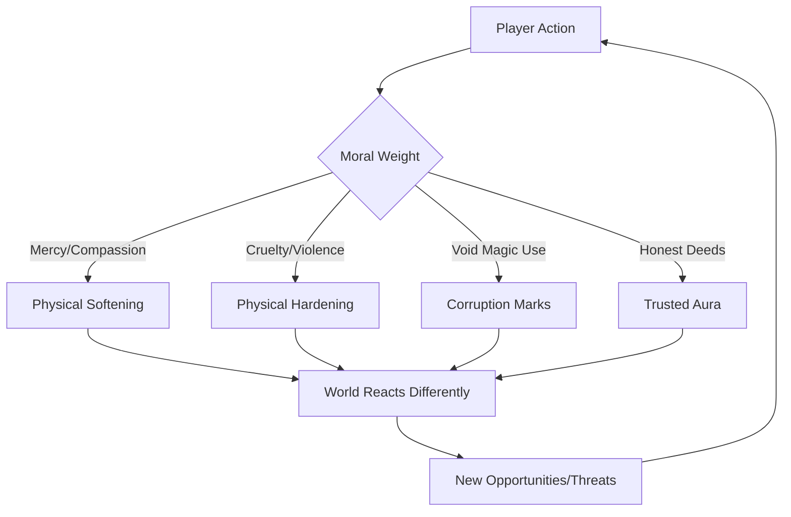
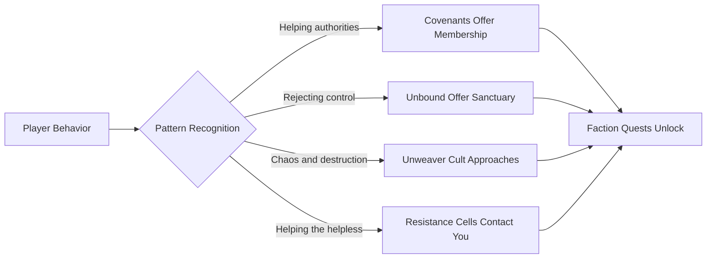

# 📖 The Player's Journey

> *"You are not chosen. You are not special. You are simply someone who looked at the world and decided you wanted something different. And that decision—that single choice—is the only power that matters."*
> — **Vaelith the Confessor**

---

## Narrative Overview

### The Core Premise

**Dark Age** is not a story about a destined hero. It is a **world** where millions of players make their own stories simultaneously. You begin as an ordinary person who discovers the ability to perceive Soul Shards—the crystalline essence of all living things—and must decide what to do with that power.

There is no "main questline" that everyone follows. There is no chosen one. There is only:
- **Your choices**, which shape your character's appearance, powers, and reputation
- **Your allegiances**, which determine which factions welcome you and which hunt you
- **Your legacy**, which lives on in the world's memory long after you log off

### Genre & Tone

| Element | Description |
|---------|-------------|
| **Primary Genre** | Open-World Action RPG |
| **Secondary Genre** | Emergent Narrative, Social Simulation |
| **Tone** | Dark, morally complex, player-driven |
| **Themes** | Choice and consequence, power and corruption, individual vs. collective |
| **Influences** | Sword of Truth (moral philosophy), Game of Thrones (political complexity), EVE Online (player-driven world) |

---

## Player Agency: You Are The Story

### Character Creation Is Only The Beginning

Your character's appearance at creation is just a starting point. Over time, your **actions reshape your being**:



### The Reputation Matrix

Your character exists in a web of relationships:

| Reputation Type | Tracked By | Impact |
|-----------------|------------|--------|
| **Personal** | Individual NPCs | Specific NPCs remember how you treated them |
| **Faction** | Covenants, Unbound, etc. | Access to quests, shops, safe zones |
| **Regional** | Towns and territories | Prices, guards' behavior, available information |
| **Global** | Server-wide tracking | Bounties, legendary status, world events |
| **Moral** | Karma-like system | Appearance changes, power availability |

> 🎭 **Example**: A player who consistently helps strangers might find NPCs offering them secret paths and discounts. A player known for betrayal might find doors closed—literally, as shopkeepers lock up when they approach.

---

## The Three Paths (Player Archetypes)

Not chosen at character creation, but **emerging from playstyle**:

### The Confessor's Path: Power Through Control

Players who embrace the Covenants' philosophy—control for the greater good—gain:
- **Binding Magic**: Ability to influence others' will
- **Authoritative Presence**: NPCs follow orders more readily
- **Ordered Appearance**: Clean, controlled aesthetic
- **Cost**: Loss of spontaneous power, rigid moral requirements

### The Unbound Path: Power Through Freedom

Players who reject all control, embracing the Wild Echoes' chaos, gain:
- **Subtractive Mastery**: Destructive and transformative powers
- **Adaptive Abilities**: Spells that change based on situation
- **Wild Appearance**: Ever-shifting, unpredictable aesthetic
- **Cost**: Social ostracism, instability risks

### The Balanced Path: Power Through Understanding

Players who navigate between extremes, seeking wisdom:
- **Shard Sight Mastery**: Perceive truths others miss
- **Negotiation Powers**: Resolve conflicts without violence
- **Balanced Appearance**: Features that reflect complexity
- **Cost**: Slower power growth, difficult choices

---

## The Multiplayer Narrative

### Shared World, Individual Stories

In Dark Age, your story unfolds alongside thousands of others:

#### Territory Control
- Players align with factions to control regions
- Controlled territories offer benefits but require defense
- Ownership changes hands through PvP and political maneuvering

#### Economic Impact
- Player crafting and trade shape the economy
- Resource scarcity drives conflict and cooperation
- Market manipulation is a valid (if risky) playstyle

#### Emergent Legends
- Player deeds generate rumors and legends
- Famous players attract followers—and assassins
- Infamous players may become world bosses

#### World Events
- Server-wide events triggered by collective player actions
- Seasonal changes based on global moral alignment
- Dynamic quests that respond to player behavior

### Multiplayer Safety Systems

For millions of players to coexist:

| System | Function |
|--------|----------|
| **Instanced Housing** | Personal spaces that can't be invaded |
| **Safe Zones** | Cities where PvP is disabled |
| **Reputation Protection** | New players get grace periods |
| **Bounty System** | Legal framework for hunting criminals |
| **Guild Structures** | Player organizations with shared goals |

---

## Key Story Beats (Player-Triggered)

### Act I: Awakening (The First Hours)

#### The Catalyst Event
Each player experiences a personalized awakening:

> 🎭 **Awakening Variations**:
> - **The Witness**: You see a Confessor take someone's will—do you intervene?
> - **The Victim**: Your village is attacked—do you flee or fight?
> - **The Discovery**: You find a forbidden text—do you read it or burn it?
> - **The Accident**: Magic manifests unbidden—do you hide it or seek training?

#### First Choices, First Consequences
Your initial decisions establish your trajectory:

| Early Choice | Immediate Effect | Long-term Impact |
|--------------|------------------|------------------|
| Help a fugitive | Gain Subtractive potential | Covenant hostility |
| Report a mage | Gain Covenant trust | Unbound hostility |
| Stay neutral | Gain flexibility | No faction backing |
| Exploit the situation | Gain resources | Reputation for selfishness |

---

### Act II: Establishing Identity (The First Days)

#### Faction Allegiance
Choose (or reject) factions based on actions, not dialogue trees:



#### Power Development
Your abilities grow based on use:

- **Frequently heal** → Healing powers strengthen, appearance softens
- **Frequently destroy** → Subtractive powers strengthen, appearance hardens  
- **Frequently deceive** → Illusion powers emerge, features become shifting
- **Frequently lead** → Charisma powers grow, aura becomes commanding

#### Regional Impact
Your presence changes areas:

- A player who clears bandits from a road makes it safer for all
- A player who over-hunts an area creates scarcity
- A player who builds a reputation in a town becomes a local fixture

---

### Act III: Legacy (The Long Game)

#### World-Shaping Power
High-level players can:

- **Establish settlements**: Create player towns with custom rules
- **Influence factions**: Shape faction policies through rank
- **Trigger world events**: Unlock server-wide storylines
- **Become legends**: NPCs tell stories of infamous players

#### The Unweaver's Threat (Endgame)

A persistent world threat that requires collective action:

- The Unweaver's army grows based on player choices (those who embraced control help them)
- Defeating the Unweaver requires coordination across factions
- Victory conditions change based on server morality
- The "ending" is temporary—the threat returns, evolved

---

## Choice Architecture

### Meaningful Choice Design

Every significant choice in Dark Age:

1. **Is Irreversible**: No quick-save scumming; decisions persist
2. **Has Trade-offs**: No "best" option, only different costs
3. **Is Visible**: The world reacts to your choices visibly
4. **Is Social**: Other players see and react to your choices
5. **Is Cumulative**: Small choices add up to major transformation

### Example Choice Chain

```
A merchant begs for protection from bandits
    ↓
Choice 1: Protect them (Mercy +1, Covenant rep +)
    → Merchant becomes ally
    → Bandits remember your interference
    → Word spreads: you're "soft"
    → Future merchants ask for help (opportunity or burden?)
    
Choice 2: Rob them yourself (Cruelty +1, Subtractive power +)
    → Gain resources
    → Merchant survives, tells story
    → Bounty placed on you
    → Other criminals respect you
    → "Honest" NPCs fear you
    
Choice 3: Ignore them (Neutral)
    → Merchant dies or survives randomly
    → No reputation change
    → Missed opportunity for ally or resources
    → Bandits grow stronger (regional consequence)
```

---

## Player Appearance Evolution

### Visual Feedback System

Your character's appearance constantly reflects your choices:

| Playstyle | Physical Manifestation |
|-----------|------------------------|
| **Saintly** | Soft glow, kind features, animals approach |
| **Monstrous** | Shadowed aura, harsh angles, NPCs flinch |
| **Void-Touched** | Translucent patches, void-eyes, reality distorts nearby |
| **Commanding** | Straight posture, penetrating gaze, natural authority |
| **Deceptive** | Shifting features, unreadable expression, unease in others |
| **Wild** | Untamed hair, weathered skin, feral presence |

> 💡 **Mechanical Impact**: NPCs react to appearance before you speak. A terrifying player might intimidate without trying. A saintly player might be trusted despite lies.

---

## Epilogue: There Is No End

Dark Age has no "game over." There is only:

- **Continued evolution**: Your character never stops changing
- **New challenges**: As the world reacts to players, new threats emerge
- **Player succession**: Leave a legacy that affects future characters
- **World memory**: The server remembers; legends persist

> *"The world doesn't need heroes. It needs people who choose, day after day, to be something. The sum of those choices—that's what writes history."*
> — **Vaelith's Final Words to New Players**

---

## Multiplayer Considerations

### Scaling to Millions

| Challenge | Solution |
|-----------|----------|
| **Server Load** | Sharded world with seamless transitions |
| **Player Density** | Instanced private spaces, public shared zones |
| **Conflict** | Opt-in PvP with safe havens |
| **Economy** | Multiple currencies, regional markets |
| **Story** | Procedural quests based on world state |

### Social Systems

- **Guilds**: Player organizations with shared territory
- **Housing**: Personal and guild housing that reflects owner choices
- **Markets**: Player-driven economy with supply/demand
- **Courts**: Player-run justice systems in some territories
- **Religion**: Player-created belief systems with mechanical benefits

---

> *"In most games, you play a character. In Dark Age, you become someone. The difference is that the world remembers."*
