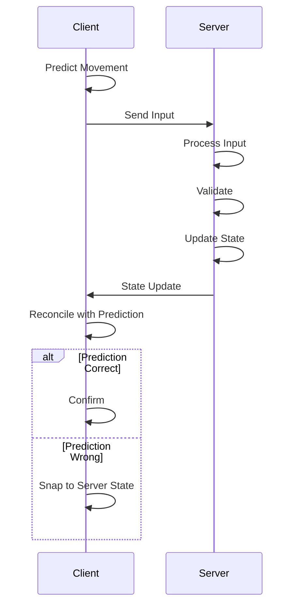
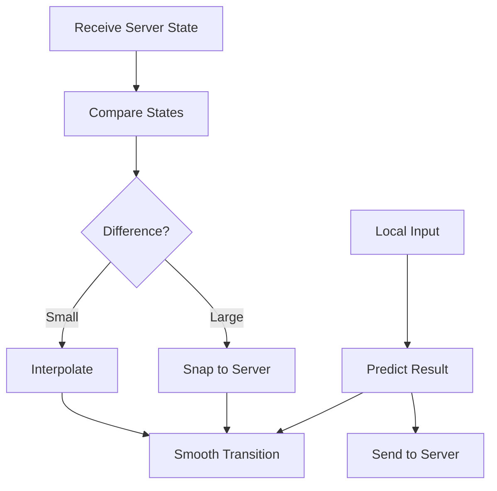
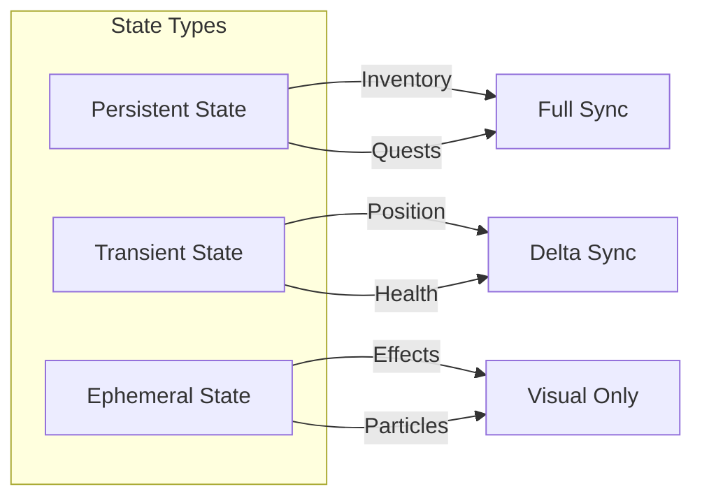
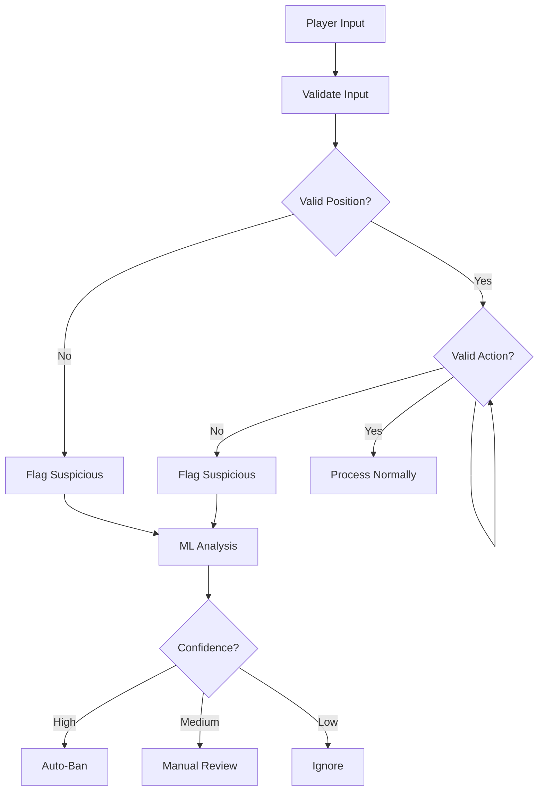
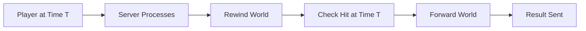
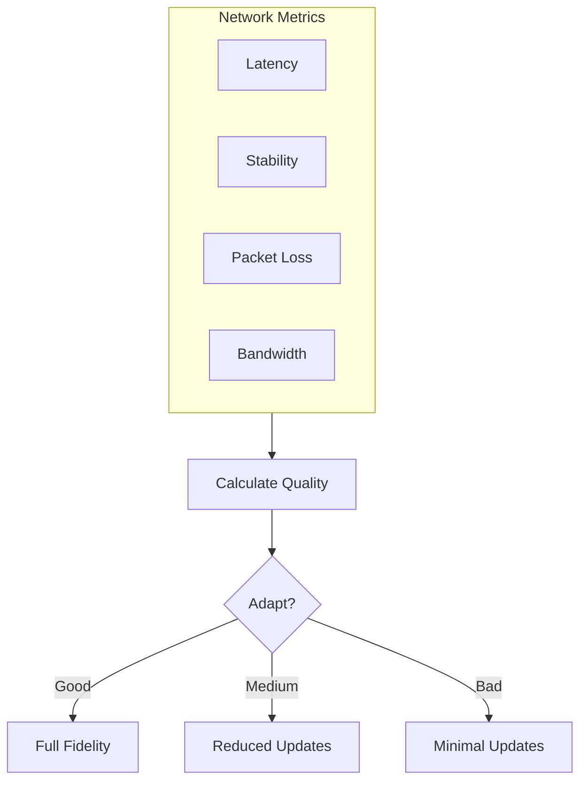
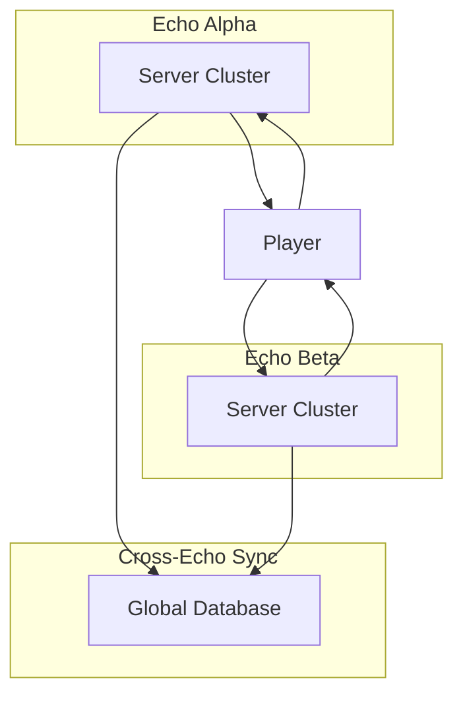

# 🌐 Network & Netcode: Multiplayer Architecture

> *"In a world of millions, the network is the nervous system. Every packet is a heartbeat, every connection a bond between souls."*

---

## Overview

Dark Age uses a sophisticated client-server architecture optimized for large-scale multiplayer gameplay. The network system prioritizes fairness, responsiveness, and the unique requirements of a persistent shared world.

### Network Design Goals

| Goal | Target | Implementation |
|------|--------|----------------|
| **Latency** | < 50ms | Regional servers, CDNs |
| **Fairness** | Server-authoritative | All critical logic server-side |
| **Responsiveness** | Smooth gameplay | Client-side prediction |
| **Security** | Anti-cheat | Server validation |
| **Scalability** | 10k+ per instance | Distributed architecture |

---

## Network Architecture

### Client-Server Model

```mermaid
flowchart TB
    subgraph Client["Client"]
        Client[Game Client]
        Prediction[Prediction System]
        Interpolation[Interpolation]
        Recon[Reconciliation]
    end
    
    subgraph Server["Server"]
        WorldSim[World Simulation]
        Auth[Authoritative State]
        AntiCheat[Anti-Cheat]
        Validation[Validation]
    end
    
    Client -->|Input| Server
    Server -->|State| Client
    Client --> Prediction
    Prediction --> Interpolation
    Interpolation --> Recon
```

### Server Types

| Server Type | Players | Responsibility |
|------------|---------|----------------|
| **Login Server** | All | Authentication, account management |
| **World Server** | 10,000 | Main game simulation |
| **Instance Server** | 5-100 | Dungeon, raid, battleground |
| **Chat Server** | All | Messaging, social |
| **Gateway Server** | 5,000 | Connection routing |

---

## Client-Side Systems

### Input Prediction

The client predicts the result of player actions to provide immediate feedback:



### Entity Interpolation

Smooth rendering of other players and entities:

| Interpolation Type | Use Case | Delay |
|-------------------|---------|-------|
| **Position** | Player movement | 100ms |
| **Rotation** | Character facing | 50ms |
| **Animation** | Action states | 150ms |
| **Projectiles** | Weapon fire | 50ms |

### Client Reconciliation



---

## Server-Side Systems

### Authoritative Simulation

All game logic runs on the server:

| System | Authoritative | Reason |
|--------|--------------|--------|
| **Position** | Server | Prevents teleporting |
| **Combat** | Server | Fair damage calculation |
| **Loot** | Server | Prevents item duplication |
| **Economy** | Server | Prevents gold exploits |
| **Inventory** | Server | Prevents item duplication |
| **Quests** | Server | Prevents progress exploits |

### Server Tick Rate

| Simulation Type | Tick Rate | Rationale |
|----------------|-----------|----------|
| **World State** | 20 Hz | Balance CPU/bandwidth |
| **Combat** | 30 Hz | Fair hit detection |
| **Movement** | 10 Hz | Position updates |
| **Inventory** | On-change | Event-driven |
| **Chat** | On-send | Real-time |

### State Synchronization



---

## Bandwidth Optimization

### Compression

| Data Type | Compression | Expected Size |
|-----------|------------|---------------|
| **Position** | Delta + Quantized | 3-5 bytes |
| **Rotation** | Quantized | 2 bytes |
| **Animation** | Bitpacked | 1 byte |
| **Inventory** | Full JSON | 50-500 bytes |
| **Chat** | UTF-8 | 10-200 bytes |

### Update Priorities

| Priority | Data | Update Rate |
|----------|------|------------|
| **Critical** | Health, Combat | Every tick |
| **High** | Position, Actions | 10 Hz |
| **Medium** | Inventory, Stats | On change |
| **Low** | Chat, Social | Real-time |

### Bandwidth Limits

| Connection Type | Max Bandwidth |
|-----------------|----------------|
| **Player** | 56 Kbps typical |
| **Server** | 100 Mbps total |
| **Instance** | 10 Mbps per player |

---

## Anti-Cheat Integration

### Client-Side Detection

| Detection Type | Method | Bypass Difficulty |
|---------------|--------|------------------|
| **Memory Scanning** | Integrity checks | Very difficult |
| **Speed Hacking** | Movement analysis | Difficult |
| **Aimbot** | Mouse input analysis | Difficult |
| **Injection** | DLL validation | Very difficult |

### Server-Side Detection



### Validation Systems

| System | Checks | Response |
|--------|--------|----------|
| **Hit Validation** | Attack hitboxes | Reject invalid hits |
| **Movement Validation** | Speed, collision | Correct position |
| **Damage Validation** | Damage formulas | Recalculate damage |
| **Loot Validation** | Drop tables | Verify loot |

---

## Latency Compensation

### Lag Compensation

When players have high latency:



### Delay Thresholds

| Latency | Compensation Method |
|---------|--------------------|
| < 50ms | Normal prediction |
| 50-100ms | Enhanced prediction |
| 100-200ms | Heavy interpolation |
| > 200ms | Rubber-banding |

### Client-Side Assistance

| Feature | Function | Fairness Impact |
|---------|----------|-----------------|
| **Hit Registration** | Expands hitboxes | Minimal |
| **Movement** | Input buffering | None |
| **Aiming** | Slight magnetism | Controversial |
| **Healing** | Instant on client | None |

---

## Network Troubleshooting

### Common Issues

| Issue | Symptoms | Solution |
|-------|----------|----------|
| **Packet Loss** | Stuttering, rubber-banding | Network fix |
| **Latency** | Input delay | Server selection |
| **Jitter** | Unstable gameplay | Network fix |
| **Disconnects** | Kicked from game | Reconnection |

### Quality of Service



---

## Cross-Echo Network

### Multi-Reality Connection

| Feature | Implementation |
|---------|---------------|
| **Echo State** | Separate server cluster |
| **Travel** | Seamless transition |
| **Inventory** | Universal (cross-Echo) |
| **Position** | Per-Echo tracking |

### Synchronization



---

## Performance Metrics

### Network KPIs

| Metric | Target | Alert Threshold |
|--------|--------|-----------------|
| **Average Latency** | < 50ms | > 100ms |
| **Packet Loss** | < 1% | > 5% |
| **Jitter** | < 20ms | > 50ms |
| **Update Rate** | 20 Hz | < 15 Hz |

### Monitoring

- Real-time network dashboards
- Automated alert systems
- Player-reported issue tracking
- Server health monitoring

---

> *"The best network is invisible. Players should feel connected, not delayed."*
