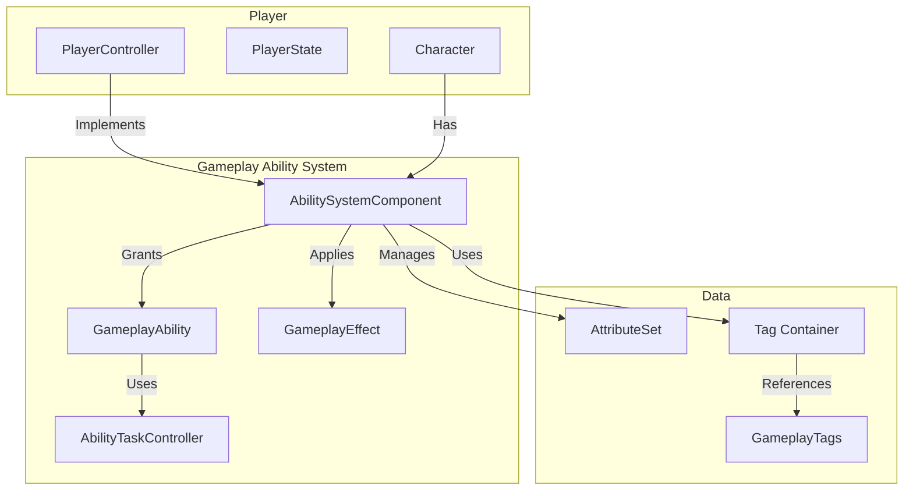
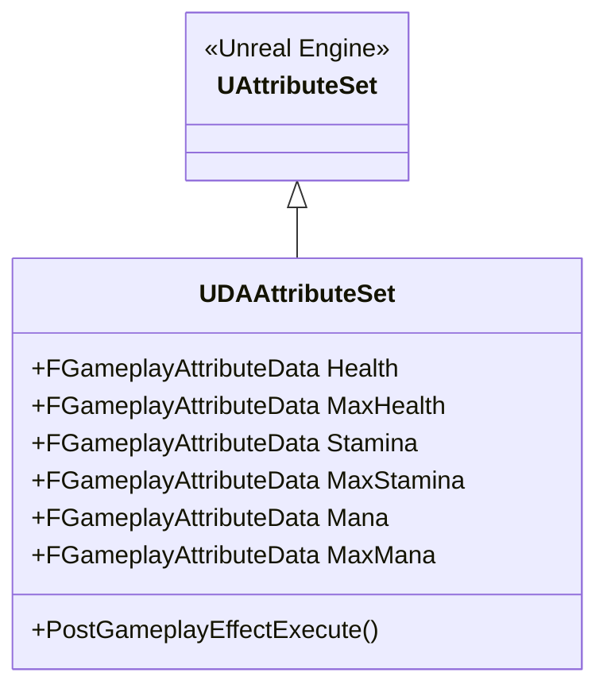
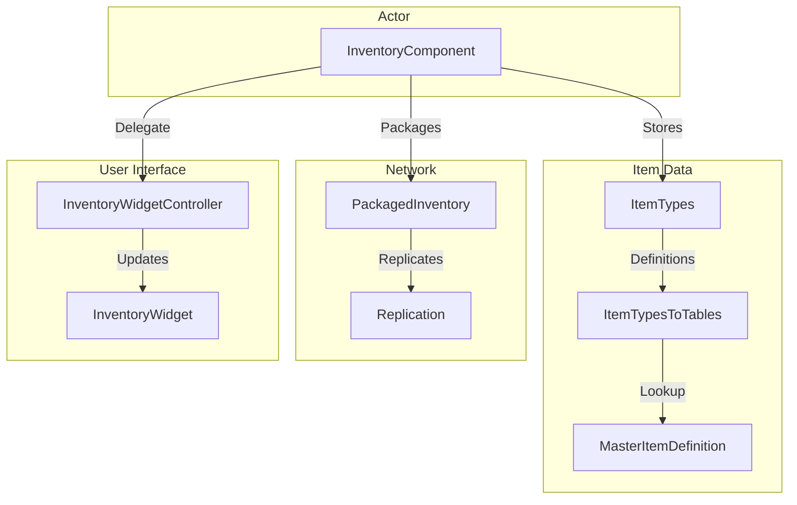
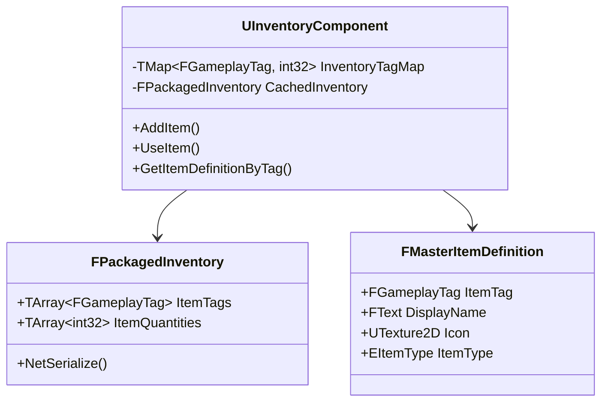
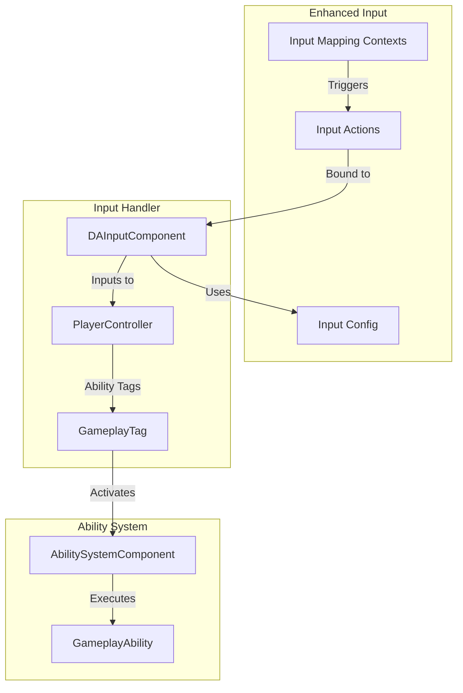
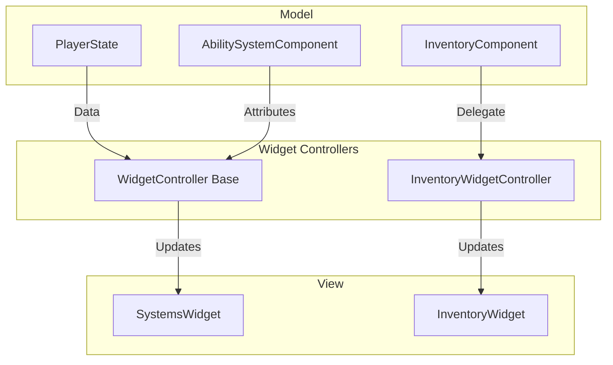
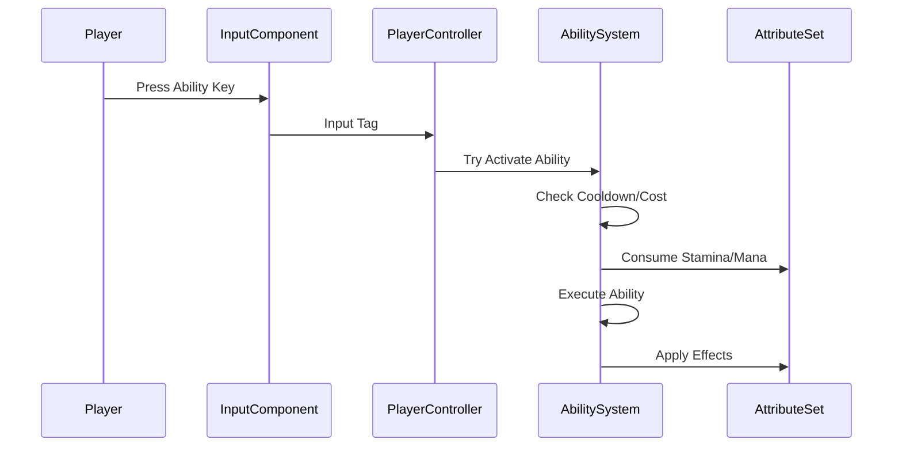
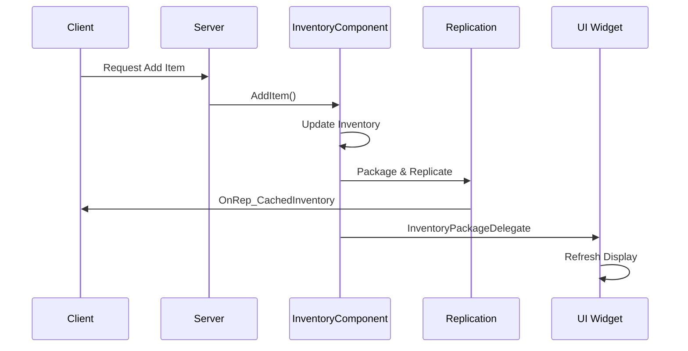

# Systems Documentation

This section provides detailed documentation for the major game systems implemented in DA.

---

## 🔮 Gameplay Ability System

The Gameplay Ability System (GAS) is the core framework for all combat abilities, skills, and gameplay effects.

### Architecture

### Core Components

| Component | Description | Class |
|-----------|-------------|-------|
| **Ability System Component** | Central GAS manager | [`UDAAbilitySystemComponent`](../../Source/DA/Public/Systems/AbilitySystem/DAAbilitySystemComponent.h) |
| **Attribute Set** | Character attributes (Health, Stamina, Mana) | [`UDAAttributeSet`](../../Source/DA/Public/Systems/AbilitySystem/Attributes/DAAttributeSet.h) |
| **Gameplay Ability** | Base class for all abilities | [`UDAGameplayAbility`](../../Source/DA/Public/Systems/AbilitySystem/Abilities/DAGameplayAbility.h) |
| **Ability System Library** | Helper functions | [`UDAAbilitySystemLibrary`](../../Source/DA/Public/Systems/AbilitySystem/Libraries/DAAbilitySystemLibrary.h) |

### Attributes

### Key Features

- ✅ **Attribute Replication** - Network synchronized attributes
- ✅ **Gameplay Tags** - Flexible tagging system for abilities
- ✅ **Gameplay Effects** - Buffs, debuffs, and modifiers
- ✅ **Ability Tasks** - Async ability execution
- 🔄 **Ability Sets** - Predefined ability loadouts

---

## 📦 Inventory System

A tag-based inventory system with network replication and UI integration.

### Architecture

### Components

| Component | Description | Class |
|-----------|-------------|-------|
| **Inventory Component** | Main inventory logic | [`UInventoryComponent`](../../Source/DA/Public/Systems/Inventory/InventoryComponent.h) |
| **Item Types** | Item type definitions | [`UItemTypes`](../../Source/DA/Public/Systems/Inventory/ItemTypes.h) |
| **Item Type Tables** | Data table mapping | [`UItemTypesToTables`](../../Source/DA/Public/Systems/Inventory/ItemTypesToTables.h) |

### Key Features

- ✅ **Tag-Based Items** - Items identified by GameplayTags
- ✅ **Network Replication** - Server-authoritative inventory
- ✅ **Packaged Storage** - Efficient network serialization
- ✅ **Item Definitions** - Data-driven item properties
- 🔄 **UI Integration** - Widget controller pattern

### Item Structure

---

## 🎮 Input System

Enhanced Input System for flexible, context-sensitive input handling.

### Architecture

### Components

| Component | Description | Class |
|-----------|-------------|-------|
| **Input Config** | Input action mapping | [`UDAInputConfig`](../../Source/DA/Public/Input/DAInputConfig.h) |
| **Input Component** | Enhanced input handling | [`UDASystemsInputComponent`](../../Source/DA/Public/Input/DASystemsInputComponent.h) |

### Key Features

- ✅ **Context-Based Mapping** - Different contexts for different game states
- ✅ **Gameplay Tag Input** - Direct ability activation via tags
- ✅ **Mobile Support** - Touch control support
- 🔄 **Input Rebinding** - Runtime key remapping

---

## 🎨 UI System

Widget controller pattern for clean UI architecture.

### Architecture

### Components

| Component | Description | Class |
|-----------|-------------|-------|
| **Base Widget Controller** | Common controller functionality | [`UWidgetController`](../../Source/DA/Public/UI/WidgetControllers/WidgetController.h) |
| **Inventory Widget Controller** | Inventory-specific controller | [`UInventoryWidgetController`](../../Source/DA/Public/UI/WidgetControllers/InventoryWidgetController.h) |
| **Systems Widget** | Base widget class | [`UDASystemsWidget`](../../Source/DA/Public/UI/DASystemsWidget.h) |

### Key Features

- ✅ **Widget Controller Pattern** - Separation of concerns
- ✅ **Data Binding** - Automatic UI updates
- ✅ **Network Replication** - Multiplayer-safe UI
- 🔄 **MVVM Pattern** - Full Model-View-ViewModel

---

## 🔗 Interfaces

Shared interfaces for cross-system communication.

### Available Interfaces

| Interface | Purpose | Class |
|-----------|---------|-------|
| **Inventory Interface** | Standard inventory access | [`IInventoryInterface`](../../Source/DA/Public/Interfaces/InventoryInterface.h) |
| **Ability System Interface** | Standard GAS access | `IAbilitySystemInterface` (UE5 Built-in) |

---

## 🧩 Data Assets

Data-driven configuration assets.

### Character Data

| Asset | Purpose | Class |
|-------|---------|-------|
| **Character Class Info** | Character class definitions | [`UCharacterClassInfo`](../../Source/DA/Public/Data/CharacterClassInfo.h) |

---

## 📋 System Interactions

### Combat Flow

### Inventory Update Flow

---

*For detailed API documentation, see [API Reference](../API/README.md)*
