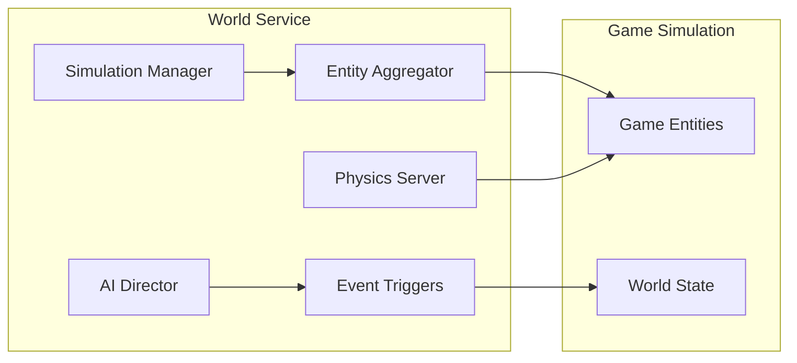
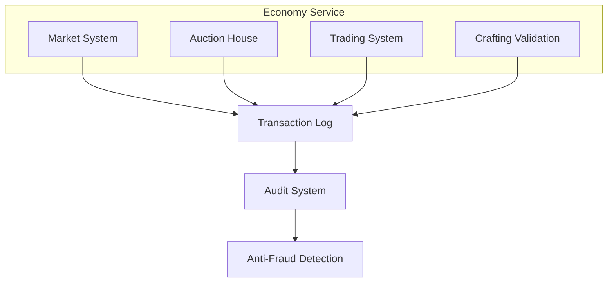
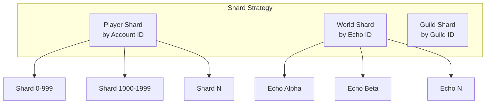
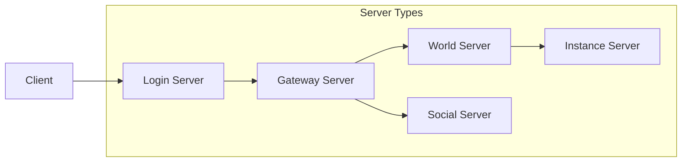
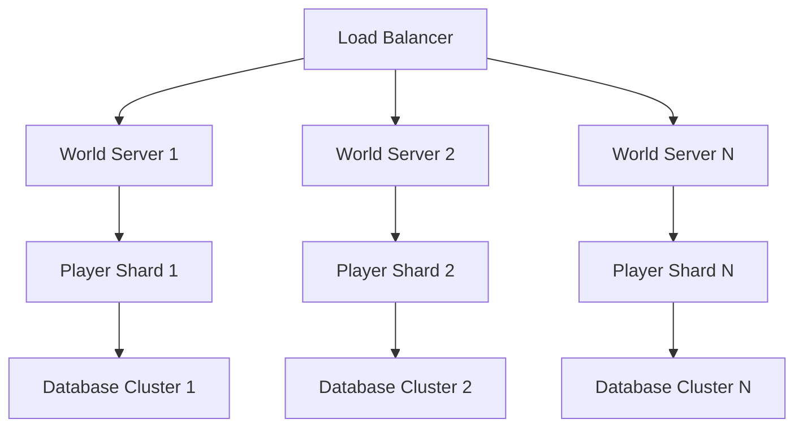
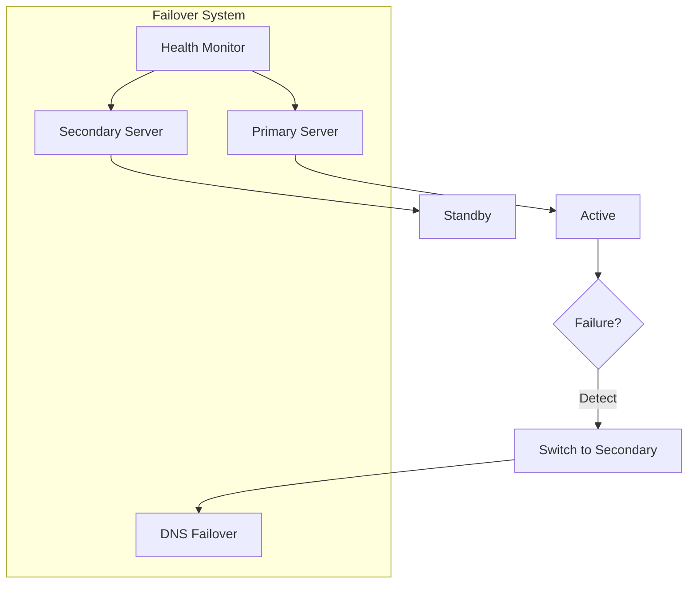
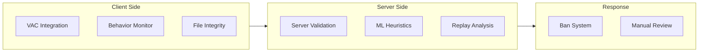
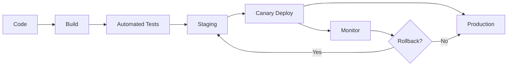

# 🖥️ Server Architecture: Technical Design

> *"A million players demand infrastructure that never sleeps, never fails, and never stops evolving."*

---

## Overview

Dark Age's server architecture is designed to support millions of concurrent players across multiple realities (Echoes). The system prioritizes scalability, reliability, and the unique requirements of a persistent multiplayer world.

### Design Goals

| Goal | Priority | Implementation |
|------|----------|----------------|
| **Scalability** | Critical | Horizontal scaling, sharding |
| **Availability** | Critical | Redundancy, failovers |
| **Latency** | High | Regional servers, CDNs |
| **Persistence** | Critical | Real-time world state |
| **Security** | Critical | Anti-cheat, encryption |
| **Flexibility** | High | Microservices architecture |

---

## High-Level Architecture

```mermaid
flowchart TB
    subgraph Client["Client Layer"]
        Client1[Single Mode Client]
        Client2[Multi Mode Client]
        ClientN[Mobile Client]
    end
    
    subgraph Gateway["Gateway Layer"]
        LB[Load Balancer]
        Auth[Authentication]
        Gateway[API Gateway]
    end
    
    subgraph Services["Service Layer"]
        World[World Services]
        Social[Social Services]
        Econ[Economy Services]
        Match[Matchmaking]
        Quest[Quest Services]
    end
    
    subgraph Data["Data Layer"]
        Cache[Redis Cache]
        DB[Primary Database]
        Backup[Backup System]
    end
    
    Client1 --> LB
    Client2 --> LB
    ClientN --> LB
    
    LB --> Auth
    Auth --> Gateway
    
    Gateway --> World
    Gateway --> Social
    Gateway --> Econ
    Gateway --> Match
    Gateway --> Quest
    
    World --> Cache
    Social --> Cache
    Econ --> Cache
    Match --> Cache
    Quest --> Cache
    
    Cache --> DB
    DB --> Backup
```

---

## Core Services

### World Service

The World Service manages the game simulation:



**Responsibilities**:
- Entity spawning and management
- Physics simulation
- AI behavior coordination
- World event triggers
- Zone management

### Social Service

Handles all player interaction systems:

| Function | Description |
|----------|-------------|
| **Friends** | Friend lists, block lists |
| **Guilds** | Guild management |
| **Chat** | All chat channels |
| **Mail** | In-game messaging |
| **Party** | Group management |

### Economy Service

Manages the player-driven economy:



### Matchmaking Service

Pairs players for group content:

| Content Type | Algorithm | Criteria |
|--------------|-----------|----------|
| **Duel** | Elo rating | Skill similarity |
| **Battleground** | Team balance | Mixed skill levels |
| **Dungeon** | Queue time | Availability |
| **Raid** | Pre-made preference | Guild/party优先 |

---

## Database Architecture

### Primary Data Stores

| Store | Technology | Purpose |
|-------|-----------|---------|
| **Player Data** | PostgreSQL | Character info, progression |
| **World State** | Cassandra | Territory, dynamic content |
| **Economy** | PostgreSQL + Redis | Transactions, market |
| **Social** | Cassandra | Friends, guilds, chat |
| **Cache** | Redis | Session, hot data |
| **Log** | Elasticsearch | Analytics, debugging |

### Data Sharding Strategy



### Replication Strategy

| Data Type | Replication | Consistency |
|-----------|-------------|-------------|
| **Player Inventory** | Regional primary | Strong |
| **World State** | Echo primary | Eventual |
| **Economy** | Global primary | Strong |
| **Chat** | Local only | Weak |
| **Position** | Predictive | Weak |

---

## Network Architecture

### Server Regions

| Region | Location | Latency Target |
|--------|----------|---------------|
| **NA East** | Virginia | 30ms |
| **NA West** | California | 50ms |
| **EU Central** | Frankfurt | 30ms |
| **EU West** | London | 40ms |
| **Asia Pacific** | Tokyo | 80ms |
| **Asia South** | Singapore | 60ms |
| **South America** | São Paulo | 60ms |
| **Australia** | Sydney | 100ms |

### Server Types



| Server Type | Players/Instance | Responsibility |
|------------|-----------------|----------------|
| **Login** | 10,000 | Authentication |
| **Gateway** | 5,000 | Routing, validation |
| **World** | 10,000 | Main simulation |
| **Instance** | 5-100 | Dungeon/raid |
| **Social** | 50,000 | Chat, friends |

---

## Scalability Solutions

### Horizontal Scaling



### Auto-Scaling Rules

| Metric | Scale Up | Scale Down |
|--------|---------|------------|
| **CPU Usage** | > 70% for 5min | < 30% for 15min |
| **Memory** | > 80% for 3min | < 50% for 20min |
| **Player Count** | > 8,000/server | < 4,000/server |
| **Queue Time** | > 60s wait | < 10s wait |

### Instance Management

| Instance Type | Scaling | Max Instances |
|--------------|---------|---------------|
| **Open World** | Per Echo | 100/Echo |
| **Dungeon** | Per party | 10,000 |
| **Battleground** | Per match | 1,000 |
| **Raid** | Per group | 500 |

---

## Fault Tolerance

### High Availability Design



### Recovery Procedures

| Failure Type | Detection | Recovery Time |
|--------------|-----------|---------------|
| **Server Crash** | Health check | 30 seconds |
| **Database Failover** | Replication lag | 60 seconds |
| **Network Partition** | Latency spike | 15 seconds |
| **Data Center Outage** | Regional monitor | 5 minutes |
| **Full Region Outage** | Global monitor | 15 minutes |

### Data Backup

| Backup Type | Frequency | Retention |
|-------------|-----------|----------|
| **Incremental** | Every hour | 24 hours |
| **Daily** | Every day | 30 days |
| **Weekly** | Every week | 90 days |
| **Monthly** | Every month | 1 year |
| **Offsite** | Real-time | Permanent |

---

## Security Architecture

### Anti-Cheat Measures



### Encryption

| Data Type | Encryption | Key Management |
|-----------|------------|----------------|
| **Password** | bcrypt + salt | Hash only |
| **Network Traffic** | TLS 1.3 | Certificate |
| **Sensitive Data** | AES-256 | Key vault |
| **Database** | Transparent | TDE |

---

## Monitoring and Observability

### Key Metrics

| Category | Metrics | Alert Threshold |
|----------|---------|------------------|
| **Performance** | TPS, latency, FPS | > 100ms |
| **Availability** | Uptime, error rate | < 99.9% |
| **Capacity** | Player count, instance count | > 80% |
| **Economy** | Transaction volume, anomalies | > 3σ |
| **Security** | Login attempts, bans | Spike detection |

### Logging Strategy

```
Log Levels:
├── FATAL: System crashes
├── ERROR: Operation failures
├── WARN: Potential issues
├── INFO: Normal operations
└── DEBUG: Detailed tracing
```

### Alerting

| Priority | Response Time | Examples |
|----------|---------------|-----------|
| **P0 - Critical** | Immediate | Server down, data loss |
| **P1 - High** | 5 minutes | Performance degradation |
| **P2 - Medium** | 15 minutes | Anomalies detected |
| **P3 - Low** | 1 hour | Minor issues |

---

## Deployment Pipeline

### CI/CD Flow



### Deployment Strategy

| Environment | Purpose | Update Frequency |
|-------------|---------|------------------|
| **Development** | Feature work | On commit |
| **Staging** | Integration testing | Daily |
| **Canary** | Production validation | Per commit |
| **Production** | Live gameplay | Weekly |

---

## Future Architecture Improvements

### Planned Upgrades

- **Edge Computing**: Deploy game logic closer to players
- **Machine Learning**: Automated scaling and anomaly detection
- **Serverless**: Event-driven content generation
- **Cross-Region Play**: Reduced latency for international groups

---

> *"The best architecture is invisible. Players should never know it's there."*
